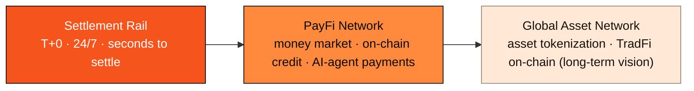

# 1.1 Core Thesis: The L1 Is the Foundation, PayFi Is the Wedge

## The Thesis in One Sentence

> **AXON Finance first proves out the rail for stablecoin payment and settlement, then — on that battle-tested rail — grows into a larger asset network.**

This one sentence holds AXON's entire strategy: **the L1 is the foundation, PayFi is the wedge.**

* **The Foundation (The L1)**: a proprietary, high-performance Layer-1 blockchain — high throughput, sub-second finality, ultra-low and predictable fees. It builds stablecoin settlement primitives, account abstraction, fee sponsorship, and a pluggable compliance gateway into the deepest layer of the chain, as the deterministic bedrock for all payment business.
* **The Wedge**: the launch flagship anchors on **PayFi (Payment Finance)**. This is the direction in today's crypto world with the most real cash flow and the closest ties to the real economy — instant stablecoin settlement, AI-agent payments, bringing the time value of money on-chain.

## Why a "Wedge" Rather Than "Everything at Once"

In infrastructure startups, the most classic and most counterintuitive lesson is: **do not try to serve everyone from day one.** The victories of general-purpose platforms almost always begin at an extremely narrow, extremely deep point of entry — becoming irreplaceable in one scenario first, then expanding sideways. Amazon began by selling books, Facebook began at a single university, Stripe began with "seven lines of code to accept payments."

For a blockchain, "payments" is exactly this kind of ideal wedge:

1. **It is the atomic operation of all finance.** Lending, trading, settlement, clearing — all are, in essence, compositions of "moving a sum of money from A to B, safely and with certainty." Only once this atomic operation is made perfectly deterministic can every financial application above it stand on solid ground.
2. **It has real, measurable demand.** Stablecoins settled $33T on-chain in 2025 — this is not a narrative, it is cash flow. The demand is already there; what is missing is a rail built for it.
3. **It can naturally grow into a larger network.** Once a chain carries trustworthy payment and clearing, assets, credit, and even traditional financial instruments get drawn onto the same rail — because they all need "settlement."

## The Three-Stage Arc

AXON's path is not a one-shot rollout but a clear arc of value evolution:

* **Stage One · Settlement Rail**: prove out the deterministic rail for stablecoin payments. This is the foundational scenario that carries everything above it.
* **Stage Two · PayFi Network**: layer money markets, on-chain credit, and AI-agent payments onto the rail, capturing the time value of money.
* **Stage Three · Asset Network**: reuse the proven capital and clearing rail to extend the network into the broader world of assets.

## How This Differs From "Just Another Fast Chain"

The market never lacks "faster chains." AXON's difference is not some isolated performance figure, but that **it anchors the design target of the entire chain on one thing: payment-grade certainty.**

* General-purpose chains chase "run anything"; AXON chases "payments never go wrong";
* General-purpose chains treat compliance, account abstraction, and fee sponsorship as application-layer patches; AXON treats them as native capabilities of the foundation;
* General-purpose chains carry payments as an afterthought; AXON is built for payments.

This is not a contest of speed, but a **contest of positioning**. The next section gives the full picture of AXON.

---

*Further reading: [1.2 What Is AXON Finance](1-2-what-is-axon.md) · [1.3 Design Philosophy & First Principles](1-3-design-principles.md) · [Part IV · The PayFi Engine](../part4-payfi/README.md)*
