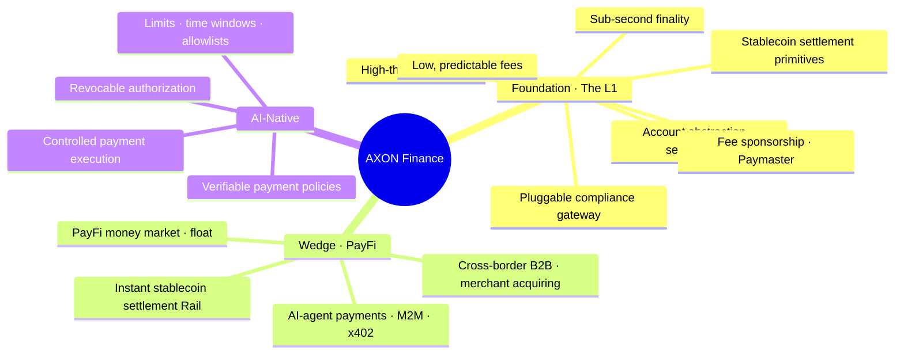

# 1.2 What Is AXON Finance: The Two-Layer Narrative

## Definition

> **AXON Finance is a high-throughput, sub-second-finality, AI-native Layer-1 blockchain; its launch flagship anchors on PayFi (Payment Finance) — instant stablecoin settlement, AI-agent payments, and bringing the "time value of money" on-chain.**

See the whole picture in one diagram:

## Three Snapshots

### 1. The Foundation: An L1 Built for Payments

At AXON's base is a proprietary blockchain, and its design target is a single word — **certainty**. Payment is not like general computation: for a transfer, "probably succeeds" is not enough — it must **succeed for certain, not double-spend for certain, be traceable for certain**. To that end, the foundation layer provides:

* **Payment-grade SLA**: high throughput, sub-second finality, ultra-low and predictable fees;
* **Built-in stablecoin settlement primitives**: settlement is not a smart contract but a first-class capability at the chain layer;
* **AI-native primitives**: account abstraction, session keys, and intents as first-class citizens;
* **Fee sponsorship (Paymaster)**: users complete payments without holding a gas token, so the experience is never fractured by gas;
* **Pluggable compliance gateway**: KYC/AML, geofencing, and risk pre-screening can be mounted at the access layer.

### 2. The Wedge: Four PayFi Scenarios

On top of the foundation, AXON launches four PayFi scenarios that stack layer upon layer (see [Part IV](../part4-payfi/README.md)):

| Scenario | In One Sentence |
| --- | --- |
| Instant stablecoin settlement Rail | A global payment rail with T+0, 24/7, seconds-to-settle |
| AI-agent payments (M2M / x402) | A machine-native payment layer with bounded authorization for AI agents |
| PayFi money market · float yield | Turn in-transit funds / receivables / float into an on-chain money market |
| Cross-border B2B & merchant acquiring | Let SMEs send and receive cross-border in seconds without a correspondent-bank network |

### 3. AI-Native: Controlled Payment Execution

AXON's positioning on AI is one of the most crucial differentiators in this whole document: **we do not lead with "AI makes money for you"; we safely wire AI into payments.** The AI-agent economy is arriving, and machines will initiate vast volumes of small, high-frequency payments on people's behalf; but letting a program that can act autonomously move money directly — without limits, auditing, or a revocation mechanism — is a disaster.

AXON positions AI as chain-native **"controlled payment execution"** — account abstraction + session keys + verifiable payment policies + limits / time windows / allowlists / revocable authorization — so AI agents **can pay, but never run off and never overspend**. See [Part V](../part5-ai/README.md).

## What the Name Means

**Axon** is the fiber through which a neuron transmits signals outward — it is the structure in the nervous system responsible for "delivering a signal with certainty, speed, and direction." This is exactly what AXON Finance means to become: **the axon of the value network**, so that every payment, like a nerve signal, arrives at its destination quickly, deterministically, and directionally. The mother token is named **AXON**.

---

*Further reading: [1.3 Design Philosophy & First Principles](1-3-design-principles.md) · [Part III · Technical Architecture](../part3-architecture/README.md)*
