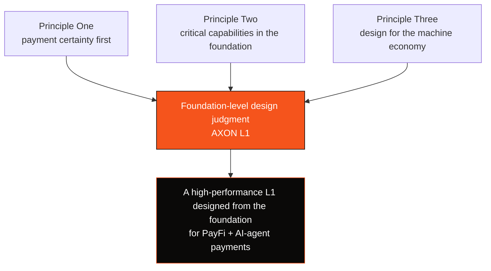

# 1.3 Design Philosophy & First Principles

Every technical choice at AXON traces back to three first principles. Understand them, and you understand "why this chain looks the way it does."

## Principle One: Payment Certainty > General-Purpose Programmability

In the worldview of general-purpose chains, everything is "computation" — a transfer is just a special state change. But from the worldview of payments, the core demand of a payment is not "can it be computed" but **"can it be certain":**

* Did the money **arrive for certain**? (finality)
* Could it be **double-spent**? (double-spend prevention)
* When something breaks, can it be **fully replayed, traced, and recovered**? (auditable, recoverable)

> **An engineering intuition validated over and over: the hardest thing for a payment chain is not throughput, but certainty, authorization, and recovery.**
>
> High throughput can be stacked up with hardware and parallelism; but "this money will never be miscalculated, never double-spent, and when it goes wrong it can always be traced" — this requires the whole path, from consensus to ordering to logging, to be co-designed. It cannot be patched in at the application layer.

So AXON makes certainty the top priority from the foundation up: deterministic-finality consensus, a globally monotonic ordering layer, and a fully replayable write-ahead log. These are developed in [Part III](../part3-architecture/README.md).

## Principle Two: Build Critical Capabilities Into the Foundation, Not Patch Them In After

When a general-purpose chain carries payments, three things are inherently absent and can only be "patched" at the application layer: **compliance, account abstraction, and fee sponsorship**. And patch-style solutions have a fundamental flaw — they cannot access the chain's underlying state, cannot guarantee global consistency, and are easy to bypass.

AXON's choice is to **push these capabilities down into the foundation**:

| Capability | The Problem With Patching | AXON's Foundation-Level Approach |
| --- | --- | --- |
| Compliance (KYC/AML / geofencing) | Each app implements its own, with inconsistent standards, bypassable | A pluggable compliance gateway at the access layer, mounted uniformly |
| Account abstraction / session keys | Simulated via contract wallets, with poor compatibility | Account abstraction as a first-class citizen, natively supported |
| Fee sponsorship (gas abstraction) | Requires third-party relayers, a fractured experience | Paymaster built in, users need not hold gas |

Why does this matter? Because **the user experience of payments cannot tolerate "the cracks between patches."** A user paying for a cup of coffee should not be asked to first go buy a token called gas, then pray the network is not congested. Only by building these into the foundation can the payment experience be as smooth as Web2 while retaining on-chain certainty and composability.

## Principle Three: Design for the Machine Economy, Not Just for People

Over the past fifteen years, almost all payment infrastructure assumed by default that "the payer is a person" — someone clicking "confirm," someone entering a verification code. But a new payment actor is rising: **the AI agent.** They will book flights on your behalf, buy compute, and consume APIs on a pay-per-call basis, initiating vast volumes of machine-to-machine (M2M) micro-payments at speeds no human hand can match.

Designing payments for machines means the constraints are entirely different:

* **Authorization must be programmable and bounded** — it cannot rely on manual per-transaction confirmation, but must carry limits, time windows, and allowlists;
* **Revocability and auditability are hard requirements** — a runaway agent must be able to be cut off instantly, and every transaction must be traceable;
* **Cost must approach zero** — a pay-per-call micro-payment cannot tolerate a few cents of gas.

AXON front-loads these constraints into the foundation design — this is the true meaning of "AI-native": **not adding an AI feature, but making the chain's authorization model assume, from the very start, that the payer may be a machine.** See [Part V](../part5-ai/README.md).

## How the Three Principles Converge

These three principles are not isolated slogans; together they point to the same conclusion: **to truly serve payments and the machine economy, you must own an L1.** The full argument for this conclusion is the subject of [Part III](../part3-architecture/README.md).

---

*Further reading: [Part II · Market & Opportunity](../part2-market/README.md) · [3.1 Why a Purpose-Built L1](../part3-architecture/3-1-why-own-l1.md)*
