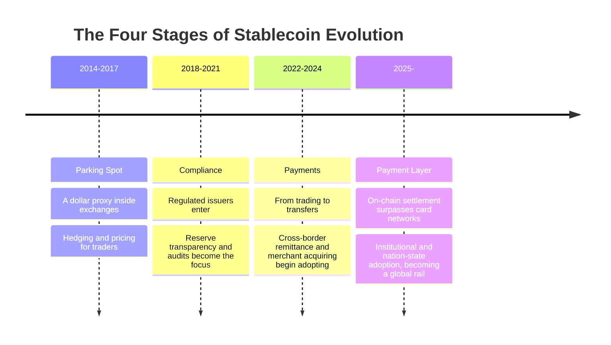

# 2.1 Stablecoins Become the Global Payment Layer

## A Fact That Has Already Happened, Yet Is Often Underrated

> **In 2025, stablecoins settled $33T (trillion) on-chain, already surpassing the combined clearing volume of the two major card networks, Visa and Mastercard (about $25.5T).**

The meaning of this number is worth pausing on: **a tool born in the crypto world, originally just a "safe harbor" for traders, has already caught up with and even surpassed, in settlement scale, a global card-network system that has run for more than half a century.** Stablecoins are no longer a narrative internal to crypto — they are already a real, globally scaled payment layer.

## A Brief History of Stablecoins: From Parking Spot to Payment Layer

To understand where this scale comes from, we need to look back at how stablecoins evolved. They passed through roughly four stages:

* **Stage One · Parking**: The original use of stablecoins was to give traders a "dollar anchor" in a wildly volatile market — a place to park value without actually exiting. It was a lubricant for crypto trading, not a payment tool.
* **Stage Two · Compliance**: As regulated issuers entered, the transparency, auditing, and compliance of reserve assets became the industry's focus. Stablecoins began to earn institutional trust, moving from "gray tool" to "trusted asset."
* **Stage Three · Payments**: People gradually realized that a dollar instrument that runs 24/7, settles in seconds, and costs almost nothing is inherently suited for **transfers** — especially in cross-border scenarios where traditional rails are slow and expensive. Stablecoins began to be used for remittance and merchant acquiring.
* **Stage Four · The Payment Layer**: By 2025, on-chain settlement scale had caught up with the card networks, and stablecoins formally became an independent global payment layer. Even the traditional giants began to plug in — Visa has started to integrate USDC settlement.

## Why Stablecoins Are Suited for Payments

Stablecoins can take on the role of a global payment layer because of several structural advantages over traditional rails:

| Dimension | Traditional wire / card networks | Stablecoin rail |
| --- | --- | --- |
| Settlement time | T+1 to T+5 (cross-border slower) | Seconds to minutes |
| Operating hours | Business days, bank hours | 24/7, no downtime |
| Programmability | Barely programmable | Natively programmable, composable |
| Marginal cost | Fixed fees + FX markups | Approaching zero (depends on the underlying chain) |
| Coverage | Limited by the account system | Only needs an on-chain address |

## The Breadth of Adoption

Stablecoin adoption is no longer confined to the crypto-native crowd:

* About **90% of financial institutions** report already using or piloting stablecoins;
* Of stablecoin cross-border flows, about **60% is already B2B (business-to-business)** — meaning stablecoins are entering the core of real commerce, not just retail speculation;
* The industry forecasts that by **2030, stablecoins could account for about 10% of cross-border payments**.

## But the Rails Have Not Kept Up

Stablecoins solved the problem of the "value instrument" — they let one dollar become digital, programmable, and globally mobile. But they did not solve the problem of **"the rail that carries this instrument."** Today, the vast majority of stablecoins still run on chains designed for general-purpose compute, inheriting all of those chains' payment-grade defects:

* **Congestion and volatile gas**: when the network is busy, the fee on a small payment can exceed the payment amount itself;
* **Uncertain finality**: probabilistic finality means "almost certain," but payments need "absolutely certain";
* **A fractured experience**: users must first hold a native gas token before they can move their own stablecoins.

**Value has already gone digital, but the rail that carries it is still stuck in the previous era.** This is exactly AXON's point of entry — to lay a rail truly designed for this payment layer that already exists in reality and has already reached tens of trillions in scale.

---

*Further reading: [2.2 The Rise of PayFi & the Time Value of Money](2-2-payfi-thesis.md) · [2.3 The Structural Pain of Cross-Border Payments](2-3-crossborder-pain.md) · [3.1 Why a Purpose-Built L1](../part3-architecture/3-1-why-own-l1.md)*
