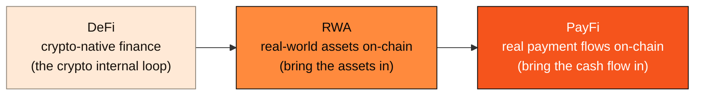

# 2.2 The Rise of PayFi & the Time Value of Money

## What PayFi Is

**PayFi = Payment + Finance.** It refers to on-chain finance built around real payment flows — not trading crypto assets against one another, but bringing on-chain **how real-world money actually moves, settles, and earns yield**.

> **The concept of PayFi was introduced by Lily Liu of the Solana Foundation in 2024, and its core thesis is: bring "the time value of money" on-chain.**

That phrase — "the time value of money" (TVM) — is the key to understanding PayFi. It is one of the oldest first principles in finance: **a dollar today is worth more than a dollar tomorrow** — because a dollar today can be put to use immediately and generate returns. All of modern finance's interest, discounting, and financing are, in essence, pricing "time."

Along the payment path, this "time value" is everywhere: the three days a cross-border payment sits in transit, a receivable on 30-day terms, the float before a credit-card settlement clears... These funds slumber in the gap of "already happened, but not yet settled," their time value not yet fully captured. **PayFi is about waking that slumbering time value with an on-chain money market.** We develop its financial core in depth in [4.4 The Finance of the Time Value of Money](../part4-payfi/4-4-time-value-of-money.md).

## Lineage: From DeFi to RWA to PayFi

PayFi did not appear out of thin air; it is the third step in the evolution of crypto finance:

* **DeFi (Decentralized Finance)**: the first step. It proved that lending, trading, and market-making can run without intermediaries, but its assets and yields are mostly **crypto-native** — an internal loop within crypto, where returns ultimately come from other participants' speculation.
* **RWA (Real-World Assets)**: the second step. People began tokenizing **real-world assets** — treasuries, real estate, private credit — and bringing them on-chain, giving on-chain yield a real-world anchor. But RWA mainly moves the static stock of "assets."
* **PayFi (Payment Finance)**: the third step. What it moves is not a static asset but **flowing cash flow** — payments, settlement, receivables, float. Cash flow is higher-frequency, closer to the real economy, and more able to keep generating real yield than static assets.

Behind this lineage is a shift in values: **from "narrative-driven" to "cash-flow-driven."** In the last cycle, the crypto world priced all manner of grand narratives; in this one, the market increasingly pays only for **real, sustainable, measurable cash flow**. PayFi stands squarely at the center of this shift.

## Cash Flow, Not Narrative: Huma's Validation

This shift is not just talk on paper. **Huma Finance**, the leader of the PayFi track, has already validated the model with real business:

> **Huma Finance's cumulative transaction volume has surpassed $10B+ (crossing ten billion in February 2026), up about 3.4x year over year (from $2.9B to $10B).** Huma runs on Solana / Stellar, building an on-chain money market around real receivables and payment financing — it validates that "bringing the time value of money on-chain" is not a concept but a business model that produces real cash flow.

Huma's significance is that it proves **PayFi has real demand, real yield, and real growth**. This is not yet another protocol whose TVL is stacked up on incentives, but a network backed by real business cash flow. It also reveals a gap — a PayFi protocol like Huma still has to run on a general-purpose chain today, dancing in the shackles of a general-purpose chain.

## From "Protocol" to "Dedicated Chain"

Huma validated PayFi's demand, but it is a **protocol-layer** player — building an application on someone else's chain. And a bigger question surfaces: **if PayFi is a track that can produce tens of billions in cash flow, does it deserve a dedicated chain designed for it from the foundation up?**

History has answered yes again and again. When an application scenario is large enough, and has unique certainty / compliance / authorization requirements of the underlying layer, it always gives rise to purpose-built infrastructure — just as high-frequency trading gave rise to purpose-built matching engines, and gaming gave rise to purpose-built graphics hardware. **PayFi is reaching that inflection point.** AXON's judgment is that the window for this dedicated chain is already open.

---

*Further reading: [2.5 Competitive Landscape](2-5-competitive-landscape.md) · [4.2 PayFi Money Market](../part4-payfi/4-2-money-market.md) · [4.4 The Finance of the Time Value of Money](../part4-payfi/4-4-time-value-of-money.md)*
