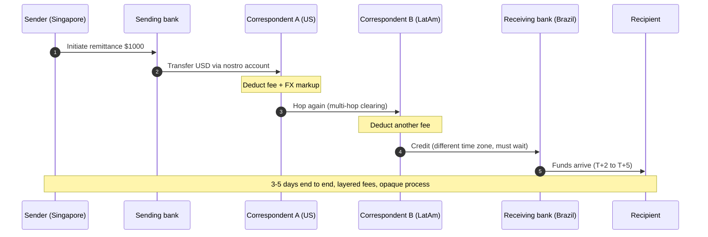
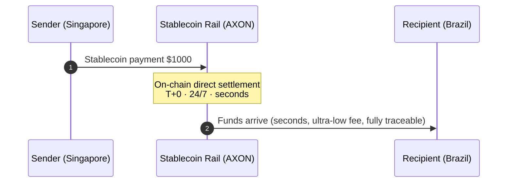

# 2.3 The Structural Pain of Cross-Border Payments

## The Life of a Cross-Border Remittance

Imagine an engineer working in Singapore who wants to send $1,000 to family in Brazil. In the traditional system, this money does not fly "directly" from Singapore to Brazil — it must travel down an invisible chain, relayed by several banks:

Every hop means **a fee, an FX markup, a stretch of delay, and a reconciliation step that can go wrong**. This is why a seemingly simple cross-border remittance often takes 3-5 days, gets marked up layer by layer, and cannot be tracked from end to end.

## Why It Works This Way: The Mechanics of the Correspondent-Banking System

Cross-border payments are slow and expensive because they rely on the **correspondent-banking system**. At the core of this system are two kinds of accounts that banks open with one another:

* **Nostro account** ("our account with you"): an account that Bank A opens at Bank B, denominated in the currency of Bank B's country.
* **Vostro account** ("your account with us"): the same account, seen from Bank B's perspective.

Because no bank in the world opens direct accounts with all other banks, a cross-border payment often needs **to be relayed through several intermediary correspondent banks** to get from the sending bank to the receiving bank. This system brings four structural problems:

| Problem | Cause |
| --- | --- |
| **Slow** | Multi-hop clearing + time-zone mismatch + bank-by-bank reconciliation; T+2 to T+5 is the norm |
| **Expensive** | Every hop charges a fee, plus an opaque FX markup |
| **Locked-up capital** | Banks must pre-park large sums of "idle money" (pre-funding) in each nostro account; capital efficiency is extremely low |
| **Opaque** | The sender cannot track in real time which hop the funds have reached; errors are hard to pinpoint |

Among these, "pre-funding" is especially underrated — to be able to clear at any moment, banks worldwide have parked trillions of idle funds in nostro accounts. This money could be generating returns, but instead just sits in the account waiting to clear. **This is exactly where the time value of money is wasted at massive scale, and exactly the opportunity the PayFi money market means to capture** (see [4.2](../part4-payfi/4-2-money-market.md)).

## The Stablecoin Rail: From Multi-Hop to Single-Hop

The stablecoin rail can disrupt this system because it compresses "multi-hop relay" into "single-hop direct":

No correspondent-bank relay, no pre-funding lockup, no time-zone mismatch — a payment settles directly on-chain, arrives in seconds, at an ultra-low fee, and is fully traceable and programmable.

## How Big a Problem Is This

The pain of cross-border payments maps to an enormous market:

* Global annual cross-border payment flow (TAM) is about **$190T+ (trillion)**;
* B2B already accounts for about **60%** of stablecoin cross-border flow;
* The industry forecasts that by **2030, stablecoins could account for about 10% of cross-border payments**.

Even capturing a small fraction of this market is an enormous opportunity. And more importantly: cross-border payments are only PayFi's first scenario — it is the **foundational scenario**, and once it is proven, money markets, credit, and AI-agent payments can all stack on the same rail.

---

*Further reading: [4.1 Instant Stablecoin Settlement Rail](../part4-payfi/4-1-settlement-rail.md) · [4.3 Cross-Border B2B & Merchant Acquiring](../part4-payfi/4-3-crossborder-b2b.md)*
