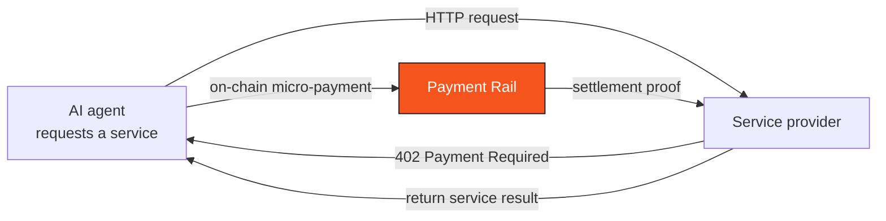

# 2.4 The Rise of the AI-Agent Economy

## A New Payment Actor Is Rising

All past payment infrastructure assumed one premise: **the payer is a person.** A pair of hands clicking "confirm," a pair of eyes checking the amount. But this premise is being broken.

As large models and autonomous AI agents mature, a new class of economic actor is emerging: **software agents that can plan, decide, and execute tasks on their own.** They will book your flights, comparison-shop your procurement, rent compute on demand, and consume online services on a pay-per-call basis. When these agents start "spending money," a brand-new payment actor is born — **the machine**.

This is not distant science fiction. The payment form it brings is fundamentally different from human payments:

* **High-frequency**: an agent completing one task may trigger hundreds or thousands of tiny paid calls;
* **Micro-amount**: a single payment may be only a fraction of a cent — paying for one API call, a slice of compute, a piece of data;
* **Machine-to-machine (M2M)**: both payer and payee may be software, with no human in the loop confirming each transaction.

This kind of payment is called **M2M (Machine-to-Machine) micro-payments**, and the commerce it supports is called **agentic commerce**.

## x402: The Revival of a Dormant Protocol

Interestingly, the technical interface prepared for machine payments has in fact long existed — it just slept for thirty years.

The HTTP protocol has a status code that was almost never truly used: **`402 Payment Required`**. It was defined in the 1990s, reserved for "pay-per-access to web resources," but lay dormant for years because there was no usable micro-payment method at the time.

**x402** is precisely the attempt to bring this protocol back to life: when an agent requests a service, the provider returns `402`, the agent completes an on-chain micro-payment, and the provider returns the result once it verifies. The whole process needs no account registration, no subscription, no human — **the service is paid for per call, and machines settle directly with machines**. This gives the AI-agent economy a native, on-demand payment interface.

## The Real Obstacle: Not "Can It Pay," but "Authorization and Security"

Here, a crucial insight surfaces. Many assume the hard part of AI-agent payment is "letting AI pay" — but that is precisely the easiest part.

> **The real obstacle is not "can it pay," but "authorization and security."**
>
> Once an AI agent can move money autonomously, but without limits, without auditing, and without revocability — that is a disaster. It could be induced, hijacked, or simply because of a bug, spend all your money without your knowledge, or send it somewhere you never intended.

This is why payment and tech giants are **racing to define the authorization standard for agentic payment** (protocols like AP2) — because whoever defines "how AI is safely authorized to move money" holds the payment gateway to the machine economy. This standards contest is, in essence, a race over the **boundary of trust**.

And this is exactly where AXON's core differentiation lies: **we do not understand AI payment as "letting AI spend money," but as "how to put a controllable rein on AI's spending."** How this judgment becomes chain-native capability is the subject of [Part V · AI-Native](../part5-ai/README.md).

## Why a General-Purpose Chain Cannot Patch This In

Some will ask: if AI-agent payment is so important, why not just add a feature to a general-purpose chain?

The problem is that "controlled payment execution" is not an application-layer feature but a **foundation-level authorization model**. It requires:

* Session keys as first-class citizens — issuing bounded, revocable authorization to each agent;
* Limits / time windows / allowlists enforced at the chain layer — not left to the application's good faith;
* Micro-payment costs approaching zero — otherwise the pay-per-call economic model simply does not hold.

A general-purpose chain can only "simulate" these requirements at the contract layer, which is neither secure nor efficient. **They must be designed from the foundation.** This is exactly the fundamental difference between "AI-native" and "AI-compatible."

---

*Further reading: [5.1 The Real Problem of Agentic Payments](../part5-ai/5-1-agentic-payments.md) · [5.3 x402 & M2M Micro-Payments](../part5-ai/5-3-x402-m2m.md) · [3.7 Account Abstraction, Session Keys & Paymaster](../part3-architecture/3-7-account-abstraction.md)*
