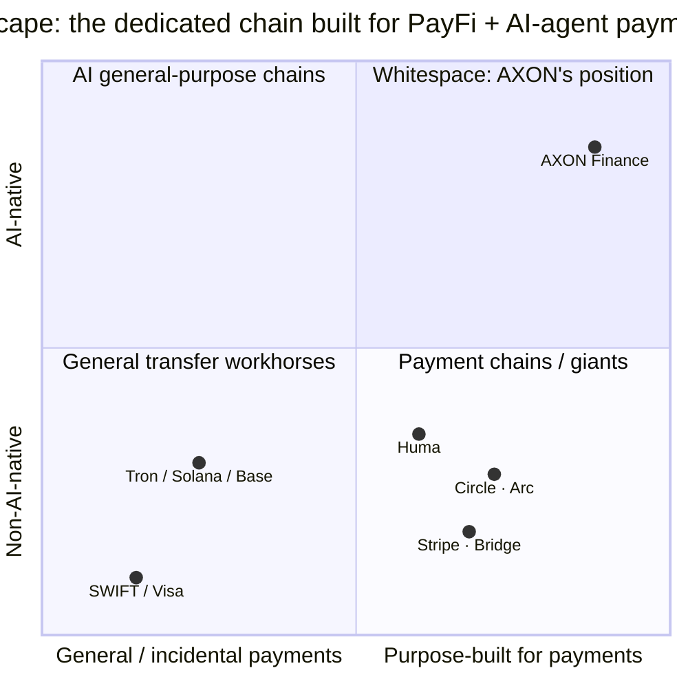

# 2.5 Competitive Landscape

The payments track never lacks players. But when we take "a high-performance L1 designed from the foundation for PayFi + AI-agent payments" as our coordinate, we find an unusual phenomenon: **the track is crowded, but that particular position is empty.**

## Five Kinds of Players

The forces currently active in stablecoin payments fall into roughly five kinds:

| Player | Path | Scale / Assessment |
| --- | --- | --- |
| **Huma Finance** | PayFi network leader (Solana / Stellar) | Cumulative volume $10B+, defining the PayFi track and validating the real-cash-flow model |
| **Circle · Arc** | Stablecoin issuer building its own payment L1 | The USDC giant enters payment-chain territory directly — confirming the "dedicated payment chain" direction |
| **Stripe · Bridge / Tempo** | Traditional payment giant + stablecoin infrastructure | $1.1B acquisition of Bridge; but closed-source / permissioned, not AI-native |
| **General-purpose chains Tron / Solana / Base** | Workhorses of stablecoin transfers | Carry payments as an afterthought; not PayFi-native, no AI-agent payment primitives |
| **SWIFT / Visa / correspondent banks** | Traditional cross-border rail | T+2 to T+5, high fees, not programmable; Visa has only just integrated USDC settlement |

Taking each in turn:

* **Huma Finance** validated PayFi's real demand and cash-flow model, and is the definer of the track. But it is a **protocol-layer** player, running on general-purpose chains, constrained by the performance and authorization capabilities of the underlying chain.
* **Circle · Arc**'s move is highly significant — **the issuer of USDC is entering the dedicated-payment-chain arena directly**, which in itself confirms the judgment that "payments need a dedicated chain." But as a stablecoin issuer, its dedicated chain inherently carries the centralization tint and ecosystem boundary of a single issuer.
* **Stripe · Bridge / Tempo** — Stripe's roughly $1.1B acquisition of the stablecoin-infrastructure company Bridge shows a traditional payment giant's resolve. But this path is **closed-source and permissioned**; it folds stablecoins into an existing centralized payment empire, rather than an open, AI-native public rail.
* **General-purpose chains (Tron / Solana / Base)** are the main carriers of stablecoin transfers today. But for them, payment is just one application carried **as an afterthought** — they have no PayFi-native settlement primitives, and even less any authorization primitives for AI-agent payment.
* **Traditional rails (SWIFT / Visa / correspondent banks)** are the object being disrupted. They are large in scale and deep in network, but their structural defects — T+2 to T+5, high fees, not programmable — are hard to reform from within. Visa has only just begun to integrate USDC settlement, which shows that even the old world must lean toward the new rail.

## The Whitespace in One Diagram

Place these players on two axes — the horizontal axis "general-purpose chain ↔ dedicated payment chain," the vertical axis "non-AI-native ↔ AI-native" — and the whitespace is clear at a glance:

* **Lower-right quadrant** (dedicated payment chain, but not AI-native): Circle·Arc, Stripe·Bridge, and Huma are all converging here — everyone realizes "payments need purpose-built design," but none makes AI-agent payment a foundation capability.
* **Lower-left / upper-left quadrants**: general-purpose chains and traditional rails, which either carry payments only as an afterthought or are simply not programmable.
* **Upper-right quadrant** (purpose-built for payments **and** AI-native): **empty.** This is exactly the position AXON means to occupy.

## A Signal of Competition, Not a Threat

It is worth stressing: the entry of giants like Circle and Stripe is, for AXON, **first a signal, not a threat**. When the issuer of USDC and the world's largest internet payment company both start building their own payment chains, they are confirming one thing through action — **the judgment that "payments need a dedicated chain" is right, and this market is large enough and important enough.**

They validated the direction, yet each left a gap: an issuer's dedicated chain has a centralization boundary, the giants' solutions are closed-source and not AI-native, and general-purpose chains lack payment and AI primitives. **An open, AI-native, high-performance L1 designed from the foundation for PayFi still awaits its occupant.**

---

*Further reading: [2.6 Whitespace & Market Size](2-6-whitespace.md) · [3.1 Why a Purpose-Built L1](../part3-architecture/3-1-why-own-l1.md)*
