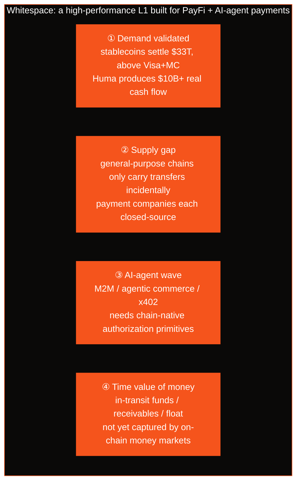
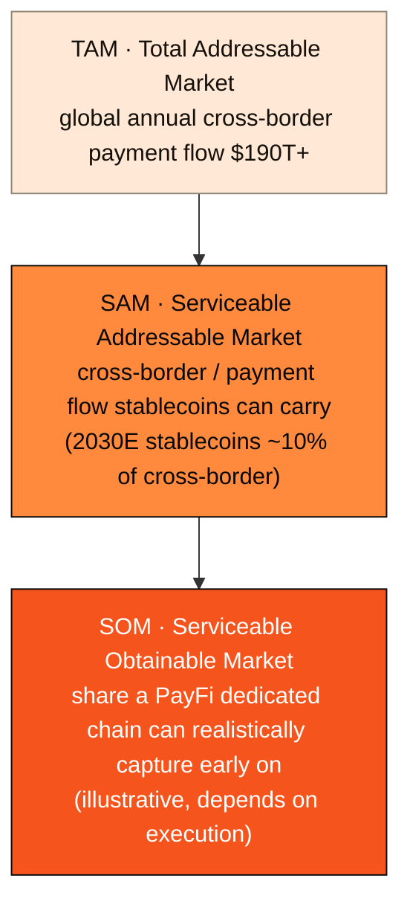

# 2.6 Whitespace & Market Size

## Four Arguments, One Whitespace

Pulling together the observations of the preceding sections, AXON's market judgment condenses into four arguments. They answer, respectively, the questions of "demand," "supply," "trend," and "yield":

* **① Demand validated.** Stablecoins settled $33T on-chain in 2025, already above Visa+MC; PayFi protocols like Huma produce $10B+ in real business — **this is cash flow, not narrative.** The market does not need to be educated; the demand is already there.
* **② Supply gap.** General-purpose chains only carry transfers incidentally, and payment companies are each closed and closed-source; **no one is building a high-performance L1 "designed from the foundation for PayFi + AI-agent payments."**
* **③ AI-agent wave.** M2M, agentic commerce, and x402 need chain-native account abstraction, session keys, and bounded authorization — these cannot be patched in by general-purpose chains; it is a brand-new native demand that is opening up.
* **④ Time value of money.** In-transit funds, receivables, and float along the payment path are not yet fully captured by on-chain money markets — **this is exactly PayFi's source of excess yield.**

Compose these four into one positioning hook:

> **A high-performance L1 built for PayFi and AI-agent payments — stablecoin T+0 settlement + bringing "the time value of money" on-chain.**

## Market Size: From TAM to Landing Point

Just how large is this whitespace? We use the classic TAM / SAM / SOM framework to calibrate the order of magnitude — note that what is given here is **an illustration of market magnitude**, not a forecast of AXON's business scale.

| Tier | Magnitude | Basis |
| --- | --- | --- |
| **TAM** (Total Addressable Market) | Global annual cross-border payment flow **$190T+** | Public monitoring / industry data |
| **Reference anchor** | Stablecoins settle **$33T** on-chain in 2025 (above Visa+MC $25.5T) | Different-tier basis; read for the trend |
| **Trend** | Stablecoins ~10% of cross-border payments by 2030E | Industry forecast |
| **Leader validation** | Huma cumulative **$10B+** (YoY 3.4×) | Real cash flow on the PayFi track |

## Why Now

Great opportunities need the right timing. AXON believes this window is exactly right:

* **Demand side is mature** — stablecoin settlement has reached the tens-of-trillions magnitude, and the PayFi leader has validated the model;
* **Supply side has a gap** — the giants' entry confirms the direction, yet each leaves the gap of an open dedicated chain;
* **Technology side is ready** — high-performance consensus, account abstraction, verifiable-policy sandboxes, and other base technologies are mature enough to be composed into an L1 built for payments;
* **AI side is at the inflection** — the AI-agent economy is moving from concept to reality, and the contest over authorization standards for machine payment is just beginning.

Four curves converge at the same moment — this is why AXON chose "now." From Part III onward, we enter the technology: how, exactly, this L1 built for the whitespace should be constructed.

---

*Further reading: [Part III · Technical Architecture](../part3-architecture/README.md) · [6.1 Roadmap P0 → P3+](../part6-roadmap/6-1-roadmap.md)*
