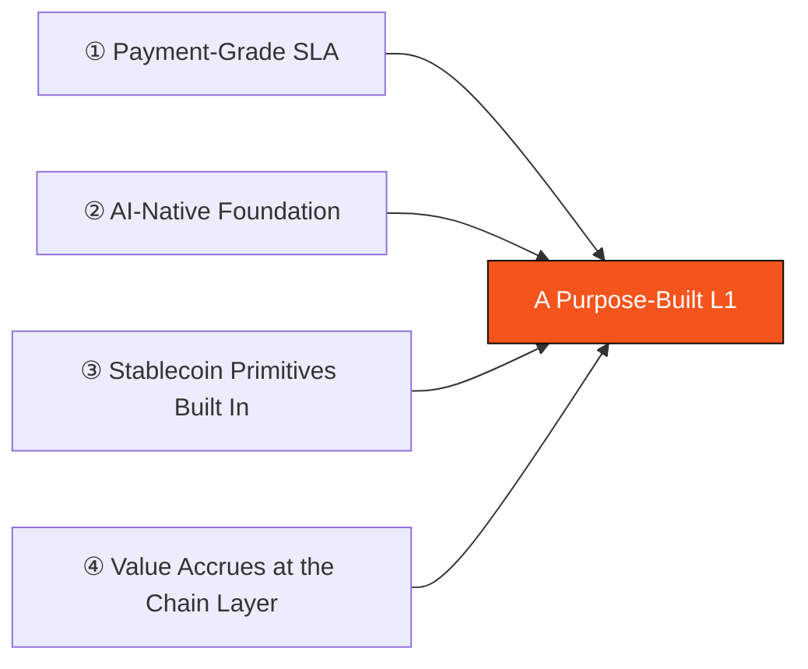

# 3.1 Why a Purpose-Built L1

Building a new Layer-1 is an expensive, hard decision. So the first question we must answer is: **why not just build an app on top of an existing high-performance chain?** AXON's answer is four reasons that cannot be sidestepped. What they have in common: **each one points to the foundation of the chain and cannot be solved at the application layer.**

## Reason One: Payment-Grade SLA

Payments carry a set of service-level (SLA) requirements that are fundamentally different from general-purpose computation:

* **High throughput** — to carry global-scale payment flow;
* **Sub-second finality** — the moment a user taps "pay," success must be settled in the blink of an eye;
* **Extremely low and predictable fees** — paying for a cup of coffee, the fee cannot cost more than the coffee, much less swing wildly with network congestion.

The congestion and gas volatility of a general-purpose chain cannot deliver the determinism that payments and settlement demand. When the network is busy, transaction fees spike and confirmation times stretch out — tolerable perhaps for a DeFi trader, but fatal for a payment that must complete in "seconds, at a fixed cost."

To guarantee a payment-grade SLA, you must be able to control consensus, block-production cadence, and the fee model — and these are all **chain-layer matters**, not something you can acquire by deploying a contract on someone else's chain.

## Reason Two: An AI-Native Foundation

As described in [2.4](../part2-market/2-4-ai-agent-economy.md), the core of AI-agent payments is not "being able to pay" but "being controllable." And "controllable" requires making account abstraction, session keys, and intents **first-class citizens** built into the chain:

* Issue bounded, revocable session keys for each agent;
* Enforce limits / time windows / allowlists at the chain layer;
* Let payment policies run verifiably inside a sandbox.

These are not capabilities a general-purpose chain can "patch in" — they demand native support all the way from the account model to the execution environment. **AI-native has to start at the foundation.**

## Reason Three: Stablecoin Settlement Primitives Built In

On a general-purpose chain, a stablecoin transfer is one ERC-20 contract call — the stablecoin is merely "a token that happens to be called USDC." But in AXON's design, **stablecoin settlement is a first-class chain-layer capability**:

* The settlement engine, multi-source fiat-anchored price feeds, and the risk reserve are built into the chain layer;
* Paymaster fee sponsorship lets users transact without holding a gas token;
* A pluggable compliance gateway is mounted at the entry layer.

Build these into the foundation, and the payment experience is no longer fractured by the seams of "first buy gas, then pray it isn't congested, and handle compliance yourself."

## Reason Four: Value Accrues at the Chain Layer

The fourth reason is about the business model. As an L1 built for payments, every payment, settlement, and credit event carried on AXON's network generates **real protocol fee revenue** at the chain layer.

Unlike networks that run on token-emission subsidies, AXON's value proposition is built on **real business volume (TPV, Total Payment Volume) generating real revenue** — the network's sustainability comes from the real economic activity it carries, not from inflationary incentives.

Only a purpose-built L1 lets this value be captured and governed at the chain layer; if you merely build an app on someone else's chain, a large share of the value is siphoned off by the underlying chain.

*(For the specific mechanism linking protocol revenue to token value, see the "deflationary flywheel" in [Part VII · Tokenomics](../part7-tokenomics/README.md).)*

## Four Reasons, One Conclusion

None of these four reasons can be solved at the application layer, and together they point to the same conclusion: **to truly serve PayFi and AI-agent payments, you must have your own L1.** What that L1 looks like is the five-layer architecture of the next section.

---

*Further reading: [3.2 The Five-Layer Architecture](3-2-layered-architecture.md) · [1.3 Design Philosophy & First Principles](../part1-vision/1-3-design-principles.md)*
