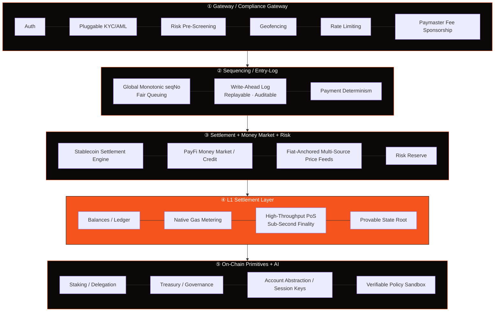
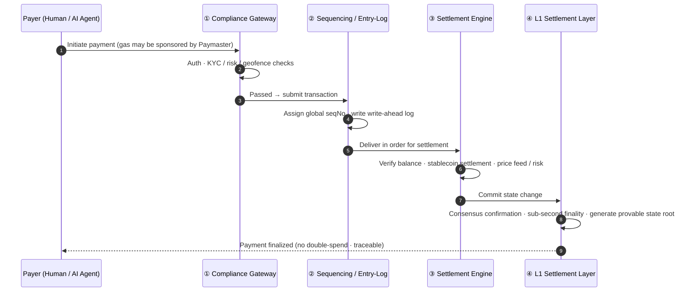

# 3.2 The Five-Layer Architecture

AXON's foundation is organized into five layers. The best way to understand these five layers is to follow **a single payment** all the way from top to bottom — it enters at the gateway layer, is ordered at the sequencing layer, completes at the settlement layer, lands in L1 state, and is supported throughout by the on-chain primitives at the very bottom.

## The Panorama

## Responsibilities, Layer by Layer

| Layer | Responsibility |
| --- | --- |
| **① Gateway / Compliance Gateway** | Auth · Pluggable KYC/AML · Risk pre-screening · Geofencing · Rate limiting · Paymaster fee sponsorship |
| **② Sequencing / Entry-Log** | Global monotonic seqNo fair queuing · Write-ahead log (replayable, auditable) · Payment determinism |
| **③ Settlement + Money Market + Risk** | Stablecoin settlement engine · PayFi money market / credit · Fiat-anchored multi-source price feeds · Risk reserve |
| **④ L1 Settlement Layer** | Balances / ledger · Native gas · High-throughput PoS with sub-second finality · Provable state root |
| **⑤ On-Chain Primitives + AI** | Staking / delegation · Treasury · Governance (fees / payments / credit) · Account abstraction / session keys / verifiable policy sandbox |

Key points for each layer:

* **① Gateway / Compliance Gateway** is the first door a payment passes through to enter the system. It handles authentication, compliance, risk control, rate limiting, and fee sponsorship uniformly at the entrance — making compliance a foundation-level capability rather than an application-level patch (see [3.6](3-6-compliance-gateway.md)).
* **② Sequencing / Entry-Log** is the heart of payment determinism. It assigns every transaction a globally monotonically increasing sequence number (seqNo), queues it fairly, and writes it into a fully replayable write-ahead log — the technical basis for "when something goes wrong, it can always be traced and recovered" (see [3.4](3-4-payment-finality.md)).
* **③ Settlement + Money Market + Risk** is where the PayFi business engine lives. Stablecoin settlement, the money market / credit, multi-source price feeds, and the risk reserve all sit at this layer (see [Part IV](../part4-payfi/README.md) and [3.5](3-5-oracle-safety.md)).
* **④ L1 Settlement Layer** (highlighted in the diagram) is the heart of the whole chain: the ledger, native gas metering, high-throughput PoS consensus with sub-second finality, and a provable state root (see [3.3](3-3-consensus-finality.md)).
* **⑤ On-Chain Primitives + AI** provides the underlying capabilities that support the whole system: staking and delegation, treasury and governance, and — most crucially — the AI primitives: account abstraction, session keys, and a verifiable policy sandbox (see [3.7](3-7-account-abstraction.md) and [Part V](../part5-ai/README.md)).

## A Payment's Journey Through Time

Turn the "vertical" structure of the five layers into a "horizontal" timeline, and you get the full lifeline of a stablecoin payment:

This timeline reveals the core idea of AXON's design: **every step of a payment is explicitly modeled, explicitly ordered, and explicitly recorded.** There is no fuzzy zone of "probably succeeded" — from entering the gateway to final settlement, every step is verifiable, auditable, and recoverable. This is what "building determinism into the foundation" concretely means.

---

*Further reading: [3.3 Consensus, Sub-Second Finality & Performance Targets](3-3-consensus-finality.md) · [3.4 Payment Finality & Double-Spend Prevention](3-4-payment-finality.md)*
