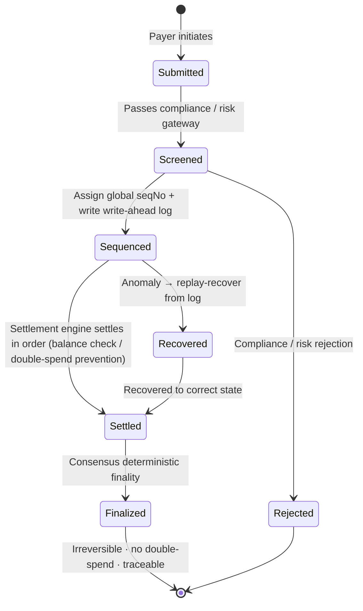

# 3.4 Payment Finality & Double-Spend Prevention

## The Real Hard Problem of a Payment Chain

Going by the marketing, people easily assume chains compete on "whose TPS is higher." But anyone who has actually built a payment system knows the hardest thing was never throughput — **the hardest thing is determinism, authorization, and recovery**:

> Has this money **definitely** arrived? Could it be **spent twice**? And if the system fails, can it be **fully replayed, traced, and recovered** to the correct state?

High throughput can be brute-forced with hardware and parallelism; but "never miscount, never double-spend, always traceable when something breaks" requires the whole path — consensus, sequencing, logging — to be designed in concert. This section explains how AXON holds this line.

## Three Guardrails

AXON sets three guardrails around payment determinism:

* **Deterministic settlement** — resting on the BFT deterministic finality of [3.3](3-3-consensus-finality.md), a transaction is irreversible once confirmed; there is no probabilistic tail of "being rolled back by a longer chain."
* **Double-spend prevention** — the same funds can never be spent twice. Every payment is assigned a globally unique sequence number (seqNo) at the sequencing layer and settled in order, eliminating concurrent double-spends.
* **Rollback protection** — even when an anomaly occurs, the system can determine "what the correct state should be" from the write-ahead log, rather than falling into inconsistency.

## The Sequencing Layer: The Heart of Determinism

The core of payment determinism lands at the **sequencing / Entry-Log layer**. It does two things that look plain but are in fact critical:

1. **Global monotonic seqNo fair queuing** — every transaction entering the system is assigned a globally monotonically increasing sequence number. This means all transactions in the system have a **unique, deterministic ordering**, eliminating the fuzzy zone of "who came first" (and compressing the room for MEV-style ordering manipulation).
2. **Write-Ahead Log (WAL)** — before a transaction is actually executed, "what it intends to do" is first written into an append-only, tamper-evident log. This log can be **fully replayed**: given the same log, any node can reconstruct exactly the same state.

The write-ahead log is time-tested engineering wisdom borrowed from traditional databases. It is precisely the WAL that lets a database guarantee "even after a power loss, it can recover to a consistent state on restart." AXON applies this same idea to payments: **as long as the log exists, the correct state can always be reconstructed.** This is the technical bedrock of "always traceable, always recoverable when something goes wrong."

## A Payment as a State Machine

Land these guardrails onto a single payment, and its lifecycle is a strict state machine — every transition explicit and verifiable:

The key point: **no state is ever "fuzzy."** A payment is either explicitly rejected at the gateway (Rejected), or it walks the deterministic path Submitted → Screened → Sequenced → Settled → Finalized; and even if an anomaly interrupts it midway, it can be replay-recovered along the write-ahead log (Recovered) to the correct state and then continue. **There is no intermediate state of "the money is lost somewhere."**

## Minimizing Trust in a Centralized Sequencer

In the network's early stages, the Sequencer may be relatively centralized — a common engineering trade-off in the early days of high-performance chains. AXON's principle here is explicit:

> **Even in its centralized stage, the Sequencer must prove that its log is tamper-evident and can be fully replayed.**

That is, the Sequencer may be "fast," but it may not be a "black box." It must continuously provide verifiable evidence that lets any third party independently reconstruct the state and confirm it has not misbehaved. As the network matures (see the P2 stage in [6.1 Roadmap](../part6-roadmap/6-1-roadmap.md)), sequencing and validation will progressively decentralize and be handed to a broader validator set.

This is a path of "minimizing trust": **first replace trust with verifiability, then dissolve trust with decentralization.** The credibility of a payment system is built, step by step, exactly this way.

---

*Further reading: [3.5 Stablecoins & Price Feeds: Multi-Source Validation and Circuit Breakers](3-5-oracle-safety.md) · [6.1 Roadmap P0 → P3+](../part6-roadmap/6-1-roadmap.md)*
