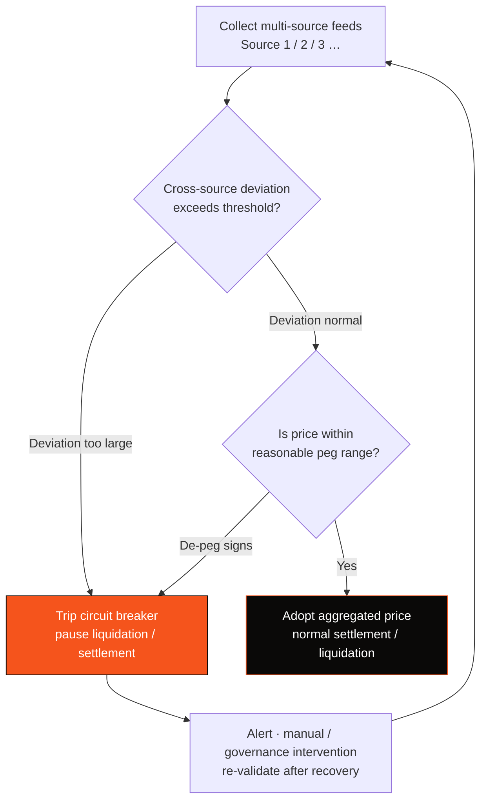

# 3.5 Stablecoins & Price Feeds: Multi-Source Validation and Circuit Breakers

## Price Feeds: The Payment Chain's Invisible Achilles' Heel

A PayFi chain must continuously answer one question: **"How much fiat is one unit of stablecoin worth right now?"** This deceptively simple question is the chain's invisible Achilles' heel — because money-market liquidations, credit collateral ratios, and risk-reserve provisioning all depend on this price.

Once a price feed (oracle) goes wrong, the consequences are catastrophic: a bad price can trigger a liquidation that should never have happened, and that liquidation sets off a chain reaction — the root cause of many "oracle attacks" and "de-peg stampedes" in DeFi history. **For a payment chain carrying real money, price-feed safety is not optional — it is a matter of life and death.**

## Three Lines of Defense

AXON sets three lines of defense around price feeds and stablecoin anchoring:

* **Multi-source validation** — the fiat-anchored price does not rely on a single source; it is cross-validated across multiple independent feeds, preventing any single point from being manipulated or failing.
* **Deviation circuit breaker** — when an abnormal deviation appears between feeds, or between a feed and its reasonable range, the system trips a circuit breaker and pauses the relevant liquidation / settlement actions, rather than blindly executing on a bad price.
* **De-peg protection** — when the stablecoin itself shows signs of de-pegging, a protection mechanism is triggered to avoid cascading liquidations under an abnormal peg.

## The Price-Feed Circuit-Breaker Decision Flow

Draw this logic as a decision flow, and it is a conservative design of "better to pause than to miscount":

This flow embodies a design philosophy of the same lineage as [3.4](3-4-payment-finality.md): **in the face of uncertainty, better to conservatively pause than to risk miscounting.** The trust damage caused by one liquidation that should never have happened far outweighs the inconvenience of a brief pause. For payment infrastructure, robustness comes before aggressiveness.

## Stablecoin Strategy: Multi-Asset, Extensible

AXON's stablecoin strategy follows several principles:

* **Multi-asset** — not bound to a single stablecoin, but designed to onboard multiple mainstream compliant stablecoins, reducing dependence on any single issuer;
* **Fiat-anchored first** — the initial launch focuses on fiat-anchored (especially USD) stablecoins, because they are the current mainstay of cross-border payments and settlement;
* **Pluggable feeds** — feed sources are designed to be pluggable and extensible, so that more independent, high-quality price sources can be onboarded as the ecosystem matures (for oracle partnerships, see [6.3](../part6-roadmap/6-3-team-partners.md)).

Price-feed safety and stablecoin anchoring are the prerequisite for the PayFi money market ([4.2](../part4-payfi/4-2-money-market.md)) to operate safely — without a trustworthy price, there is no trustworthy credit or liquidation.

---

*Further reading: [3.6 Pluggable Compliance Gateway](3-6-compliance-gateway.md) · [4.2 PayFi Money Market](../part4-payfi/4-2-money-market.md)*
