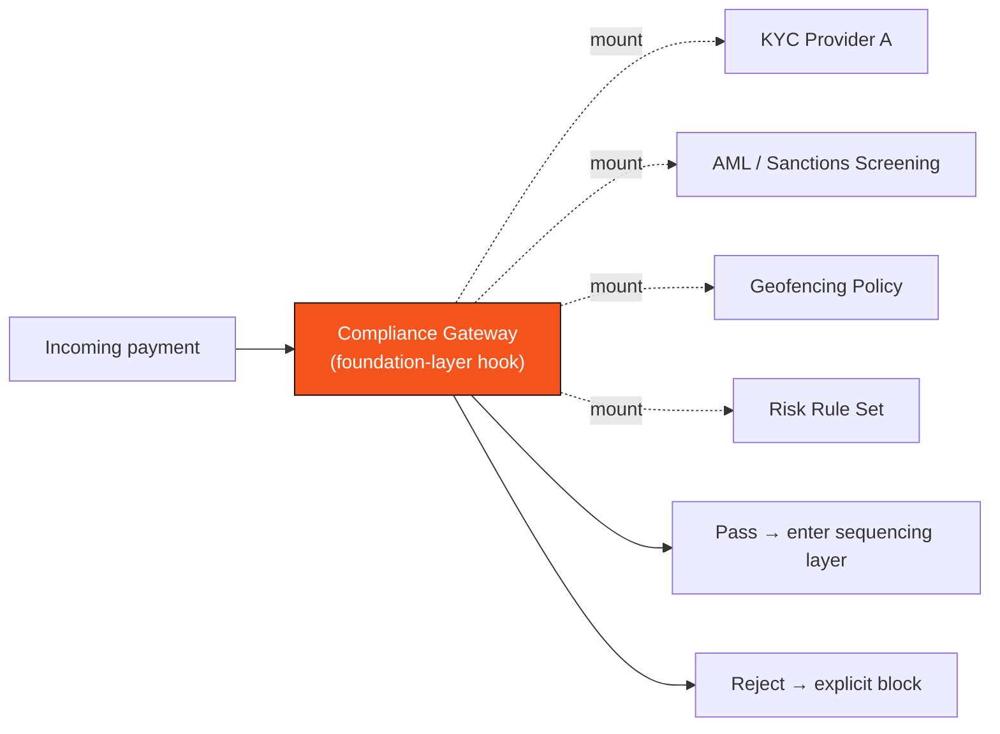

# 3.6 Pluggable Compliance Gateway

## Payment Infrastructure Cannot Escape Compliance

DeFi can run inside the ideal of "permissionless," but **payment infrastructure cannot escape compliance**. The moment you set out to carry real cross-border payments, merchant acquiring, and enterprise settlement, you inevitably face a whole set of real-world rules: KYC/AML, sanctions lists, geographic jurisdiction, the Travel Rule, and more.

The question is not "whether to comply" but "at which layer compliance lives." There are two paths:

* **Patching at the application layer** — each application implements its own compliance logic. The result is inconsistent standards, reinvented wheels, and easy circumvention.
* **Native at the foundation layer** — build compliance capability into the chain's entry layer: uniform, pluggable, auditable.

AXON chooses the latter: a **pluggable compliance gateway.**

## The Gateway's Responsibilities

The compliance gateway sits at the very top of the five-layer architecture (layer ① in [3.2](3-2-layered-architecture.md)) and is the first door a payment passes through to enter the system. It handles:

| Capability | Function |
| --- | --- |
| **Auth** | Verify the initiator's identity |
| **Pluggable KYC/AML** | Connect to third-party compliance services; mount identity and anti-money-laundering checks on demand |
| **Risk Pre-Screening** | Assess and intercept risk before a transaction executes |
| **Geofencing** | Restrict availability of specific features / assets by jurisdiction |
| **Rate Limiting** | Prevent abuse and abnormal traffic |
| **Paymaster Fee Sponsorship** | Sponsor gas once compliance passes, for a smooth experience |

## Why "Pluggable"

"Pluggable" is the keyword of this design. Compliance is not one fixed set of rules that fits all — **different jurisdictions, different businesses, different assets have wildly different compliance requirements.** A cross-border remittance scenario in Singapore and a merchant-acquiring scenario in Latin America need different KYC levels, sanctions screening, and geographic restrictions.

So AXON designs compliance as a **pluggable module**:

* Compliance capabilities act as **hooks (mount points)** at the chain layer, into which third-party compliance providers can plug on demand;
* Different business scenarios can be configured with different combinations of compliance policies;
* All compliance decisions happen at a unified entrance — auditable, traceable, and impossible for the application layer to circumvent.

## Crypto-Friendly Jurisdictions and Phased Rollout

AXON's compliance strategy follows a pragmatic, phased principle:

* **Launch focuses on the stablecoin compliance standard** — KYC/AML + geofencing + crypto-friendly jurisdictions, serving the relatively well-defined scenarios of stablecoin payments / settlement;
* **Expansion toward TradFi** (P3+ in [6.1](../part6-roadmap/6-1-roadmap.md)) takes a **stricter** compliance path, because traditional financial assets face a far higher regulatory bar than stablecoin payments;
* **Compliance capability evolves with the ecosystem** — the pluggable architecture lets AXON flexibly mount the corresponding compliance modules as it enters new jurisdictions and new scenarios.

Building compliance into the foundation is not about being "stricter" — it is about making **compliance a part of the payment experience rather than an after-the-fact friction**. This is the prerequisite for PayFi to genuinely connect with real-world commerce.

---

*Further reading: [3.7 Account Abstraction, Session Keys & Paymaster](3-7-account-abstraction.md) · [3.5 Stablecoins & Price Feeds](3-5-oracle-safety.md)*
