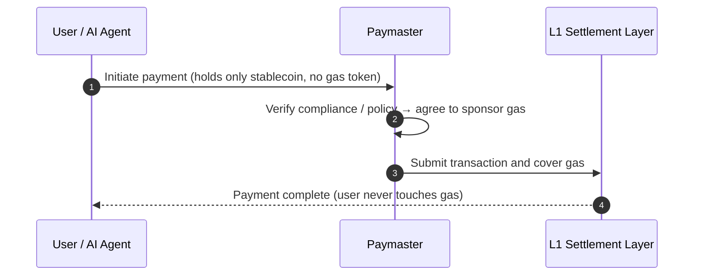

# 3.7 Account Abstraction, Session Keys & Paymaster

This section introduces three foundation-level primitives that set AXON apart from general-purpose chains. They are both the basis of a smooth payment experience and the technical prerequisite for [Part V · AI-Native](../part5-ai/README.md) — it is precisely these three primitives that turn "granting an AI agent controllable authorization" from a slogan into an implementable mechanism.

## Account Abstraction: Making Accounts Programmable

On a traditional blockchain, accounts come in two kinds: "externally owned accounts" controlled directly by a private key, and "contract accounts" controlled by code. A user account is just "a private key" — what it can do, who authorizes it, and by what rules are all hard-coded.

**Account abstraction** breaks this rigid model: it makes the account itself **programmable**. An account can define its own verification logic, authorization rules, and recovery mechanism. This brings a series of payment-friendly capabilities:

* **Flexible authorization** — an account can grant multiple keys with different permissions, rather than a single "all-or-nothing" private key;
* **Social recovery** — losing a key no longer means losing your assets;
* **Batch and conditional execution** — payments can be triggered automatically on preset conditions.

In AXON, **account abstraction is a first-class citizen, not something simulated by contracts** — this is the foundation of "AI-native" (see [3.1 Reason Two](3-1-why-own-l1.md)).

## Session Keys: Bounded, Revocable Authorization

On top of account abstraction, the most crucial primitive is **session keys**.

A session key is a **bounded, temporary, revocable** key — it is not the account's master private key, but a "restricted pass" the master account grants for one specific purpose. You can set strict boundaries on it:

* **Spend limit** — how much it can spend at most;
* **Time window** — within what time window it is valid;
* **Allowlist** — only which recipients it can pay;
* **Revocable** — can be revoked at any time, taking effect immediately.

This is exactly the key to safely plugging an AI agent into payments. Issuing a session key to an AI agent is like telling it: "You may pay autonomously within this budget, this time window, and this set of recipients — **but not one step beyond the boundary, and I can reclaim it at any time.**"

An illustrative grant might look like this:

```javascript
// Illustrative pseudocode: issue a restricted session key to an AI agent
grantSessionKey({
  agent:      "agent://travel-booker",   // the authorized agent
  maxSpend:   { amount: 200, asset: "USDC" }, // spend limit: up to 200 USDC
  window:     { from: now, to: now + 24*3600 }, // time window: 24 hours
  allowlist:  ["merchant://airlines", "merchant://hotels"], // allowlist
  perTxCap:   { amount: 50, asset: "USDC" }, // per-transaction cap
  revocable:  true,                       // revocable at any time
})
```

The full lifecycle of a session key, and how it is enforced at the chain layer, is the subject of [5.2 Controlled Payment Execution](../part5-ai/5-2-controlled-execution.md).

## Paymaster: Letting Users Transact Without Holding Gas

The last friction in the payment experience is gas. On a general-purpose chain, to spend their own stablecoins, users must first hold that chain's native token to pay for gas — a huge barrier for new users, and unnecessary complexity for AI agents.

**Paymaster (fee sponsorship)** removes this friction: it allows a third party (such as the application, the merchant, or the protocol itself) to **sponsor a transaction's gas fee**, so users / agents can complete a payment without holding the native gas token.



The leap in experience this brings: **payments can be as smooth as Web2** — the user only cares about "how much stablecoin I paid," and need not understand, let alone hold, a token called gas. For the AI-agent economy this is even more critical: a pay-per-call agent should not also have to manage the balance of a separate gas token.

## How the Three Primitives Work Together

These three primitives build on one another, together forming AXON's "AI-native" foundation:

| Primitive | Problem It Solves | What It Means for AI Agents |
| --- | --- | --- |
| Account abstraction | Rigid, non-programmable accounts | Makes "controllable authorization" possible at the account layer |
| Session keys | Authorization is "all-or-nothing" | Gives agents bounded, revocable spending rights |
| Paymaster | Users must hold gas | Agents need not manage gas, focusing on the payment itself |

With these three foundation primitives in place, we can move into [Part IV](../part4-payfi/README.md) and [Part V](../part5-ai/README.md) to see how they hold up PayFi's four scenarios and AI-native controllable payment execution.

---

*Further reading: [Part IV · The PayFi Engine](../part4-payfi/README.md) · [5.2 Controlled Payment Execution](../part5-ai/5-2-controlled-execution.md)*
