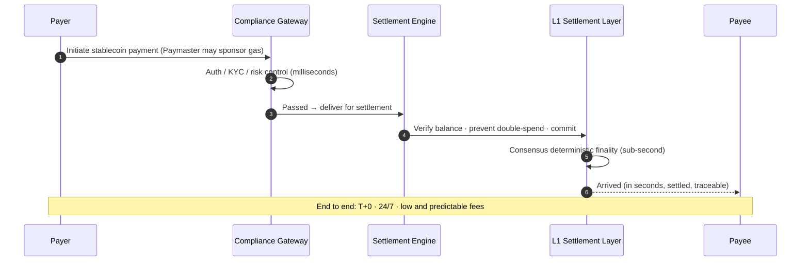

# 4.1 Instant Stablecoin Settlement Rail

## The Foundation Scenario

Among PayFi's four scenarios, the **instant stablecoin settlement rail is the foundation** — it produces the least flashy yield story, yet it carries everything else. The money market needs it to clear, cross-border needs it to arrive, AI agents need it to pay. Making this rail supremely deterministic and supremely smooth is the prerequisite for all of PayFi's value.

Its product promise can be distilled into three words: **T+0, 24/7, settlement in seconds.**

## Compared to Traditional Settlement

Put this rail side by side with traditional settlement, and the difference is plain:

| Dimension | Traditional Settlement (Wire / Card Networks) | AXON Stablecoin Settlement Rail |
| --- | --- | --- |
| Arrival time | T+1 to T+5 (slower cross-border) | **T+0, in seconds** |
| Uptime | Business days / bank hours | **24/7, no downtime** |
| Clearing method | Multi-hop correspondent-bank relay | **On-chain single-hop direct settlement** |
| Capital lockup | Large sums pre-funded in nostro accounts | **No pre-funding; capital instantly available** |
| Cost | Fixed fee + FX markup, opaque | **Low and predictable, transparent end to end** |
| Programmability | Barely programmable | **Natively programmable and composable** |
| Determinism | Depends on reconciliation, can err | **Deterministic finality, no double-spend** |

## The Journey of One Instant Settlement

This journey reuses all the foundation capabilities of [3.2 The Five-Layer Architecture](../part3-architecture/3-2-layered-architecture.md): compliance is completed at the gateway, determinism is guaranteed at the sequencing and consensus layers, and gas friction is removed by the Paymaster. **The settlement rail is not an isolated product but the first — and most fundamental — realization of the foundation's capabilities.**

## Why the "Foundation Scenario" Matters So Much

Product design has a plain truth: **the bottom-most capability must be the most reliable, because everything above rests on it.** If the settlement rail occasionally miscounts, occasionally delays, or occasionally sees fees spike, then the money market, credit, and AI-agent payments built on top all inherit that uncertainty.

So AXON's order is explicit (see [6.1 Roadmap](../part6-roadmap/6-1-roadmap.md)): **first polish the settlement rail's determinism to perfection** (the P0 testnet's goal is precisely to "eliminate miscounting / double-spends / exploitability"), then stack more complex PayFi scenarios on top. An unstable foundation holds up no tower.

## Whom It Carries

This rail serves a broad spectrum:

* **Individuals** — cross-border remittances, everyday payments;
* **Merchants** — acquiring settlement, instant arrival;
* **Enterprises** — B2B payments, supply-chain settlement;
* **AI agents** — machine-to-machine micro-payments (see [Part V](../part5-ai/README.md)).

Their reasons for paying differ, but what they need is the same: **a sum of money, moved fast, settled, and low-cost, from A to B.** That is the entire point of the instant stablecoin settlement rail.

---

*Further reading: [4.2 PayFi Money Market](4-2-money-market.md) · [4.3 Cross-Border B2B & Merchant Acquiring](4-3-crossborder-b2b.md)*
