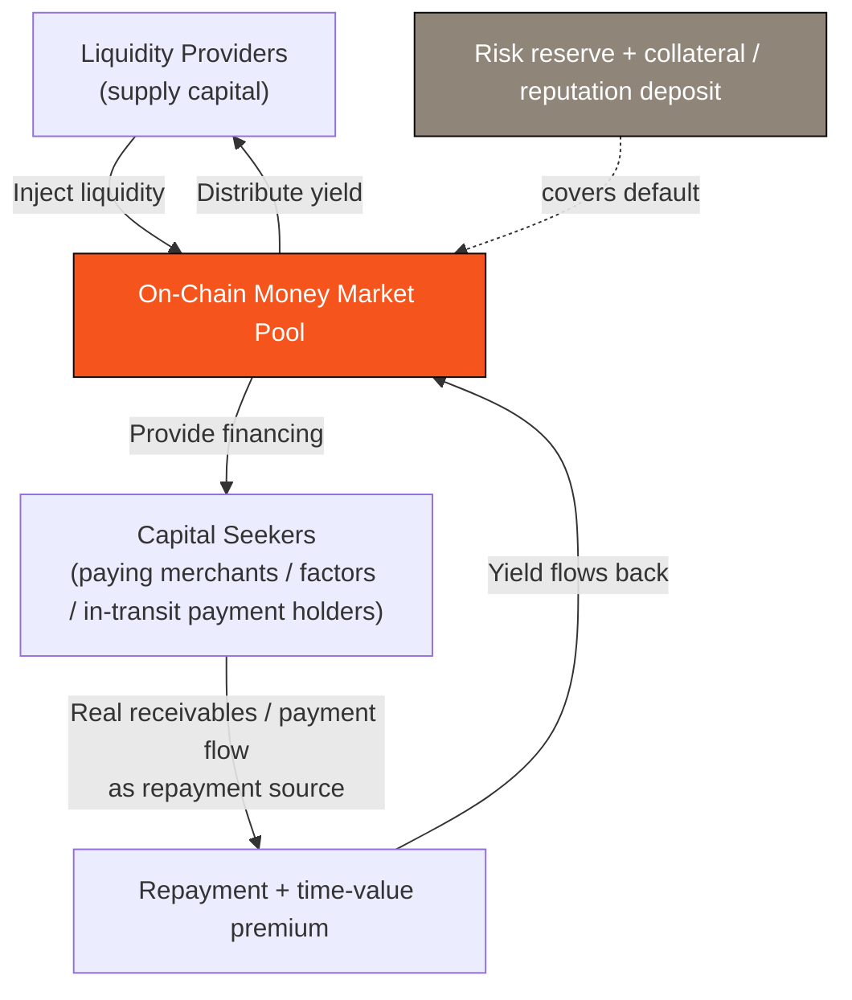

# 4.2 PayFi Money Market: Float & On-Chain Credit

## Where PayFi's Excess Yield Comes From

The settlement rail ([4.1](4-1-settlement-rail.md)) solved "how money flows fast and deterministically." But a payment network's real excess value hides in the **gaps** where money flows — the funds that have "already happened but are not yet cleared."

Think of these scenarios:

* A cross-border payment, in transit, takes several days to clear;
* A 30- or 60-day receivable, waiting for the buyer to pay;
* A credit-card purchase, with a pre-settlement float period before the merchant receives the money.

In these gaps, **funds sleep in the form of "in-transit funds, receivables, and float"** — they could have generated yield, but the inefficiency of the traditional system wastes them. **The PayFi money market wakes these sleeping funds and uses an on-chain money market to capture their time value.** This is precisely PayFi's source of excess yield over pure "transfers," and it is the model validated by [Huma](../part2-market/2-2-payfi-thesis.md) running $10B+ of real cash flow.

## A Bit of Financial Background: Receivables Financing & Working Capital

This logic is not an invention of the crypto world; it corresponds to an ancient and vast business in traditional finance — **receivables financing** and **working-capital financing**.

In reality, after shipping goods, a company often has to wait 30–90 days to receive payment. But the company cannot simply wait — it needs cash to buy raw materials, pay wages, and keep operating. So it finances the "receivable it will collect in the future": at a certain discount, it gets cash up front. This is the core of **factoring** and **trade finance**. The party providing capital for this stretch of "time" earns exactly the time value of money.

This is a mature, multi-trillion-dollar market, but it has long been monopolized by traditional financial institutions — cumbersome processes, high barriers, low transparency. **What the PayFi money market sets out to do is bring this business on-chain** — using an on-chain money market to price the time value along the payment path efficiently, transparently, and composably.

## The Money Market's Fund Flow (Design Model)

A PayFi money market is, in essence, matching "capital providers" and "capital seekers" on-chain:

* **Liquidity providers (LPs)** inject capital and earn yield from real payment flow;
* **The pool** matches supply and demand on-chain, transparently and auditably;
* **Capital seekers** use real receivables / payment flow as their repayment source to get cash up front;
* **Repayment** flows back to the pool carrying a time-value premium, distributed to LPs;
* **The risk reserve + collateral / reputation deposit** acts as the first buffer against default.

## Risk Control: The Mechanism's Line Between Life and Death

The success or failure of a credit business was never about "how to lend" but about "how to manage risk." The PayFi money market's risk framework (design direction) includes several lines of defense:

| Risk Layer | Design Direction |
| --- | --- |
| **Authenticity of repayment source** | Financing is bound to real receivables / payment flow, not credit conjured from nothing — self-liquidating cash flow is the first line of defense |
| **Collateral and reputation deposit** | Capital seekers / participating nodes lock a deposit, slashed for misbehavior (see the authorization-boundary approach in [3.7 Session Keys](../part3-architecture/3-7-account-abstraction.md)) |
| **Price-feed and valuation safety** | Resting on the multi-source validation and circuit breakers of [3.5](../part3-architecture/3-5-oracle-safety.md), preventing a bad valuation from triggering cascading liquidations |
| **Risk reserve** | A reserve provisioned at the chain layer, cushioning default losses |
| **Default waterfall** | An explicit order of repayment: deposit → reserve → absorbing losses tier by tier, protecting LP principal |

## Where the Yield Comes From: Sustainable Cash Flow

The **legitimacy** of the PayFi money market's yield is what fundamentally distinguishes it from a Ponzi structure. Its yield comes not from new entrants' capital but from **the real time value of money**:

* Capital seekers are willing to pay a premium for "getting cash up front" — and that premium is real commercial value;
* The pricing principle behind that premium is the time value of money (present value, discounting, float yield), which we lay out fully with financial formulas in [4.4](4-4-time-value-of-money.md);
* As long as the underlying is real payment flow and real receivables, the yield has a sustainable, real-world source.

**This is PayFi's most important quality: its yield is rooted in the cash flow of the real economy, not in a zero-sum game internal to crypto.** This is also why, in a market increasingly willing to pay only for real cash flow, the PayFi money market is AXON's most imaginative value engine.

---

*Further reading: [4.4 The Finance of the Time Value of Money](4-4-time-value-of-money.md) · [3.5 Stablecoins & Price Feeds](../part3-architecture/3-5-oracle-safety.md)*
