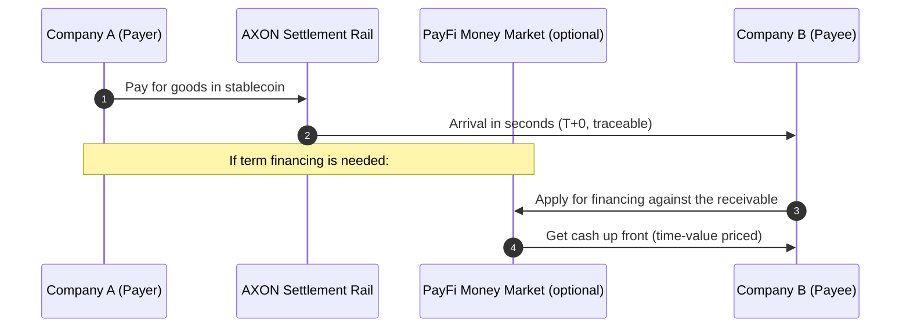

# 4.3 Cross-Border B2B & Merchant Acquiring

## Bringing PayFi into Real-World Commerce

The settlement rail is the foundation, the money market is the engine, and **cross-border B2B and merchant acquiring** is where PayFi truly reaches real-world commerce. This is the key scenario that brings "on-chain payment" out of the crypto world and into everyday business — SMEs' cross-border payments, merchants' daily acquiring, platforms' batch settlement.

## Scenario One: Cross-Border B2B Settlement

As described in [2.3](../part2-market/2-3-crossborder-pain.md), traditional cross-border B2B payments are dragged down by the correspondent-bank system — T+2 to T+5, layered fees, pre-funding lockup, opacity. For an SME in import/export, this means cash flow is chronically pinned in an "in-transit" state, with high financing costs.

AXON's stablecoin rail reconstructs this path into a single hop, direct:

* **Instant clearing** — the payment arrives in seconds, no longer pinned in multi-hop clearing;
* **Optional financing** — the payee can plug the receivable into the [PayFi money market](4-2-money-market.md) to get cash up front;
* **Transparent and traceable end to end** — every transaction is auditable, sharply cutting reconciliation cost.

What this means for SMEs is substantial: **cross-border is no longer a privilege of large enterprises — a single on-chain address is enough to plug into the global settlement network.**

## Scenario Two: Merchant Acquiring

Merchant acquiring brings payment to the "last mile" — the everyday scenario of a consumer paying and a merchant collecting. The traditional acquiring chain is long (consumer → issuing bank → card network → acquiring bank → merchant), with high fees and slow settlement (merchants often wait T+1 or longer to get their money).

AXON's merchant-acquiring approach (design direction) emphasizes:

| Capability | Value |
| --- | --- |
| **Instant settlement** | The merchant is paid the moment a transaction completes, improving cash flow |
| **Low and predictable fees** | Acquiring cost is transparent and controllable (see the predictable fee model in [3.3](../part3-architecture/3-3-consensus-finality.md)) |
| **Fiat on/off-ramp** | Merchants can smoothly convert between stablecoins and local fiat |
| **Paymaster smooth experience** | Consumers can pay without holding a gas token (see [3.7](../part3-architecture/3-7-account-abstraction.md)) |

## Fiat On/Off-Ramp: Connecting Two Worlds

Both cross-border and acquiring scenarios come down to one thing: **the bridge between fiat and stablecoins (on/off-ramp).** Merchants ultimately often need to convert stablecoins into local fiat to pay wages and taxes; consumers may need to buy stablecoins with fiat.

AXON's design treats the fiat on/off-ramp as a key part of the PayFi ecosystem — through compliant on/off-ramp partners, letting the stablecoin rail connect smoothly with the real world's fiat system. **Without a smooth fiat bridge, on-chain payment is just an island; with it, PayFi can truly embed into the bloodstream of real-world commerce.**

## Layered Value, Closing the Loop Here

At this point, the value stacking of PayFi's four scenarios closes the loop:

* **The settlement rail** ([4.1](4-1-settlement-rail.md)) provides the deterministic payment track;
* **The money market** ([4.2](4-2-money-market.md)) captures time value and provides financing;
* **Cross-border B2B and merchant acquiring** (this section) brings it all into real commercial transactions;
* And **AI-agent payments** ([Part V](../part5-ai/README.md)) become the way of paying in the machine age, running through them all.

One rail as the foundation, four scenarios stacking value on top — this is the full picture of the PayFi engine.

---

*Further reading: [4.4 The Finance of the Time Value of Money](4-4-time-value-of-money.md) · [Part V · AI-Native](../part5-ai/README.md)*
