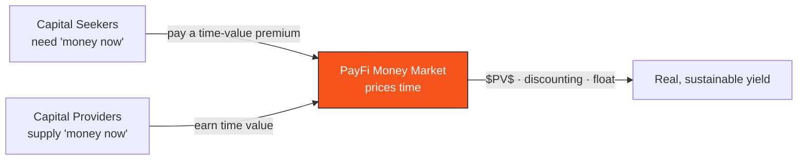

# 4.4 The Finance of the Time Value of Money

PayFi's core proposition is "bringing the time value of money on-chain." In this section, we lay that "time value" out fully — it is finance's oldest first principle, and the source of legitimacy for all of PayFi's yield.

## First Principle: A Dollar Today Is Worth More Than a Dollar Tomorrow

> **The time value of money (TVM): the same sum of money is more valuable the earlier you own it.**

Why? Because **a dollar today can be put to use immediately** — deposited to earn interest, invested in operations, used to repay debt. A dollar tomorrow costs you all the value it could have created during that wait. This "cost of waiting" is exactly what the interest rate $r$ measures.

All of modern finance — interest, discounting, financing, factoring — is at bottom the pricing of "time." PayFi simply takes this pricing process out of the black box of traditional financial institutions and moves it onto a transparent, efficient, composable chain.

## Present Value and Future Value

TVM's two most basic formulas are **Future Value** and **Present Value**.

A sum with present value $PV$, at interest rate $r$ over $n$ periods, has a future value of:

$$FV = PV \times (1 + r)^n$$

Conversely, an $FV$ receivable only after $n$ periods — what is it worth discounted to today? This is **discounting**:

$$PV = \frac{FV}{(1 + r)^n}$$

This simple formula is the pricing cornerstone of the PayFi money market. A receivable maturing in $n$ periods with face value $FV$ has a fair price today of exactly $PV$ — the difference between the two, $FV - PV$, is precisely the **time-value return the capital provider deserves for "paying up front."**

**Example**: a receivable maturing in 90 days with a face value of 10,000 USDC, at an annualized discount rate of 8%, gives

$$PV = \frac{10{,}000}{(1 + 0.08)^{90/365}} \approx 9{,}812 \text{ USDC}$$

The capital provider pays about 9,812 USDC today and collects 10,000 USDC in 90 days — the roughly 188 USDC difference is the price of that stretch of time value.

## Discounting: Pricing Receivables Financing

In trade-finance practice, a more direct **discount** pricing is common — deducting from face value by the product of a discount rate and a time proportion:

$$P_{\text{discount}} = FV \times \left(1 - d \cdot \frac{t}{360}\right)$$

where $d$ is the annualized discount rate and $t$ is the number of days to maturity (by traditional convention, a year is often taken as 360 days). This is the classic formula by which a factor quotes a receivable — it packages "time" and "credit risk" together into $d$.

The PayFi money market brings this pricing process on-chain: transparent pricing, composable capital, and auditable risk replace the black box and high barriers of traditional factoring.

## The Economics of Float

Another important form of TVM is **float** — the funds that are "already in your hands but not yet yours, not yet cleared." Float exists before credit-card settlement, while a payment is in transit, and between a prepayment and delivery.

A float of size $\Phi$, put to use at an annualized yield $r$ for $t$ days, generates:

$$Y_{\text{float}} = \Phi \times r \times \frac{t}{365}$$

The power of float economics lies in **scale and turnover**: a single unit of float may last only briefly and earn a modest rate, but when a payment network carries a vast, continuously turning flow of payments, the scale of $\Phi$ and the frequency of turnover let $Y_{\text{float}}$ accumulate into considerable value. This is precisely a long-underestimated source of profit for the traditional payment giants — **and in the traditional system, most of this value is stranded and wasted in nostro pre-funded accounts** (see [2.3](../part2-market/2-3-crossborder-pain.md)).

What the PayFi money market sets out to do is recapture this wasted float value with an on-chain money market and distribute it transparently.

## Time Arbitrage: The Essence of Trade Finance

Put these together, and the commercial essence of the PayFi money market becomes clear — it performs a kind of **time arbitrage**:

* On one side are **capital seekers in urgent need of cash** (companies awaiting payment terms after shipping, holders of in-transit payments) — willing to pay a time-value premium for "getting the money up front";
* On the other side are **capital providers seeking yield** — supplying liquidity and earning that time value;
* The PayFi money market matches the two sides on-chain, using those ancient formulas — $PV$, discounting, float — to price "time," transparently, efficiently, and composably.

## Closing: Why This Matters

Once you understand TVM, you understand the fundamental difference between PayFi and a Ponzi structure: **PayFi's yield is not conjured from nothing — it is the fair consideration paid for something real and valuable: "making funds available ahead of time."** As long as the underlying is real payment flow and real receivables, this yield is rooted in the real economy — sustainable, explainable, and able to withstand scrutiny.

This is the full weight of the phrase "bringing the time value of money on-chain."

---

*Further reading: [4.2 PayFi Money Market](4-2-money-market.md) · [Part V · AI-Native](../part5-ai/README.md)*
