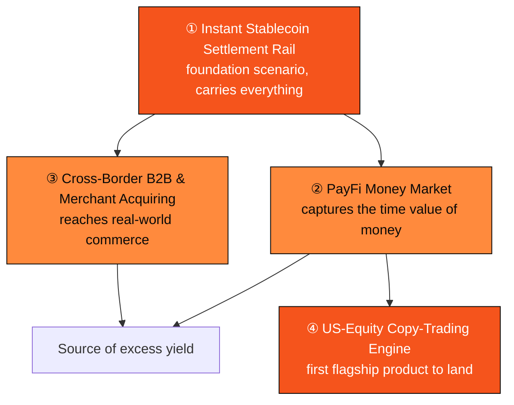

# Part IV · The PayFi Engine

> One payment rail as the foundation; four scenarios stacking value on top.

Part III built the foundation. This part shows the business that grows on top of it: **PayFi's four scenarios.**

These four scenarios are not four parallel features but a **layered value structure** — at the bottom is the settlement rail, which carries everything; on top of it stacks the money market, capturing time value; then cross-border and merchant scenarios, reaching real-world commerce; and AI-agent payments (Part V) run through them all, becoming the way of paying in the machine age.

The chapter map for this part:

* **4.1** Instant Stablecoin Settlement Rail — the foundation scenario that carries everything.
* **4.2** PayFi Money Market — float and on-chain credit, PayFi's source of excess yield.
* **4.3** Cross-Border B2B & Merchant Acquiring — bringing PayFi to real-world commerce.
* **4.4** The Finance of the Time Value of Money — the financial first principle underpinning it all.
* **4.5** The US-Equity Copy-Trading Engine — the first PayFi flagship to land, turning the above capabilities into a product.
