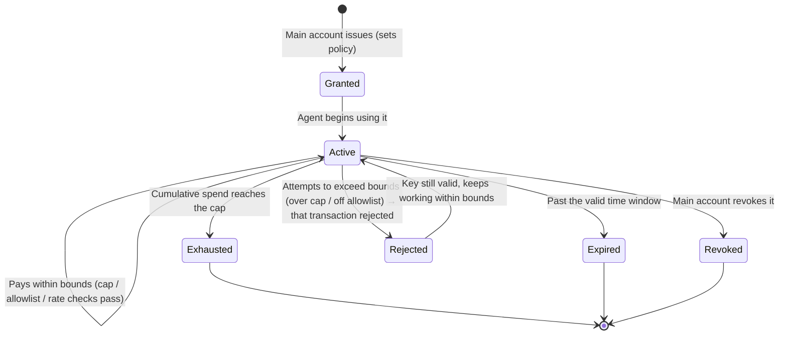

# 5.2 Controlled Payment Execution

## A one-sentence definition

> **Controlled Payment Execution: account abstraction + session keys + verifiable payment policy + spending cap / time limit / allowlist / revocable authorization — so that AI agents "can pay, can't run off, can't overspend."**

This is AXON's complete answer to the difficulty in [5.1](5-1-agentic-payments.md). It is not a feature but an authorization system built on top of the [3.7 foundational primitives](../part3-architecture/3-7-account-abstraction.md).

## The authorization model: giving AI a "restricted key"

The core idea is intuitive: **do not hand the main account's private key to the AI — instead, issue it a session key with strict boundaries.** This key precisely defines "what this agent can and cannot do":

```javascript
// Illustrative pseudocode: issuing a restricted session key to an AI agent
grantSessionKey({
  agent:      "agent://travel-booker",         // who is authorized
  policy: {
    maxSpend:  { amount: 200, asset: "USDC" },  // total cap: at most 200 USDC
    perTxCap:  { amount: 50,  asset: "USDC" },  // per-transaction cap: 50 USDC
    window:    { from: now, to: now + 24*3600 },// time limit: valid for 24 hours
    allowlist: [ "merchant://airlines",         // allowlist: can only pay these parties
                 "merchant://hotels" ],
    rateLimit: { maxTxPerHour: 10 },            // rate limit: guards against runaway loops
  },
  revocable:  true,                             // revocable at any time
  auditable:  true,                             // every transaction is traceable
})
```

Behind this key are five constraints that together form the "bridle" on AI spending:

| Constraint | Function | Risk it stops |
| --- | --- | --- |
| **Spending cap (maxSpend / perTxCap)** | Total and per-transaction limits | Runaway bugs, manipulated large transfers |
| **Time limit (window)** | Valid time window | Expired keys being reused |
| **Allowlist (allowlist)** | Can only pay designated parties | Money paid to an attacker's account |
| **Rate limit (rateLimit)** | Cap on transactions per unit time | Loop bugs paying repeatedly |
| **Revocable (revocable)** | Revoke at any time, effective immediately | Stopping losses after an agent is hijacked |

The key point: **these constraints are enforced at the chain layer, not left to the agent's discretion.** Even if the agent is fully compromised, the maximum loss an attacker can inflict is locked tightly within the boundary of this key. That is the technical meaning of "can't overspend, can't run off."

## The lifecycle of a session key

From issuance to expiry, a session key travels through a strict state machine:



Note the cleverness of the `Rejected` state: when the agent attempts an out-of-bounds payment (say, over the cap, or to a party outside the allowlist), **that payment is rejected, but the key itself remains valid** — the agent can keep working normally within bounds. Crossing a boundary does not paralyze the agent; it only blocks that one dangerous action. This is precisely the "controlled" design, not the "all-or-nothing" one.

## The full sequence of an authorized payment

Stringing the mechanism together, an AI agent's authorized payment looks like this:

```mermaid
sequenceDiagram
    autonumber
    participant O as User (authorizer)
    participant A as AI agent
    participant K as Session key (chain-layer policy)
    participant L as L1 settlement layer
    O->>K: Issue session key (cap 200 / allowlist / 24h)
    A->>K: Request payment of 40 USDC to airlines (on allowlist)
    K->>K: Check: cap ✓ allowlist ✓ time ✓ rate ✓
    K->>L: Passed → execute payment
    L-->>A: Payment succeeded (160 remaining)
    A->>K: Request payment of 500 USDC to unknown (out of bounds!)
    K-->>A: Rejected (over per-tx cap + off allowlist)
    Note over A,K: That transaction is blocked; key still valid
    O->>K: Task done, actively revoke key
    K-->>O: Revoked, effective immediately
```

## Verifiable payment policy and misconduct slashing

On top of session keys, AXON adds two more layers of hardening:

* **Verifiable payment policy sandbox (WASM)** — more complex payment logic (such as "only pay if a certain condition holds") can be written as a policy and executed in a **verifiable sandbox environment** (see [3.2](../part3-architecture/3-2-layered-architecture.md), Layer ⑤). The policy is deterministic and auditable — you can prove the agent will only act according to the stated policy.
* **Reputation bonds and slashing** — participants carrying higher responsibility (such as PayFi nodes, liquidity providers, or even high-privilege agents) can be required to lock a reputation bond; once they act maliciously or default, the bond is slashed. This extends "behavioral constraint" from a "technical boundary" to an "economic incentive."

## The weight of this design

Returning to the three sub-problems from [5.1](5-1-agentic-payments.md), controlled payment execution gives a complete answer:

* **Authorization** → session keys provide a "bounded" payment authority, not "all-or-nothing";
* **Safety** → caps / allowlists / rate limits are enforced at the chain layer, so compromising the agent still cannot breach the boundary;
* **Control** → revocable at any time, with every transaction auditable and traceable.

**This is the true meaning of "AI-native" — not adding an AI feature to the chain, but making the chain's authorization model assume, from the foundation up, that the payer may be a machine that needs to be constrained.**

---

*Further reading: [5.3 x402 & M2M Micro-Payments](5-3-x402-m2m.md) · [5.4 An Honest Positioning for AI](5-4-honest-ai.md)*
