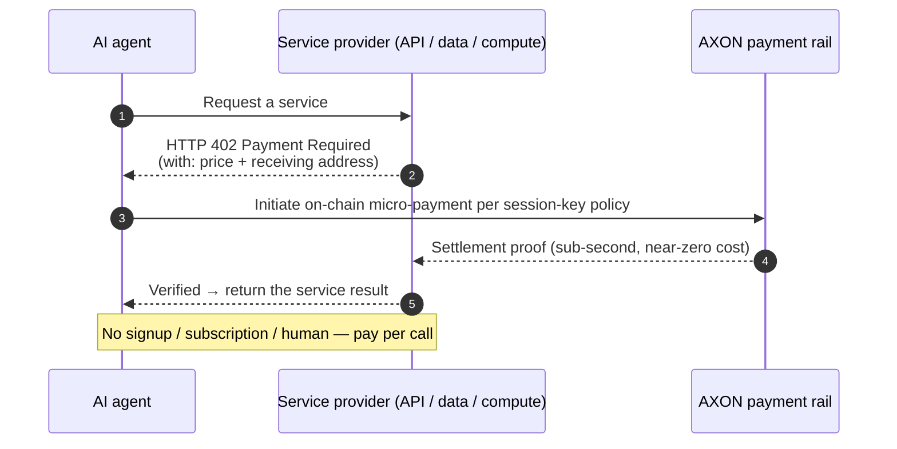

# 5.3 x402 & M2M Micro-Payments

## The machine economy needs a new form of payment

[5.2](5-2-controlled-execution.md) solved "how to safely authorize AI to spend." This section solves another problem: **between machines, how exactly does money move?**

Human payments and machine payments are two entirely different forms:

| Dimension | Human payment | Machine-to-machine (M2M) payment |
| --- | --- | --- |
| Frequency | Low (a few per day) | Extremely high (hundreds or thousands per task) |
| Amount | Relatively large | Extremely tiny (a fraction of a cent) |
| Trigger | Manual click to confirm | Program-driven, automatic, on demand |
| Cost tolerance | A few cents in fees is acceptable | Fees must approach zero |

What the machine economy needs is a form of payment that is **high-frequency, micro-sized, automatic, and near-zero-cost**. And the interface to carry it happens to be an old protocol that has slept for thirty years.

## x402: bringing HTTP 402 back to life

The HTTP protocol contains a status code that has almost never been used — **`402 Payment Required`**. It was defined back in the 1990s, reserved for "pay-per-use access to network resources," yet lay dormant for years because no usable micro-payment mechanism existed at the time.

**x402** is the protocol that brings this status code back to life. Its logic is elegant and simple:

* The service returns `402` to a request, attaching a price and a receiving address;
* The agent, within the policy bounds of its session key (see [5.2](5-2-controlled-execution.md)), initiates an on-chain micro-payment;
* The service verifies receipt and returns the result.

The whole process requires **no account signup, no subscription, no human intervention** — the service truly achieves "pay per call," settling machine-to-machine directly.

## Why this needs a chain like AXON

The idea of x402 is beautiful, but it places demanding requirements on the underlying chain — and those requirements happen to be AXON's design targets:



**The economics of micro-payments cannot tolerate high gas.**

If an API call is worth only 0.01 cents, but the on-chain fee is 5 cents, the "pay per call" model simply doesn't hold. AXON's **sub-cent fee target** (see [3.3](../part3-architecture/3-3-consensus-finality.md)) exists precisely to make M2M micro-payments economically viable.



**Machine payments come in enormous volume.**

An agent completing one task may trigger hundreds or thousands of paid calls; ten million agents running concurrently is an astronomical payment volume. AXON's **>10,000 TPS design target** is built to carry this machine-scale traffic.



**Machine payments must be bounded.**

High-frequency automatic payments without bounds mean one bug can burn through the balance. Every x402 micro-payment executes under AXON's session-key **cap / rate / allowlist** constraints (see [5.2](5-2-controlled-execution.md)) — the precondition for M2M payment safety.



**Agents shouldn't manage a gas balance.**

An agent focused on completing a task shouldn't also have to maintain a balance of a native gas token. AXON's **Paymaster fee sponsorship** (see [3.7](../part3-architecture/3-7-account-abstraction.md)) lets the agent care only about the stablecoin it wants to pay, while gas is sponsored by a third party.



**Near-zero cost, high throughput, safe authorization, gas abstraction** — a general-purpose chain cannot satisfy these four requirements simultaneously, yet they are exactly the targets AXON anchored on from its foundational design. This is why "agentic payments" is not a feature you can bolt on, but a foundational property of the chain.

## The space of possibility M2M micro-payments open up

Once machines can pay each other safely and at near-zero cost, an entirely new economic layer opens up:

* **Compute billed by the second** — AI agents rent compute by actual usage, rather than monthly subscription;
* **Data paid for per item** — an agent pays for each piece of data it actually reads;
* **APIs settled per call** — services need not build complex billing systems; settlement happens on-chain directly;
* **Agents hiring agents** — one agent outsources a subtask to another and pays for the result.

This is an economy where **machines serve machines and settle instantly** — the embryo of agentic commerce. What AXON aims to become is precisely the **settlement layer** of this machine economy.

---

*Further reading: [5.4 An Honest Positioning for AI](5-4-honest-ai.md) · [3.3 Consensus, Sub-Second Finality & Performance Targets](../part3-architecture/3-3-consensus-finality.md)*
