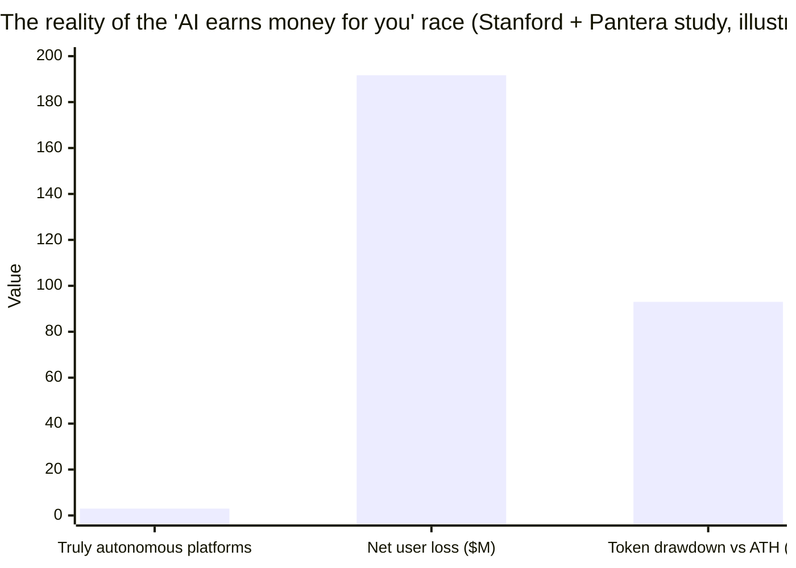

# 5.4 An Honest Positioning for AI

## A deliberate choice

In this wave where AI and crypto converge, the loudest narrative is "**AI earns money for you**" — AI traders, AI advisors, smart agents that auto-generate yield. These stories are exciting, raise capital ferociously, and send tokens soaring.

AXON deliberately **does not** take this path. Our positioning of AI has always been restrained: **we don't lead with "AI that earns money for you" — we safely plug AI into payments.** This is not conservatism, but an evidence-based judgment — because the story of "AI earns money for you" has just been shattered against reality.

## The hard reality: a sobering study

A study by Stanford and Pantera scanned **11 AI-trading-agent platforms and roughly 925,000 wallets**, and its conclusions are startling:

| Finding | Data |
| --- | --- |
| Platforms that truly achieved autonomous execution | **Only 3 / 11** (most were "AI" in name only) |
| Aggregate net user losses | **~$191.7M ($191.7 million)** |
| Average drawdown of the related tokens from their all-time highs | **~−93%** |

The researchers' summary cuts to the bone:

> *"the infrastructure needed for AI agents to trade effectively simply does not exist yet."*

## What this lesson teaches us

This study is not meant to negate the combination of AI and crypto — on the contrary, it pinpoints **where the problem lies**, and in doing so illuminates the right direction:

* **The problem is not "AI isn't smart enough," but "the infrastructure doesn't exist yet."** Most "AI trading" projects peddle promises exceeding what the technology can truly deliver today — selling "AI will earn money for you" as the pitch, with users ultimately footing the bill in losses.
* **What is truly missing is the foundation that lets AI interact with money safely.** Authorization, boundaries, revocability, auditability — this "boring but critical" infrastructure is the real bottleneck for combining AI with finance.

**AXON chooses to build that "missing infrastructure" rather than to peddle that "nonexistent promise."**

## Why "controlled payment execution" holds up better under scrutiny

Place the two paths side by side and the difference speaks for itself:

| | The "AI earns money for you" path | AXON's "controlled payment execution" path |
| --- | --- | --- |
| **Core promise** | AI will make you a profit | AI can safely pay on your behalf |
| **Dependency** | AI's prediction / decision ability (not yet reliable) | Authorization and boundaries (deterministic, verifiable) |
| **Where risk lands** | The user bears the losses of AI's mistaken decisions | Losses are locked within the authorization boundary |
| **Provability** | Hard to prove it "will earn money" | Provable that it "can't overspend, can't run off" |
| **Does it hold up under scrutiny?** | Already falsified by reality | Built on deterministic engineering |

The reason AXON's positioning "holds up better under scrutiny" is that it **makes no unfulfillable promises about AI's capabilities**. We don't guarantee that AI will make good decisions — that is unreliable; what we guarantee is: **whatever decision the AI makes, its spending behavior stays within the boundary you set and the chain layer enforces.** This is a deterministic, verifiable, engineering-achievable promise.

## Closing: a more long-termist path

In a race saturated with over-promising, restraint is itself a differentiator. AXON's positioning of AI — **controlled payment execution** — may not be the sexiest story, but it is:

* **Real** — built on deterministic foundational capabilities like session keys and capped authorization;
* **Safe** — folding the catastrophe surface of AI moving money into controllable, revocable, auditable boundaries;
* **Long-term** — when the AI-agent economy truly arrives, what it needs is precisely such a trustworthy settlement layer.

> We don't build "AI that earns money" — we build "an AI payment layer that can be trusted to be authorized to spend." This is AXON's honest positioning for AI.

---

*Further reading: [Part VI · Roadmap & Governance](../part6-roadmap/README.md) · [5.2 Controlled Payment Execution](5-2-controlled-execution.md)*
