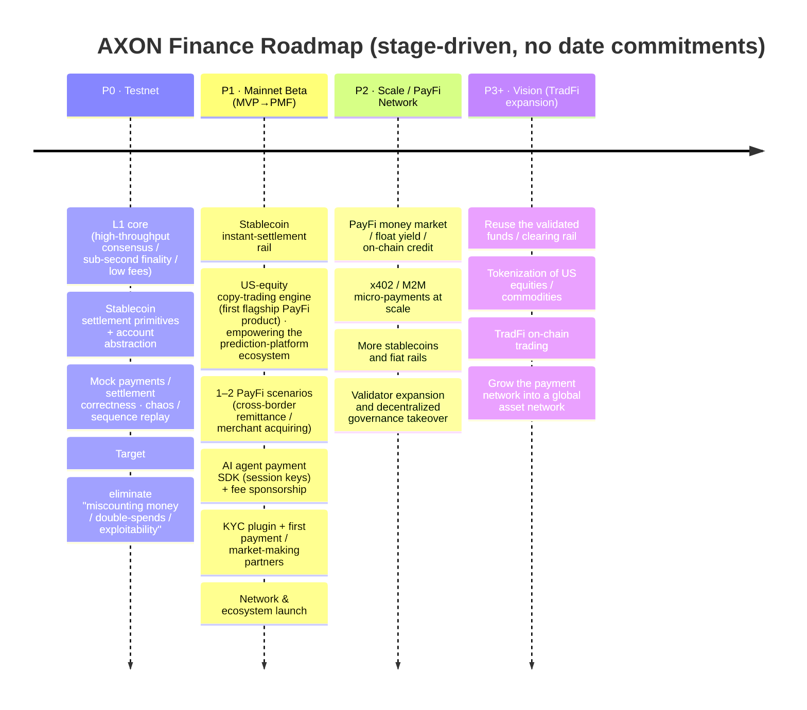

# 6.1 Roadmap P0 → P3+

AXON's roadmap divides into four stages, mapping to the three-phase evolutionary arc of [1.1](../part1-vision/1-1-thesis.md) — first get the foundation and settlement rail running, then grow into a PayFi network, and finally extend into a global asset network. **Each stage has independent exit value.**

## The four-stage panorama

## Stage-by-stage reading

### P0 · Testnet — polishing determinism to the extreme

The goal of the first stage is not flashy features, but **the determinism of the foundation**. It delivers the L1 core (high-throughput consensus, sub-second finality, low fees), stablecoin settlement primitives, and account abstraction, and through mock-payment / settlement-correctness tests, chaos engineering, and sequence-replay drills, it hammers on one thing over and over:

> **Eliminate "miscounting money / double-spends / exploitability."**

This is of a piece with [3.4 Payment Finality](../part3-architecture/3-4-payment-finality.md) — if the foundation is unstable, everything after it is a castle in the air. **Exit value**: a payment L1 whose determinism has been validated.

### P1 · Mainnet Beta — from MVP to PMF

The second stage cashes the foundation into a usable product, with the goal of moving from minimum viable (MVP) to product-market fit (PMF):

* **Stablecoin instant-settlement rail** goes live ([4.1](../part4-payfi/4-1-settlement-rail.md));
* **US-equity copy-trading engine** goes live — AXON's **first flagship PayFi product**, empowering the ecosystem of prediction platforms such as Polymarket, Kalshi, and Kairos, using deterministic stablecoin yield to convert external traffic into real TVL and addresses ([4.5](../part4-payfi/4-5-copy-trading-engine.md));
* **1–2 PayFi scenarios** land (cross-border remittance / merchant acquiring, [4.3](../part4-payfi/4-3-crossborder-b2b.md));
* **AI agent payment SDK** (session keys) + fee sponsorship ([5.2](../part5-ai/5-2-controlled-execution.md), [3.7](../part3-architecture/3-7-account-abstraction.md));
* **KYC plugin** + first payment / market-making partners;
* **Network & ecosystem launch** ([Season 1 · Ecosystem Open Program](6-4-ecosystem-season.md)).

**Exit value**: a PayFi mainnet with real users and real payment flow.

> **Product priority**: the copy-trading engine is AXON's **first GTM wedge product** in the PayFi direction — rather than rolling out every scenario at once, it first proves out the "foundation-first, product-wedge" strategy through a single incision whose traffic, yield, and closed loop can all be truly validated. Logically it lands in P1 (the first flagship launch) and scales up in P2 as the PayFi network grows.

### P2 · Scale / PayFi Network — opening the engine fully

The third stage expands PayFi from "a few scenarios" into "a network":

* **PayFi money market / float yield / on-chain credit** at scale ([4.2](../part4-payfi/4-2-money-market.md));
* **x402 / M2M micro-payments** at scale ([5.3](../part5-ai/5-3-x402-m2m.md));
* Onboard **more stablecoins and fiat rails**;
* **Validator expansion, decentralized governance takeover** ([6.2](6-2-governance.md)).

**Exit value**: a self-reinforcing PayFi network, with governance beginning to decentralize.

### P3+ · Vision — from payment network to asset network

Last comes the long-range vision: on top of a payment / clearing rail validated by real business, extend the network into the broader world of assets — **tokenization of US equities / commodities, TradFi on-chain trading**. Reuse the validated funds and clearing rail to grow the payment network into a **global asset network**.

## Why stages, not dates

The attentive reader will notice that this roadmap has **only stages, no specific calendar dates**. This is a deliberate choice:

* An L1 built from the foundation up has progress that depends on many variables — determinism validation, compliance progress, ecosystem maturity — and **date commitments precise to the quarter are often unrealistic, even misleading**;
* We prefer to measure progress by "the exit value of each stage" — **what was accomplished, not what day it was reached**;
* The stage-based division gives the team room to advance honestly, and gives readers a clear yardstick for judging progress.

**L1 + PayFi first, TradFi as the long-range vision** — this ordering says more about AXON's priorities than any date could.

---

*Further reading: [6.2 Governance Framework](6-2-governance.md) · [1.1 Core Thesis](../part1-vision/1-1-thesis.md)*
