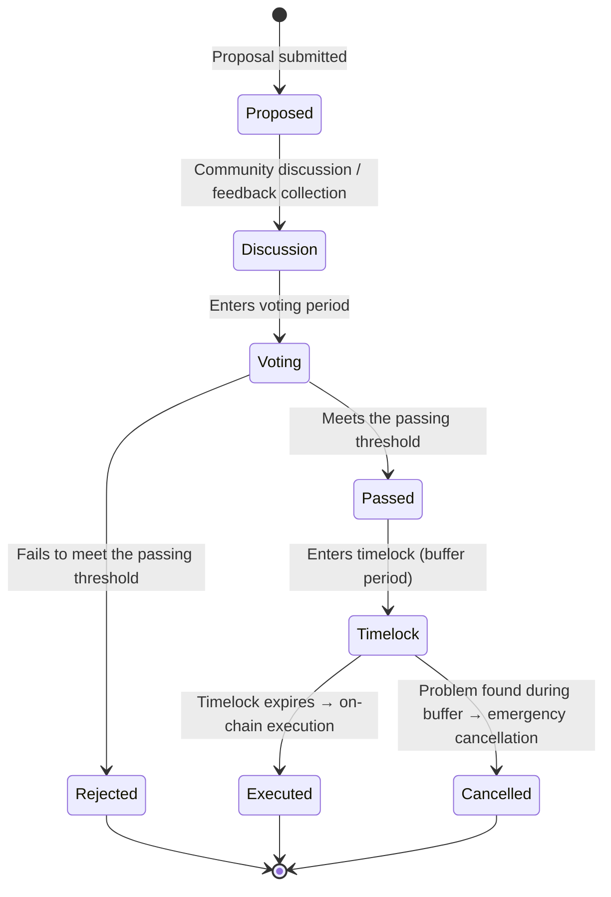
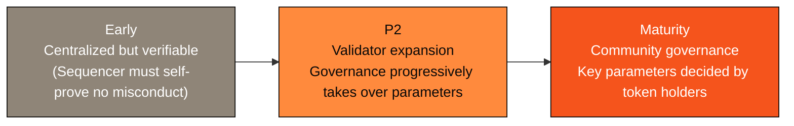

# 6.2 Governance Framework

## The realism of governance

Decentralization is not a switch but a journey. Many projects swing between the ideal of "fully decentralized on day one" and the reality of "centralized forever." AXON chooses a **pragmatic, gradual path**:

> **First replace trust with verifiability, then dissolve trust with decentralization.**

In the network's early days, for the sake of performance and rapid iteration, the sequencer and some key roles may be relatively centralized — but even so, they must continuously provide verifiable evidence (see [3.4](../part3-architecture/3-4-payment-finality.md)). As the network matures (the P2 stage of [6.1](6-1-roadmap.md)), the validator set expands and governance is progressively handed over to the community.

## The objects of governance

What a PayFi chain needs to govern are the **protocol parameters and decisions** that affect network operation and user interests:

| Governance object | Description |
| --- | --- |
| **Fee parameters** | The fee structure for payments / settlement / credit |
| **Payment parameters** | Settlement rules, limits, risk-control thresholds, etc. |
| **Credit parameters** | Risk control, reserves, and liquidation rules for the PayFi money market ([4.2](../part4-payfi/4-2-money-market.md)) |
| **Compliance policy** | Policy configuration of the pluggable compliance gateway ([3.6](../part3-architecture/3-6-compliance-gateway.md)) |
| **Validators & network** | Validator admission, cadence of decentralization |
| **Treasury & ecosystem** | The direction of ecosystem resource allocation |

## The lifecycle of a governance proposal

A healthy governance mechanism needs a clear, predictable process with safety valves. AXON's governance lifecycle (design direction) looks like this:

This process has two key designs:

* **Discussion first** — a proposal goes through open discussion and feedback collection before voting, avoiding hasty decisions;
* **Timelock** — even a passed proposal does not take effect immediately, but enters a buffer period. This gives all stakeholders a chance to review, prepare, and even cancel it in an emergency if a serious problem is found. **The timelock is governance's safety valve** — it prevents a malicious or erroneous proposal from causing irreversible damage the instant it passes.

## The path of progressive decentralization

AXON's decentralization does not happen in one step, but advances gradually along the roadmap:

* **Early**: centralized but verifiable — building credibility through verifiability;
* **P2**: the validator set expands, and governance begins to take over protocol parameters;
* **Maturity**: key parameters are decided by community governance, and the network truly becomes public infrastructure.

The philosophy of this path is **honesty**: we don't pretend to be "fully decentralized on day one," nor do we settle for "centralized forever." **Decentralization is a promise to be fulfilled, not an opening line.**

---

*Further reading: [6.3 Team & Resource Network](6-3-team-partners.md) · [3.4 Payment Finality & Double-Spend Prevention](../part3-architecture/3-4-payment-finality.md)*
