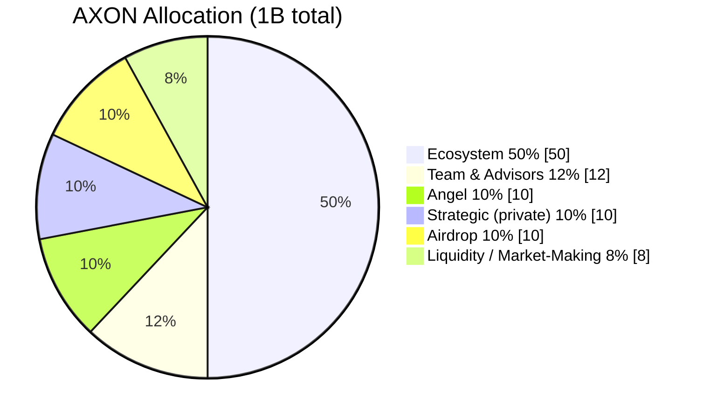

# 7.1 Supply & Allocation

## Base parameters

| Parameter | Value |
| --- | --- |
| Token symbol | **AXON** |
| Total supply | **1 billion** (1,000,000,000) |
| TGE float | **4%** (40M) |
| Value capture | Fee revenue buys back and burns (see [7.3](7-3-utility-flywheel.md)) |

AXON adopts a fixed total supply of 1 billion (initial price and FDV are not disclosed at this time). At TGE (Token Generation Event), only **4%** is released into circulation, with the rest released linearly per each bucket's vesting rules (see [7.2 Vesting & Circulating Supply](7-2-vesting-circulation.md)).

## The six-bucket allocation

The 1 billion total is allocated across six buckets, summing to 100%:

| Bucket | Share | Amount | Vesting |
| --- | --- | --- | --- |
| **Ecosystem** | **50%** | 500M | TGE 3% + 60-month linear (governance-controlled) |
| **Team & Advisors** | **12%** | 120M | 1-year lock + 3-year linear |
| **Angel** | **10%** | 100M | 2-year lock + 3-year linear (5 years total) |
| **Strategic (private)** | **10%** | 100M | 12-month cliff + 24-month linear |
| **Airdrop** | **10%** | 100M | TGE 25% + quarterly linear (anti-sybil) |
| **Liquidity / Market-Making** | **8%** | 80M | 6-month lock, listing liquidity / market-making reserve |

The **Ecosystem bucket (50%)** is the largest, used for the AI-agent / PayFi ecosystem, liquidity incentives, and the ecosystem fund, released under governance control. It is the funding source for the project-team token incentives of the [6.4 Season 1 · Ecosystem Open Program](../part6-roadmap/6-4-ecosystem-season.md), as well as for various ecosystem building.

> **Disclosure scope**: the Ecosystem bucket is disclosed as a **single aggregate bucket (50%)**; a further breakdown of its internal uses and a more granular release schedule will be disclosed separately at TGE / exchange listing.

## Fundraising rounds (compliance scope)

The fundraising-related buckets follow a compliance design of fixed subscription price and per-round lockup — **each round is a fixed subscription price, with no promise of secondary-market price or returns**:

| Round | Scope |
| --- | --- |
| **Angel** | 10% · 2-year lock + 3-year linear, binding the earliest long-term supporters |
| **Strategic (private)** | 10% · 12-month cliff + 24-month linear, strategic institutional placement |
| **Liquidity / Market-Making** | 8% · 6-month lock, used for listing liquidity and market-making |
| **Airdrop** | 10% · for active stablecoin users / payment merchants / AI-agent developers, anti-sybil |

For the institutional and market-making resource network, see [6.3 Team & Resource Network](../part6-roadmap/6-3-team-partners.md); for the list of token utilities, see [7.3](7-3-utility-flywheel.md).

---

*Next: [7.2 Vesting & Circulating Supply](7-2-vesting-circulation.md)*
