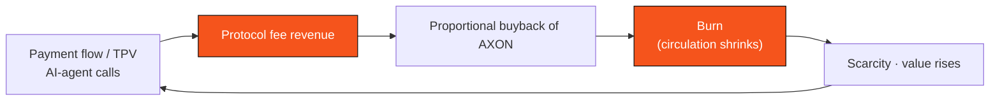

# 7.3 Token Utility & the Deflationary Flywheel

## AXON's six utilities

AXON is not a pure-governance or pure-incentive token; it carries six real functions within the network:

1. **Gas / compute** — pays the fees for network transactions and compute ([F.1 Gas & Fee Market](../yellowpaper/f1-gas-fees.md)).
2. **Staking & governance** — validators stake as a security bond, and token holders participate in governance ([6.2 Governance Framework](../part6-roadmap/6-2-governance.md), [F.2 Staking & Slashing](../yellowpaper/f2-staking-slashing.md)).
3. **Settlement / reputation bond** — serves as the settlement and reputation-guarantee bond in PayFi scenarios.
4. **Fee discount** — paying with AXON earns a fee discount, creating usage demand.
5. **Risk-reserve backing** — serves as one of the risk backstops for the money market and copy-trading reserve pool.
6. **Buyback-and-burn sink** — protocol fee revenue buys back AXON and burns it, forming the token's deflationary sink.

## The deflationary flywheel: revenue is deflation

AXON's value capture does not rely on inflationary subsidies, but on a **deflationary flywheel driven by real business**:

Payment flow / TPV / AI-agent calls → protocol fee revenue → proportional buyback of AXON → burn (circulation shrinks) → scarcity, value rises. **It mints the growth of the network's real business into token value, rather than relying on inflationary subsidies.** For the payment scenarios it depends on, see [Part IV · The PayFi Engine](../part4-payfi/README.md).

## The interface with the copy-trading engine

The [4.5 US-Equity Copy-Trading Engine](../part4-payfi/4-5-copy-trading-engine.md) is a direct entry point to this flywheel: the engine takes a proportional cut of user yield, and this capital is injected into the AXON reserve pool — part of it enters the buyback-and-burn flywheel along with protocol fees, supporting liquidity and token price; part of it replenishes the on-chain copy-trading reserve pool, backstopping the "principal-protected floor." Every real trade both gives users deterministic yield and settles value back into the L1.

This is the closed loop of AXON's tokenomics: **real payment and trading business → real protocol revenue → buyback-and-burn → token scarcity → network value.**

---

*Previous: [7.2 Vesting & Circulating Supply](7-2-vesting-circulation.md) · Further reading: [3.1 Why a Purpose-Built L1](../part3-architecture/3-1-why-own-l1.md)*
