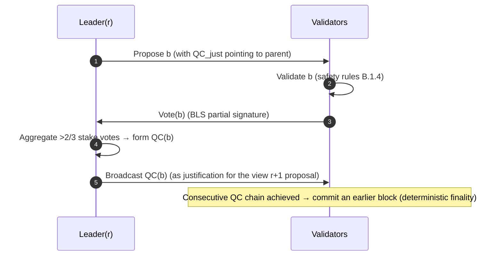

# B.1 BFT PoS Consensus Protocol

> **Design status**: proposed design. AXON adopts a HotStuff-style pipelined BFT; specific parameters (timeouts, pipeline depth) await testnet benchmarking.

## B.1.1 Why BFT Rather Than Longest-Chain

Payments require **deterministic finality** ([A.1.4](a1-system-model.md)). Nakamoto-style longest-chain consensus offers only probabilistic finality — the probability of a transaction being rolled back decays exponentially with confirmations but never reaches zero. For payments, "almost certain" is unacceptable.

AXON adopts **BFT (Byzantine Fault Tolerant) consensus**: once a quorum confirms a block, it is **immediately irreversible**. The cost is a need for a known validator set and voting rounds; the payoff is sub-second absolute finality. AXON chooses a **HotStuff-style** modern BFT because of its **linear communication complexity** ($O(n)$, thanks to BLS aggregation and leader relaying) and **pipelining**, which fit high throughput.

## B.1.2 Basic Objects

* **View** $r$: a monotonically increasing round. Each view has a unique leader $\mathsf{Leader}(r)$, derived by VRF ([B.2](b2-validators.md)).
* **Quorum Certificate (QC)**: the aggregation of a set of votes on some block $b$, with stake $> \tfrac{2}{3}S$. Denoted $\mathsf{QC}(b)$. Compressed by BLS to constant size ([A.2.3](a2-cryptography.md)).
* **Block** $b = (\text{parent}, \text{height}, \text{payload}, \mathsf{QC}_{\text{just}})$: each block carries a QC on its parent as justification, forming a QC chain.

## B.1.3 Normal Flow (pipelined)

Each view's leader proposes a block, validators vote, and a QC is formed; the QC in turn serves as the justification for the next block. **Commit is achieved through the continuity of the QC chain** — when a direct QC chain of three consecutive views appears ($b \leftarrow b' \leftarrow b''$, with consecutive views), the earliest block $b$ is finalized (committed).



The pipelining meaning: the votes of view $r$ form the QC of $b$ and simultaneously drive the proposal of view $r{+}1$ — each message round serves both to "confirm the previous block" and to "propose the next block," with no idle cycles.

## B.1.4 Vote Safety Rules

A validator maintains two pieces of state: $\mathsf{lockedQC}$ (the highest currently locked QC) and $\mathsf{lastVoted}$ (the most recently voted view). On receiving a proposal $b$, it votes **only if** the following rules hold:

```text
VOTE(b) if and only if:
  1.  b.view > lastVoted                      # Monotonic: at most one vote per view
  2.  b's justification QC points to b.parent  # Legal extension
  3.  b.parent.view ≥ lockedQC.view           # Safety: do not depart from the locked branch
Update: lastVoted ← b.view
        if b's QC is higher, lockedQC ← b's QC
```

Rule 3 (locking) is the key to safety: once an honest node locks a QC at height $h$ on some branch, it will not again vote for a competing block that bypasses that branch.

## B.1.5 Safety Argument (key points)

**Proposition**: Under $S_f < \tfrac{1}{3}S$, it is impossible for two conflicting blocks to both obtain a QC and be committed at the same height.

**Proof (key points)**: A QC requires $> \tfrac{2}{3}S$ of stake. If two conflicting QCs existed at the same height, the sum of the two vote-stakes would be $> \tfrac{4}{3}S$, and the portion exceeding the total stake $S$, which is $> \tfrac{1}{3}S$, must be **the same set of validators voting for both conflicting blocks**. By vote rule 1 (at most one vote per view) and the locking rule, honest nodes do not double-vote or depart from the locked branch; hence these double-voters are all Byzantine, and their stake is $> \tfrac{1}{3}S$, contradicting $S_f < \tfrac{1}{3}S$. $\blacksquare$

This is the algebraic root of the safety property in [A.1.4](a1-system-model.md): the **quorum-intersection argument**. It depends on no timing assumption, so safety holds even under full asynchrony.

## B.1.6 View Change & Liveness (Pacemaker)

A faulty leader or network asynchrony can prevent a view from advancing. The **Pacemaker** mechanism handles timeouts:

```text
Each view has a timeout Δ_view (adaptive, exponential backoff):
  if the QC for b.view is not seen within Δ_view:
     broadcast TimeoutMsg(view)
  collect TimeoutMsg from >2/3 of stake → form a TimeoutCertificate(TC)
  enter view+1 with the TC; the new leader proposes with the highest QC it has seen
```

Liveness is guaranteed only after $t \geq \mathrm{GST}$: during a synchronous period, an honest leader's proposal can gather votes before the timeout, and views advance steadily. $\Delta_{\text{view}}$ grows adaptively to accommodate the unknown $\Delta$.

## B.1.7 Finality Latency

From the commit perspective, the final-confirmation latency of a transaction is approximately:

$$T_{\text{final}} \approx k \cdot (\delta_{\text{net}} + \delta_{\text{agg}})$$

where $k$ is the number of consecutive QCs required for commit (pipeline depth, typically 2–3), $\delta_{\text{net}}$ is one-hop network latency, and $\delta_{\text{agg}}$ is aggregation-verification time. With $k=3$ and a block interval target of $250$–$500\,\mathrm{ms}$, the finality target falls in the **sub-second range ($<1\mathrm{s}$)** ([G.2](g2-performance.md) gives the full derivation).

---

*Next: [B.2 Validator Set & Block Production](b2-validators.md)*
