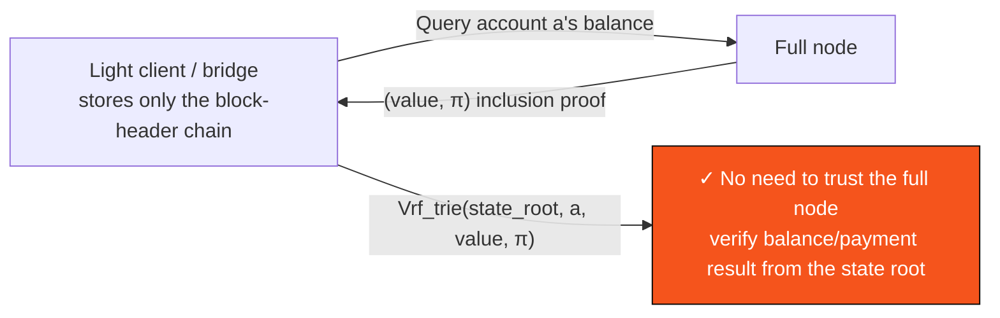

# B.3 State Model & State Commitments

> **Design status**: proposed design. The account model is account-based; fields may be adjusted along with the execution-layer design.

## B.3.1 Account Model

AXON adopts an **account-based state model** (as opposed to UTXO), because it naturally fits programmable accounts, session-key authorization, and stablecoin-balance semantics. The global state is a mapping from account addresses to account objects:

$$\mathsf{st} : \mathsf{Addr} \to \mathsf{Account}$$

Account object definition (the full data structure is in [Appendix III](appendix-datastructures.md)):

```text
Account := {
  nonce      : u64          // Anti-replay counter
  balances   : Map<AssetId, u128>   // Multi-asset balances (native + stablecoins)
  verifier   : VerifierRef  // Verification logic (default Ed25519, or custom, see C.1)
  policy_root: Hash?        // Session-key / authorization-policy commitment (see C.2)
  code       : Hash?        // Optional: contract/policy code commitment (WASM, see C.3)
  storage_root: Hash?       // Optional: root of the account's storage subtree
}
```

`balances` is a multi-asset mapping — a stablecoin is a first-class balance at the chain layer, not bookkeeping inside some contract ([D.1](d1-settlement.md)).

## B.3.2 State Transition Function

Block execution is defined by the deterministic state transition function $\delta$:

$$\mathsf{st}' = \delta(\mathsf{st}, b) = \delta(\dots \delta(\delta(\mathsf{st}, \mathsf{tx}_1), \mathsf{tx}_2)\dots, \mathsf{tx}_m)$$

i.e., the single-transaction transition $\delta_{\mathsf{tx}}$ is applied one by one in the `seqNo` order of the transactions in the block. **$\delta$ is purely deterministic**: given the same $(\mathsf{st}, b)$, any node computes exactly the same $\mathsf{st}'$ — this is the premise for replayability ([B.4](b4-sequencing.md)) and state-root consistency.

Skeleton of the single-transaction transition:

```text
δ_tx(st, tx):
  assert st[tx.sender].nonce == tx.nonce          # Anti-replay
  assert Verify(st[tx.sender], tx)                # Authorization (C.1/C.2)
  assert authorization-policy predicate Auth(tx) == true   # Session-key bounds (C.2)
  charge_gas(tx)                                   # Fee charging (F.1; Paymaster see C.3)
  apply_effects(st, tx)                            # Transfer/settlement/contract call
  st[tx.sender].nonce += 1
  return st'
```

If any assert fails → the transaction is rejected (state unchanged, only possibly deducting the gas already consumed), entering the `Rejected` terminal state ([B.5](b5-finality.md)).

## B.3.3 State Commitment & State Root

The post-execution state is committed as a Merkle tree root ([A.2.4](a2-cryptography.md)):

$$\mathsf{root}(\mathsf{st}') \in \{0,1\}^{256}$$

written into the block header. Since $\delta$ is deterministic, honest validators compute the same $\mathsf{root}(\mathsf{st}')$ for the same block; thus the consensus QC on the block header also **authenticates the state root** — a block obtaining a QC is equivalent to more than $\tfrac{2}{3}S$ of stake endorsing "the state root after executing this block is this value."

## B.3.4 Provability

The value of the state root lies in its **provability**:



A light client need only track the block-header chain (including the state root + QC) to verify any account balance or whether some payment has settled, using an inclusion proof of size $O(\log |\mathsf{st}|)$ — without trusting any single full node. This supports **trustless verification** for cross-chain bridges, L2s, and external auditing.

## B.3.5 State-Bloat Governance

State in the account-based model grows with the number of accounts. AXON's design countermeasures (proposed):

* **Storage rent / dormant archival**: the storage subtree of long-inactive accounts can be archived and revived on demand against a proof (the state-expiry approach).
* **Verkle-ready**: reserving the interface to migrate to vector commitments, compressing proof sizes from $O(\log n \cdot 32\text{B})$ to near-constant, paving the way for stateless verification (stateless clients).

The specific archival strategy and rent parameters are TBD ([Appendix II](appendix-parameters.md)).

---

*Next: [B.4 Sequencing, Entry-Log & Deterministic Execution](b4-sequencing.md)*
