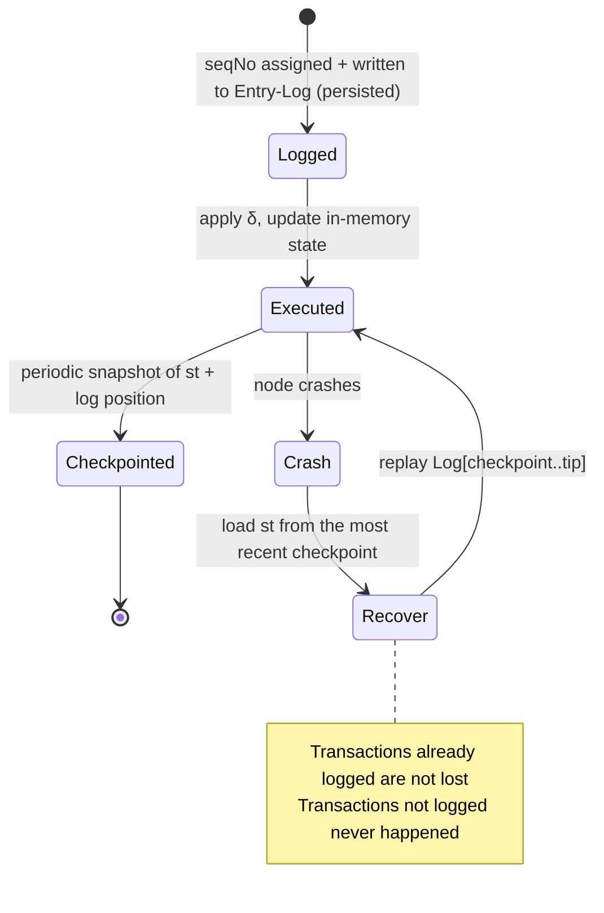

# B.4 Sequencing, Entry-Log & Deterministic Execution

> **Design status**: proposed design. The sequencer is early-stage centralized but verifiable, decentralizing along with P2.

The sequencing layer is the heart of AXON's payment determinism. It does two things that look plain but are in fact critical: **give every transaction a globally unique sequence number**, and **write it into a tamper-evident, fully replayable log**.

## B.4.1 Global Monotonic Sequence Numbers

The sequencer $\mathsf{Seq}$ assigns a globally monotonically increasing sequence number to every transaction that passes through the access gateway ([D.3](d3-compliance.md)):

$$\mathsf{seqNo} : \mathsf{Tx} \to \mathbb{N}, \qquad \mathsf{tx}_i \prec \mathsf{tx}_j \iff \mathsf{seqNo}(\mathsf{tx}_i) < \mathsf{seqNo}(\mathsf{tx}_j)$$

This gives all transactions in the system a **unique total order**. A total order eliminates the fuzzy zone of "who came first," and also **compresses the room for MEV** — ordering is not decided on the fly by the block-producing leader, but determined by the sequencing layer in arrival order ([F.3](f3-security.md)).

**Separation of ordering authority and block-production authority**: $\mathsf{Seq}$ decides the order, and validators ([B.2](b2-validators.md)) decide a block's finality. A block can only contain a **contiguous interval** of `seqNo`s, and cannot reorder or skip them — the leader receives an already-ordered transaction stream.

## B.4.2 Entry-Log: The Write-Ahead Log

Once a sequence number is assigned, the transaction is first written into the **Entry-Log** — an append-only, hash-linked **write-ahead log (WAL)** — and only then executed:

$$\mathsf{Log} = [\,e_1, e_2, \dots\,], \qquad e_k = \big(\mathsf{seqNo}_k,\ \mathsf{tx}_k,\ h_{k}\big),\quad h_k = H(h_{k-1} \,\|\, \mathsf{seqNo}_k \,\|\, \mathsf{tx}_k)$$

The hash chain $h_k$ makes the log **tamper-evident**: altering any historical entry breaks all subsequent hashes. The WAL is a time-tested idea borrowed from databases — **first record "what to do," then do it**. As long as the log exists, the correct state can always be reconstructed.

## B.4.3 Deterministic Execution & Replay

Since the state transition $\delta$ is deterministic ([B.3.2](b3-state.md)) and the Entry-Log gives a unique total order of transactions, **state is a pure function of the log**:

$$\mathsf{st}_k = \delta(\mathsf{st}_{k-1}, \mathsf{tx}_k), \qquad \mathsf{st}_k = \mathsf{Replay}(\mathsf{st}_0, \mathsf{Log}[1..k])$$

**Replayability**: any node, given $\mathsf{st}_0$ and $\mathsf{Log}$, obtains exactly the same $\mathsf{st}_k$ upon replay. This is the technical basis for "always able to get to the bottom of things when something goes wrong," and the premise for different validators agreeing on the state root.

## B.4.4 Crash Recovery

The classic value of the WAL: recovering to a consistent state after a crash.

The recovery semantics are clear: **a transaction that has entered the Entry-Log is guaranteed to be recovered; a transaction that has not entered it is treated as never having happened** — there is no intermediate state of "the money is lost somewhere." A periodic checkpoint (state snapshot + log position) bounds the length of log that recovery needs to replay.

## B.4.5 Minimizing Trust in the Sequencer

The early-stage sequencer may be relatively centralized (for performance and iteration). AXON's hard requirement:

> **Even if the sequencer is centralized, it must prove that its log is tamper-evident and can be fully replayed.**

Concrete mechanisms:

* **Log commitments on-chain**: the sequencer periodically commits the head of the Entry-Log's hash chain $h_k$ into a block, endorsed by the consensus QC — history cannot later be quietly rewritten.
* **Fair-queuing proofs**: a timestamp/receipt can be attached to a transaction's arrival order, making "queue-jumping" detectable.
* **Independently replayable**: any third party holding the log can reconstruct the state and check the state root — the sequencer cannot misbehave without being caught.

This is the first step of "first replace trust with verifiability, then dissolve trust with decentralization."

## B.4.6 Decentralization Path

Along roadmap P2, sequencing progressively decentralizes; candidate directions (proposed):

* **Shared sequencing / leader rotation**: rotate the $\mathsf{Seq}$ role across the validator set, using VRF to prevent manipulation.
* **Encrypted mempool**: transactions are encrypted to the sequencer before ordering (threshold decryption), further compressing the sequencing layer's MEV/censorship capacity.

The final form is subject to the conclusion on the trade-off between degree of decentralization and performance.

---

*Next: [B.5 Payment Finality, Double-Spend Prevention & Recovery](b5-finality.md)*
