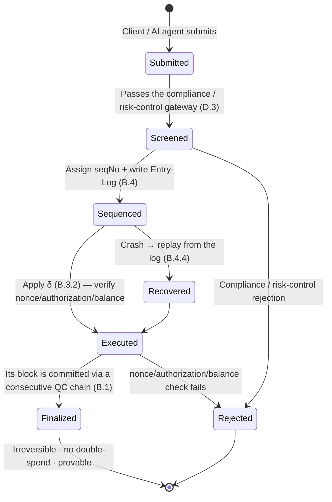

# B.5 Payment Finality, Double-Spend Prevention & Recovery

> **Design status**: proposed design. This section integrates [B.1](b1-consensus.md)/[B.3](b3-state.md)/[B.4](b4-sequencing.md) to derive payment-grade guarantees.

## B.5.1 Transaction Lifecycle State Machine

From submission to final confirmation, a payment walks through a **strict state machine** — every transition explicit and verifiable, with no fuzzy intermediate state:

Key point: a transaction either walks the deterministic path `Submitted → … → Finalized`, or is `Rejected` at an explicit checkpoint; on a crash it returns to the correct state via `Recovered`. **There is no dangling state of "already debited but undecided."**

## B.5.2 Double-Spend Prevention

A double-spend means the same funds are spent successfully twice. AXON prevents it with a **triple mechanism**; any one suffices to block it, and the three together provide defense in depth:

1. **Monotonic nonce** ([B.3.2](b3-state.md)): each account transaction's `nonce` strictly increases. A second transaction with the same `nonce` is rejected right at the `assert nonce` step of $\delta_{\mathsf{tx}}$ — replaying the same payment is impossible.
2. **Global monotonic seqNo + deterministic execution** ([B.4](b4-sequencing.md)): all transactions have a unique total order and are executed in order. Two transactions spending the same funds must have a before/after; when the latter executes, the balance has already been debited by the former, and it fails for insufficient balance.
3. **Deterministic finality** ([B.1](b1-consensus.md)): once `Finalized`, the result cannot be rolled back; there is no "another longer chain" to revive spent funds.

**Proposition (No Double-Spend)**: Let funds $x$ belong to account $a$. If transaction $\mathsf{tx}_1$ spends $x$ and reaches `Finalized`, then any $\mathsf{tx}_2$ attempting to spend $x$ again must reach `Rejected`.

**Proof**: By the seqNo total order, $\mathsf{tx}_1, \mathsf{tx}_2$ have a definite before/after. Without loss of generality, let $\mathsf{seqNo}(\mathsf{tx}_1) < \mathsf{seqNo}(\mathsf{tx}_2)$. After executing $\mathsf{tx}_1$, $a$'s corresponding balance is reduced by $x$; when executing $\mathsf{tx}_2$, the balance check `balance ≥ x` fails (or, if $\mathsf{tx}_2$ reuses the nonce, it fails even earlier at the nonce check). Hence $\mathsf{tx}_2 \to$ `Rejected`. By deterministic finality, $\mathsf{tx}_1$'s `Finalized` is irreversible. $\blacksquare$

## B.5.3 Rollback Protection

A probabilistic-finality chain has "reorgs" — a confirmed block being replaced by a longer chain. AXON's BFT deterministic finality **excludes reorgs at the protocol layer**:

$$\mathsf{Finalized}(b) \implies \nexists\, b' \neq b \text{ Finalized at the same height}$$

guaranteed by the quorum-intersection argument of [B.1.5](b1-consensus.md). Therefore, once a payment is `Finalized`, a merchant can **release goods immediately**, without the probabilistic wait of "waiting for N confirmations" — this is precisely the experiential leap of payments over general-purpose chains.

## B.5.4 Finality Bridging to External Systems

Fiat on/off-ramps, cross-chain bridges, and the like need to pass AXON's finality on to external systems. Using the provable state root + QC of [B.3.4](b3-state.md), an external system can verify:

* whether a payment **has been Finalized** (block-header QC + transaction inclusion proof);
* the **definite balance** of an account at a given height (state root + inclusion proof).

No need to trust any single node. This provides a finality credential — connectable to traditional finance — for settlement that is "T+0, programmable, and auditable" ([D.1](d1-settlement.md)).

## B.5.5 Overview of Payment Determinism

| Guarantee | Mechanism | Section |
| --- | --- | --- |
| Unique total order | Global monotonic seqNo | [B.4.1](b4-sequencing.md) |
| Replayable / auditable | Entry-Log (WAL) + deterministic $\delta$ | [B.4.3](b4-sequencing.md) |
| Double-spend prevention | nonce + ordered execution + balance check | This section |
| Irreversible | BFT deterministic finality (quorum intersection) | [B.1.5](b1-consensus.md) |
| Crash-recoverable | checkpoint + log replay | [B.4.4](b4-sequencing.md) |
| Trustless verification | provable state root + QC | [B.3.4](b3-state.md) |

These six together fulfill the payment-specific goals of [A.1.5](a1-system-model.md) — **the hardest things for a payment chain, namely determinism, authorization, and recovery, are built into the bedrock.**

---

*Next: [C.1 Account Abstraction & Transaction Execution](c1-account-abstraction.md)*
