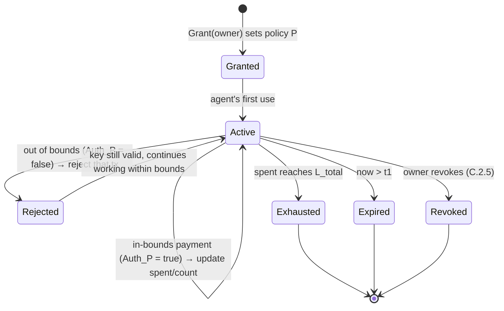

# C.2 Session Keys & the Authorization Model

> **Design status**: proposed design. This is the protocol core of AXON's "controlled payment execution" (the formalization of whitepaper [5.2](../part5-ai/5-2-controlled-execution.md)).

## C.2.1 Goal

Enable an automated principal (an AI agent) to initiate payments autonomously, while its spending power is **enforced by the chain** within a precise, revocable boundary—"**can pay, but can't run off or overspend**". The core is to turn "authorization" from "one all-powerful private key" into "a programmable, bounded, revocable policy".

## C.2.2 Session Keys and Policies

The account owner (master key $sk_{\text{owner}}$) issues a **session key** $sk_a$ to the agent, binding it to an **authorization policy** $P$:

$$\mathsf{Grant}(sk_{\text{owner}}) \to (sk_a,\ P), \qquad P = \{\,c_1, c_2, \dots, c_k\,\}$$

The policy $P$ is a set of **constraint predicates**. The commitment to the constraints $\mathsf{policy\_root} = \mathsf{root}(P)$ is written into the account ([B.3.1](b3-state.md)), making the policy an authenticated piece of on-chain state.

Supported constraint types (each constraint is a predicate over a transaction $c : \mathsf{Tx} \times \mathsf{Ctx} \to \{0,1\}$):

| Constraint | Notation | Semantics |
| --- | --- | --- |
| Total cap | $c_{\text{cap}}$ | Cumulative session spend $\leq L_{\text{total}}$ |
| Per-tx cap | $c_{\text{tx}}$ | Per-transaction amount $\leq L_{\text{tx}}$ |
| Time window | $c_{\text{time}}$ | $t \in [t_0, t_1]$ |
| Allowlist | $c_{\text{allow}}$ | Recipient $\in W$ |
| Asset scope | $c_{\text{asset}}$ | Asset $\in \mathcal{S}$ |
| Rate limit | $c_{\text{rate}}$ | Transactions per unit time $\leq \rho$ |
| Call scope | $c_{\text{call}}$ | Target/method $\in \mathcal{F}$ |

## C.2.3 The Authorization Predicate

A transaction $\mathsf{tx}$ signed by a session key is authorized **if and only if all constraints are simultaneously satisfied**—the authorization predicate is the conjunction of the constraints:

$$\mathsf{Auth}_P(\mathsf{tx}, \mathsf{ctx}) \;=\; \bigwedge_{c \in P} c(\mathsf{tx}, \mathsf{ctx})$$

where the context $\mathsf{ctx} = (\text{now},\ \mathsf{spent},\ \mathsf{count},\ \dots)$ carries the **session state**: cumulative spend $\mathsf{spent}$, count of transactions within the window $\mathsf{count}$, etc. These states are updated as the session is used, and are the key to enforcing the "cumulative cap" and "rate limit"—they are authenticated on-chain state that the agent cannot bypass or forge.

Unfolded into a decidable check:

```text
Auth_P(tx, ctx):
  assert verify(session_pubkey, tx)                     # session-key signature valid
  assert not revoked(session_id)                        # not revoked (C.2.5)
  assert t0 ≤ ctx.now ≤ t1                              # c_time
  assert tx.amount ≤ L_tx                               # c_tx
  assert ctx.spent + tx.amount ≤ L_total                # c_cap (cumulative)
  assert tx.recipient ∈ W                               # c_allow
  assert tx.asset ∈ S                                   # c_asset
  assert ctx.count_in_window + 1 ≤ ρ                    # c_rate
  assert tx.call ∈ F                                    # c_call
  return true    # any failed assert → false (that tx is rejected, key stays valid)
```

## C.2.4 The Session State Machine

The lifecycle of a session key is a strict state machine. **Going out of bounds does not disable the key, it only blocks that one transaction**—this is the essence of a "controlled" rather than "all-or-nothing" design:



`Rejected` is a **return state**: an out-of-bounds transaction is rejected, but the session key remains `Active`, and the agent can keep working normally within bounds. Only exhausting the cap, timing out, or being revoked terminates the session.

## C.2.5 Revocation

Revocation must be **immediate and enforced at the chain layer**—this is the last valve for stopping losses. Revocation writes a session marker into account state:

$$\mathsf{Revoke}(sk_{\text{owner}}, \mathsf{session\_id}) \Rightarrow \mathsf{revoked}[\mathsf{session\_id}] \gets \top$$

Once `Finalized` ([B.5](b5-finality.md)), any subsequent transaction from that session fails immediately at the `not revoked` check in $\mathsf{Auth}_P$. Even if the agent is completely compromised, the owner can cut off its spending power within a single block.

## C.2.6 Security Properties

The session-key authorization model provides three provable properties (corresponding to the three sub-problems of whitepaper [5.1](../part5-ai/5-1-agentic-payments.md)):

* **Boundedness**: cumulative session spend always satisfies $\mathsf{spent} \leq L_{\text{total}}$, and per-transaction $\leq L_{\text{tx}}$. Enforced at the chain layer by $c_{\text{cap}}, c_{\text{tx}}$—**compromise the agent, and the loss is still locked within bounds**.

$$\text{For any execution sequence}\ \sum_{\text{confirmed tx}} \mathsf{amount} \leq L_{\text{total}}$$

* **Directedness (Confinement)**: funds can only flow to the allowlist $W$, limited to assets $\mathcal{S}$—**the agent can't get to places you don't want it to go**.
* **Revocability**: the owner can irreversibly terminate the authorization within a single block—**take it back anytime**.

These are **enforced by the chain**, not dependent on the agent's own honesty or off-chain components—which is precisely the fundamental value of "native account abstraction" ([C.1.1](c1-account-abstraction.md)) over relay-based approaches.

## C.2.7 Integration with x402 / M2M

Session keys are the authorization foundation for x402 (HTTP 402 pay-per-call) and M2M micropayments: within its session bounds, an agent initiates a constrained on-chain micropayment for each service call (whitepaper [5.3](../part5-ai/5-3-x402-m2m.md)). $c_{\text{rate}}$ prevents runaway loops from burning funds, $c_{\text{cap}}$ caps total risk, and $c_{\text{allow}}$ restricts the service counterparties—the security of machine payments thus shifts from "trust the agent" to "trust the constraints".

The same model is also used for **one-click copy-trading with a session key** ([E.3.6](e3-copy-trading.md)): the copy-trading session key's $L_{\text{tx}}$ corresponds to the per-round quota, $L_{\text{total}}$ to the cumulative cap, and $c_{\text{allow}}$ restricts funds to only enter the escrow/settlement contracts—authorization for human users shares the same bounded, directed, revocable predicates as authorization for AI agents.

---

*Next: [C.3 Policy Sandbox & Paymaster](c3-policy-paymaster.md)*
