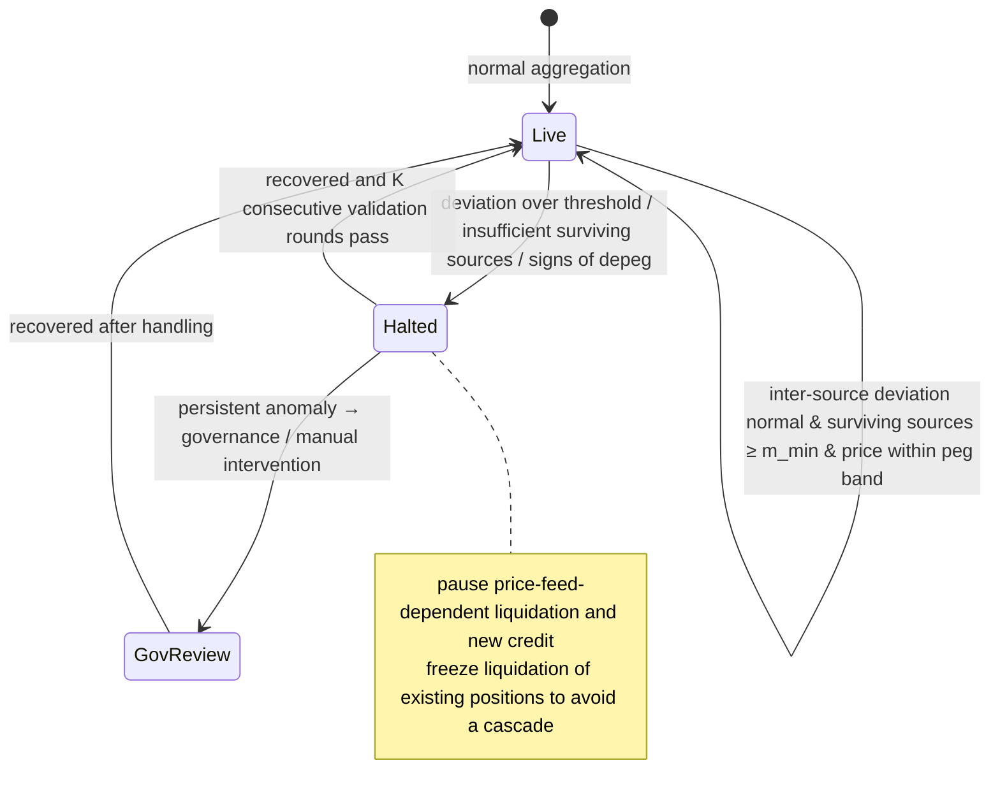

# D.2 Oracle & Price-Feed Safety

> **Design status**: proposed design. The aggregation algorithm is a design proposal and the threshold parameters are TBD; oracle partnerships are covered in whitepaper [6.3](../part6-roadmap/6-3-team-partners.md).

## D.2.1 The Price Feed Is the Payment Chain's Invisible Weak Point

Money-market liquidation, credit collateral ratios, and the risk reserve all depend on "how much fiat one unit of stablecoin is worth right now". Once a price feed is wrong, it triggers cascading liquidations that should never have happened—this is the root cause of DeFi's repeated "oracle attacks" and "depeg stampedes". AXON's design philosophy: **in the face of uncertainty, better to conservatively halt than to risk computing wrong.**

## D.2.2 Multi-Source Aggregation

Let $m$ independent price sources provide prices $\{p_1, \dots, p_m\}$ at some moment. AXON **does not use the mean** (easily skewed by outliers/manipulation), but the **median**:

$$\hat{p} = \mathrm{median}(p_1, \dots, p_m)$$

The median's **breakdown point is 50%**—as long as fewer than half the price sources are manipulated, the aggregated price remains robust. This is the first line of defense against manipulation.

## D.2.3 Deviation Detection (MAD)

Before aggregation, **MAD (Median Absolute Deviation)** is used to identify outlier sources:

$$\mathrm{MAD} = \mathrm{median}\big(\,|p_i - \hat{p}|\,\big), \qquad z_i = \frac{|p_i - \hat{p}|}{\mathrm{MAD} + \varepsilon}$$

Sources whose $z_i$ exceeds the threshold $\tau_{\text{dev}}$ are flagged as outliers and **removed** before re-aggregating. MAD is more robust than the standard deviation (it is not contaminated by the extreme outliers themselves). If, after removal, the **number of surviving sources is insufficient** ($< m_{\min}$), the circuit-breaker (next section) is triggered—better to halt than to settle on incomplete data.

## D.2.4 The Circuit-Breaker State Machine

The price-feed system is an explicit state machine that **halts liquidation/settlement on anomalies rather than executing blindly**:

In the `Halted` state, price-feed-dependent liquidation and new credit are paused—the trust damage from one liquidation that should never have happened far outweighs the inconvenience of a brief pause.

## D.2.5 TWAP Fallback and Depeg Protection

* **TWAP fallback**: to resist momentary flash-price manipulation, sensitive decisions such as liquidation can use a **time-weighted average price (TWAP)** rather than the instantaneous price:

$$\mathrm{TWAP}_{[t-\Delta,\,t]} = \frac{1}{\Delta}\int_{t-\Delta}^{t} \hat{p}(s)\, ds$$

For an attacker, manipulating the TWAP requires sustained investment across the entire window $\Delta$, at a cost far higher than manipulating a single point.

* **Depeg guard**: when a stablecoin itself deviates significantly from its fiat peg ($|\hat{p} - p_{\text{peg}}| > \tau_{\text{peg}}$), protection is triggered—liquidation denominated in that asset is paused, to avoid force-liquidating healthy positions under an abnormal peg.

## D.2.6 Price-Feed Safety Overview

| Threat | Defense |
| --- | --- |
| A minority of sources manipulated | Median aggregation (50% breakdown point) |
| Outlier/faulty sources | MAD deviation removal + minimum surviving-source count |
| Momentary flash price | TWAP time-weighting |
| Stablecoin depeg | Depeg guard |
| Data anomaly across the board | Circuit-breaker halt + governance intervention |

Price-feed safety is the prerequisite for the PayFi money market ([E.1](e1-money-market.md)) and liquidation ([E.2](e2-liquidation.md)) to run safely—**without a trustworthy price, there is no trustworthy credit or liquidation**. The US-equity copy-trading engine's off-chain settlement price and settlement-result proof also reuse this mechanism ([E.3.5](e3-copy-trading.md)): in the `Halted` state, copy-trading settlement is paused, refusing to split proceeds on incomplete data.

---

*Next: [D.3 Pluggable Compliance Gateway](d3-compliance.md)*
