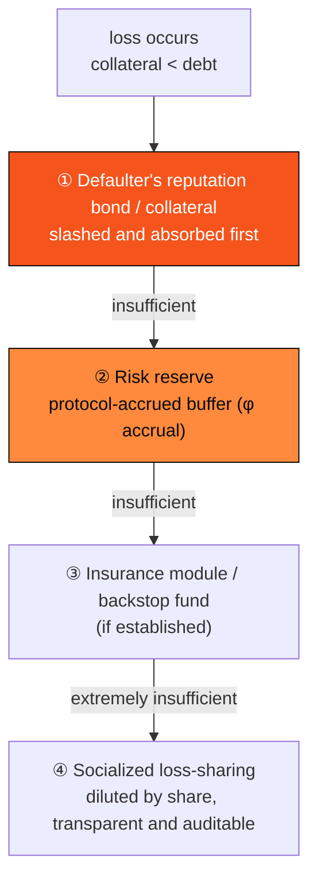

# E.2 Credit Risk Control & Liquidation

> **Design status**: proposed design (a design model). Liquidation parameters and reserve ratios are to be set by governance, and this is **not a promise of returns**.

The success or failure of a credit business lies not in "how to lend" but in "how to manage risk". This section gives the risk-control and liquidation design of AXON's PayFi money market ([E.1](e1-money-market.md)).

## E.2.1 Liquidation Trigger

When a position's health factor ([E.1.5](e1-money-market.md)) drops below the threshold, the position may be liquidated:

$$H < 1 \ \Longrightarrow\ \text{liquidatable}$$

To resist flash-price manipulation, the trigger decision uses TWAP ([D.2.5](d2-oracle.md)) rather than the instantaneous price, and requires the price-feed system to be in the `Live` state—if the feed is `Halted`, liquidation is paused (to avoid harming healthy positions with an abnormal price).

## E.2.2 The Liquidation Mechanism

Liquidation transfers an unhealthy position's collateral to the liquidator at a discount, repaying the debt and restoring the pool's solvency:

```text
Liquidate(position p):
  assert H(p) < 1  and  oracle.state == Live
  repay ≤ closeFactor · Debt(p)          # max fraction liquidated per call (avoid over-liquidation)
  seize = repay · (1 + bonus) / price(collateral)   # liquidator receives collateral + liquidation bonus
  assert seize ≤ collateral(p)
  transfer: liquidator pays repay in stablecoin → repay debt
            protocol transfers seize collateral → liquidator
  update p; if still H<1, may continue (partial liquidation)
```

* **Liquidation bonus**: a discount incentive for the liquidator, ensuring liquidation happens promptly (market-based liquidation).
* **Close factor**: the cap fraction per liquidation, avoiding a one-shot over-liquidation that shocks the price.

## E.2.3 The Default-Processing Waterfall

If the collateral is insufficient to cover the debt (extreme market moves / bad debt), the loss is absorbed level by level via a **liquidation waterfall**, protecting LP principal:



A clear order of repayment = a predictable allocation of risk. The first few levels (bond + reserve) are designed to cover the vast majority of cases; socialized loss-sharing is the last resort, and is transparent and auditable on-chain throughout.

## E.2.4 The Risk Reserve

The risk reserve $R$ is continuously accrued from borrow interest by the reserve factor $\phi$ ([E.1.3](e1-money-market.md)):

$$\frac{dR}{dt} = \phi \cdot r_{\text{borrow}}(U) \cdot B$$

The reserve adequacy ratio $R / B$ is a key indicator of pool health; governance can dynamically adjust $\phi$, collateral ratios, and the interest-rate curve based on it. The reserve is the second line of defense in the default waterfall, smoothly absorbing the impact of low-probability bad debt.

## E.2.5 Risk-Control Layers Overview

Echoing the risk-control framework of whitepaper [4.2](../part4-payfi/4-2-money-market.md), where each line of defense lands at the protocol layer:

| Risk-control layer | Mechanism | Section |
| --- | --- | --- |
| Authenticity of repayment source | Cash-flow self-liquidating (tied to real receivables/payment flows) | [E.1.4](e1-money-market.md) |
| Collateral and reputation bond | Health factor $H$ + slashing | [E.1.5](e1-money-market.md) |
| Price-feed and valuation safety | Multi-source median + MAD + circuit-breaker + TWAP | [D.2](d2-oracle.md) |
| Timely liquidation | Market-based liquidation + liquidation bonus + close factor | this section |
| Loss absorption | Default-processing waterfall + risk reserve | this section |

**The yield of the PayFi money market is rooted in the real cash flows of the real economy, not in a zero-sum game inside crypto**—this is what fundamentally distinguishes it from a Ponzi structure, and the point of this whole risk-control design.

> The same thinking—"clear order, real capital buffer, on-chain auditable"—also underpins the guaranteed backstop of the US-equity copy-trading engine: its copy-trading reserve pool and default waterfall are this section's mechanism mapped onto the copy-trading scenario ([E.4](e4-reserve-risk.md)).

---

*Next: [E.3 The US-Equity Copy-Trading Engine](e3-copy-trading.md)*
