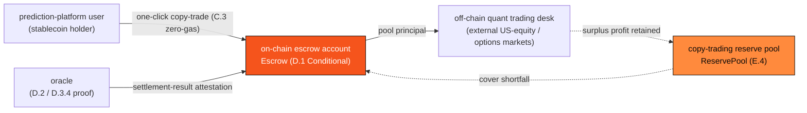
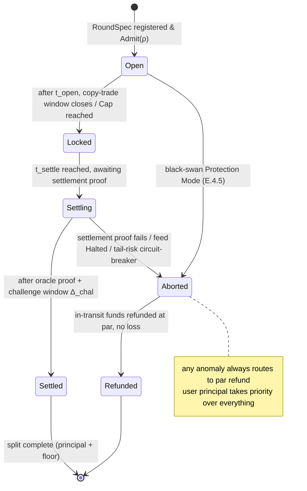

# E.3 The US-Equity Copy-Trading Engine

> **Design status**: proposed design (a protocol design model). The escrow, settlement-proof, and authorization mechanisms are design proposals; the product thresholds (guaranteed floor rate 1%–3%, tier quotas, settlement window 2–24h) are finalized product parameters, while unspecified internal protocol parameters (hedge ratio, challenge-window length, injection rate) are marked `TBD / set by governance`. For the business-side mechanism in the whitepaper, see [4.5 The US-Equity Copy-Trading Engine](../part4-payfi/4-5-copy-trading-engine.md); for reserve and risk control, see [E.4](e4-reserve-risk.md).

The US-equity copy-trading engine is AXON L1's **first major flagship PayFi product**. This section deepens its product mechanism to protocol-specification level: it is **not a standalone new on-chain system**, but an assembly of existing settlement primitives ([D.1](d1-settlement.md)), the oracle ([D.2](d2-oracle.md)), and account abstraction and authorization ([C.1](c1-account-abstraction.md)–[C.3](c3-policy-paymaster.md)) into a "deterministic PayFi yield" product. Its externally stated deterministic yield is backstopped at the protocol layer by the reserve and risk control of [E.4](e4-reserve-risk.md).

## E.3.1 Goal and Design Boundary

The engine packages the AXON team's off-chain US-equity quant capability into a **deterministic stablecoin yield** that prediction-market users can use with one click: users copy-trade with stablecoins, their principal is protected by the on-chain reserve, and each round earns a guaranteed floor USDT return.

What the protocol layer must guarantee is three things—**the safety of fund custody, the correctness of settlement/profit-splitting, and the boundedness of authorization**; where the yield comes from and how it is backstopped is the solvency and risk-control problem of [E.4](e4-reserve-risk.md). The separation of the two is precisely the boundary between this chapter and the next.

## E.3.2 System Model and Participants

The engine consists of four protocol roles, of which only the **on-chain escrow account** and the **copy-trading reserve pool** are on-chain objects; the quant execution happens off-chain in external markets:



* **User (copy-trader)**—a stablecoin holder on the prediction platform, participating via account abstraction ([C.1](c1-account-abstraction.md)) and session-key authorization ([C.2](c2-session-keys.md)).
* **On-chain escrow account (Escrow)**—a contract account that holds users' principal per round; it is an application instance of [D.1](d1-settlement.md)'s `Escrow/Conditional` settlement primitive (E.3.4).
* **Off-chain quant trading desk**—executes strategy in external US-equity/options markets. Its behavior is **external** to the protocol and affects on-chain state only through oracle-proven settlement results.
* **Copy-trading reserve pool (ReservePool)**—an on-chain fund pool that backstops the guaranteed-floor commitment (see [E.4](e4-reserve-risk.md)).

**Fund-isolation invariant**: users' escrowed assets $A_u$, the quant desk's proprietary assets $A_q$, the reserve pool $R_{ct}$, and the protocol treasury are strictly isolated at the account layer and cannot overdraw one another:

$$A_u \cap A_q = A_u \cap R_{ct} = \varnothing, \qquad \text{user-withdrawable amount} \leq A_u + (\text{proven settlement proceeds})$$

Proprietary losses of the quant desk **may not draw on** $A_u$; the backstop for user principal can only come from the $R_{ct}$ waterfall ([E.4.5](e4-reserve-risk.md)).

## E.3.3 The Copy-Trading Round RoundSpec and Admission Predicate

An "official copy-trading round" is an on-chain registered `RoundSpec` (see [Appendix III](appendix-datastructures.md) for the data structure):

$$\rho = \big(\, \text{asset},\ t_{\text{cat}},\ g,\ \text{Cap},\ \text{tier}_{\min},\ [\,t_{\text{open}}, t_{\text{settle}}\,] \,\big)$$

where $t_{\text{cat}}$ is the deterministic-catalyst timestamp, $g \in [1\%, 3\%]$ is the guaranteed floor rate, $\text{Cap}$ is the per-round total copy-trade cap, $\text{tier}_{\min}$ is the minimum participation tier, and the settlement window $t_{\text{settle}} - t_{\text{open}} \in [2, 24]\,\text{h}$.

Round registration must pass the **admission predicate** $\text{Admit}(\rho)$—the protocol recognizes only rounds satisfying the following four conditions as "official copy-trading", excluding low-quality underlyings and one-sided naked bets at the source:

$$\text{Admit}(\rho) = c_{\text{cat}} \wedge c_{\text{liq}} \wedge c_{\text{hedge}} \wedge c_{\text{short}}$$

| Predicate | Meaning |
| --- | --- |
| $c_{\text{cat}}$ | A deterministic catalyst with a definite timestamp (major earnings / CPI / nonfarm payrolls / rate decision), where volatility predictably amplifies |
| $c_{\text{liq}}$ | The underlying is top-100 by market cap or a core ETF (SPY/QQQ), so entering and exiting does not move the market |
| $c_{\text{hedge}}$ | An options combination (Iron Condor / Straddle) can be constructed to hedge, locking risk into a known range ([E.4.2](e4-reserve-risk.md)) |
| $c_{\text{short}}$ | Short-cycle settlement (2–24h), not tying up users' stablecoins long-term, preserving the high-frequency PayFi experience |

## E.3.4 The Escrow Lifecycle State Machine

A single copy-trading round is one **conditional escrow** ([D.1](d1-settlement.md)'s `Escrow/Conditional` primitive): the user's principal is locked into escrow, and proceeds are split only when the release predicate "the oracle has proven this round settled" is satisfied. The lifecycle is an explicit state machine:



* **Open**: the copy-trade window opens, and users deposit stablecoins into the escrow account via zero-gas authorization (E.3.6), up to a cumulative $\text{Cap}$.
* **Locked**: the window closes, principal is frozen, and the quant desk executes off-chain.
* **Settling**: the settlement window is reached, awaiting the oracle settlement proof + challenge window $\Delta_{\text{chal}}$ (E.3.5).
* **Settled**: the proof is confirmed, and proceeds are split per E.3.5 (principal + floor).
* **Aborted → Refunded**: any anomalous path (proof failure, feed `Halted`, tail-risk circuit-breaker, black-swan Protection Mode) **does not confiscate user principal**; in-transit funds are **refunded at par with no loss**.

**Principal-first principle**: all anomalous branches of the state machine point to `Refunded` rather than slashing the user—this is the biggest difference from liquidation ([E.2](e2-liquidation.md)): liquidation disposes of a borrower's collateral, whereas copy-trading escrow protects the copy-trader's principal.

## E.3.5 Settlement and Oracle Proof

After the off-chain quant desk closes positions in external markets, the settlement result must be brought on-chain via an **oracle proof** before the protocol splits proceeds accordingly. To resist forged settlement prices, the proof reuses two existing security mechanisms:

1. **Price layer** ([D.2](d2-oracle.md)): the underlying's settlement price uses multi-source median + MAD removal; in the feed's `Halted` state, settlement is paused (moves to `Aborted`), refusing to split proceeds on incomplete data.
2. **Result layer** ([D.3.4](d3-compliance.md)): the quant desk issues a signed attestation $\pi$ about "this round's settlement result", verified via $\text{Vrf\_attest}(pk_{\text{desk}}, \text{claim}, \pi)$.

The settlement proof passes through a **challenge window** $\Delta_{\text{chal}}$ (`TBD / set by governance`): within the window, any guardian may submit counter-evidence to challenge the settlement result, and if the challenge holds, the round moves to `Aborted → Refunded`. After the window, the proof is final and proceeds to splitting.

The split is completed in a single atomic `BatchSettle` ([D.1](d1-settlement.md)). Let a round's total copy-trade amount be $P = \sum_i p_i$ and the guaranteed floor rate be $g$; user $i$'s entitlement is:

$$\text{payout}_i = p_i \cdot (1 + g)$$

The destination of the surplus $\Pi = (\text{net settlement proceeds}) - g \cdot P$, and the shortfall backstop when net proceeds fall short of $g\cdot P$, are both specified by the solvency model of [E.4](e4-reserve-risk.md). The split logic (illustrative pseudocode):

```text
SettleRound(round ρ, attestation π):
  assert state(ρ) == Settling
  assert oracle.state == Live                        # feed healthy (D.2)
  assert Vrf_attest(pk_desk, claim(ρ), π)            # settlement-result proof (D.3.4)
  assert now ≥ ρ.t_settle + Δ_chal  and  not challenged(ρ)   # challenge window passed
  net := verified_net_pnl(π)                          # proven off-chain net proceeds
  gross_floor := g · P                                # total floor payable
  if net < gross_floor:                               # shortfall → run reserve waterfall (E.4.5)
      draw := cover_from_reserve(gross_floor - net)   # coverage constraint see E.4.3
      assert draw succeeds                            # otherwise this round should not have been admitted (E.4.3 Ξ≥Ξ_min)
  BatchSettle({ user_i : p_i · (1 + g) for all i })   # atomic split (D.1)
  surplus := max(0, net - gross_floor)
  route(surplus)                                      # profit retention / injection into reserve (E.4.1/E.4.3)
  state(ρ) := Settled
```

After the split, users can withdraw instantly (experiencing AXON's sub-second finality), or click compound-rollover to invest in the next round (establishing the authorization for a new `RoundSpec`).

## E.3.6 Zero-Gas Copy-Trading and Bounded Authorization

Copy-trading is a direct application of **bounded authorization** ([C.2](c2-session-keys.md)): the user grants a **copy-trading session key**, whose policy $P_{\text{copy}}$ precisely constrains permissions to just the one thing "copy-trading":

$$P_{\text{copy}} = \big(\, L_{\text{tx}} = \text{per-round quota},\ L_{\text{total}} = \text{cumulative tier cap},\ W = \{\text{escrow account},\ \text{settlement contract}\},\ F = \{\text{copy-trade},\ \text{redeem}\},\ \rho_{\text{rate}} \,\big)$$

The authorization predicate $\text{Auth}_{P_{\text{copy}}}$ directly reuses the conjunction decision of [C.2](c2-session-keys.md)—any unsatisfied constraint rejects that transaction, while the key stays valid. The three security properties are thereby inherited: **bounded** (the copy-trade quota is capped), **directed** (funds can only enter the escrow/settlement contracts, nowhere else), and **revocable** (a user's one-click exit = `Revoke(session_id)`, effective within a single block).

**Zero-gas**: the prediction platform acts as Paymaster ([C.3](c3-policy-paymaster.md)) to sponsor the gas of copy-trade transactions—the user operates entirely within stablecoin semantics without ever perceiving gas, and `resolve_paymaster`'s deposit and quota mechanisms prevent the sponsorship from being drained.

**Tier quotas**: a user's on-chain interaction depth determines their per-round quota cap $L_{\text{tx}}$, mapped to the $L_{\text{tx}}$ of the session key's scope (the values are finalized product parameters):

| Tier | Participation threshold | Per-round quota $L_{\text{tx}}$ |
| --- | --- | --- |
| Silver | Regular prediction-platform user | 1,000 USDT |
| Gold | Active AXON interactor | 10,000 USDT |
| Diamond | $AXON whale / node | 50,000 USDT |

The existence of the quota cap stems from the real ceiling of "acquisition budget + quant-strategy capacity" ([E.4.1](e4-reserve-risk.md)), not from artificial scarcity.

## E.3.7 Mechanism Mapping for This Section

| Copy-trading mechanism | Reused protocol primitive | Section |
| --- | --- | --- |
| Per-round escrow settlement | `Escrow/Conditional` + `BatchSettle` | [D.1](d1-settlement.md) |
| Settlement-price safety | Multi-source median + MAD + circuit-breaker | [D.2](d2-oracle.md) |
| Settlement-result proof | attestation `Vrf_attest` | [D.3.4](d3-compliance.md) |
| Copy-trade authorization | session-key policy $P_{\text{copy}}$ + revocation | [C.2](c2-session-keys.md) |
| Zero-gas copy-trading | Paymaster sponsorship | [C.3](c3-policy-paymaster.md) |
| Floor backstop / coverage circuit-breaker | reserve pool + default waterfall | [E.4](e4-reserve-risk.md) |

The copy-trading engine rebuilds no underlying mechanism—it proves the **composability** of the AXON foundation (settlement, oracle, account abstraction): a flagship product for real users can be assembled entirely from existing primitives.

---

*Next: [E.4 Copy-Trading Reserve & Risk Control](e4-reserve-risk.md)*
