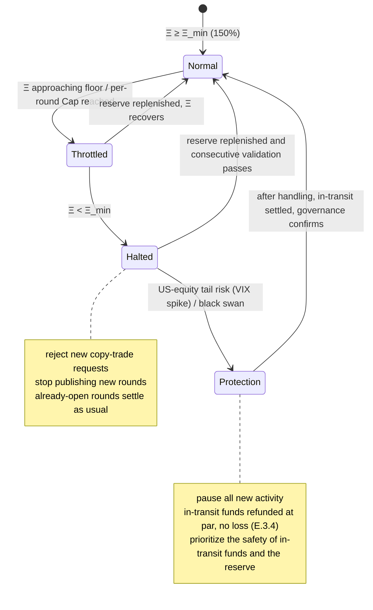
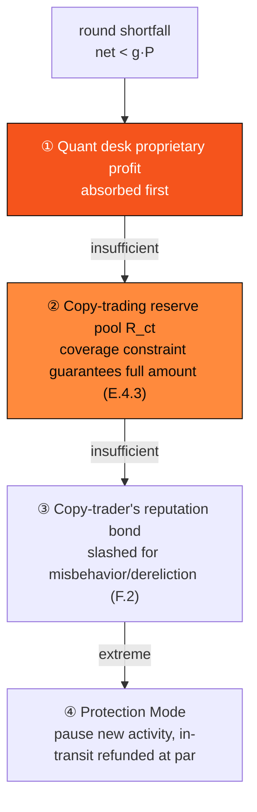

# E.4 Copy-Trading Reserve & Risk Control

> **Design status**: proposed design (a protocol design model). The solvency and risk-control mechanisms are design proposals; the coverage floor (≥150%) and the guaranteed floor-rate range (1%–3%) are finalized product parameters, while internal protocol parameters such as the injection rate and hedge ratio are marked `TBD / set by governance`. This chapter specifies how [E.3 The US-Equity Copy-Trading Engine](e3-copy-trading.md)'s guaranteed floor is honored and how risk is constrained.

[E.3](e3-copy-trading.md) laid out the escrow, settlement, and authorization of the copy-trading engine. This chapter answers the most critical question: **on what basis can the protocol honor "principal protection + a guaranteed floor"?** The answer is not a promise, but a set of auditable solvency sources plus a chain-enforced coverage invariant. This is of a piece with the thinking of [E.2 Liquidation](e2-liquidation.md) protecting LP principal—the mechanisms differ (escrow backstop vs. liquidation waterfall), but the philosophy of "use a real capital buffer, absorb losses in a clear order, auditable on-chain throughout" is consistent.

## E.4.1 Solvency Sources: The Four Pillars

A round's floor payable is $g \cdot P$ (floor rate $g$, total copy-trade amount $P$). This money comes from four layers of **real cash flow**, absorbed by priority, and is by no means a Ponzi structure of "new entrants' funds paying old users":

| Pillar | Source | Role |
| --- | --- | --- |
| ① Quant alpha | Structural arbitrage proceeds of the off-chain quant desk in external options/underlying markets | The main yield source; in normal conditions it covers the floor and retains the surplus |
| ② Options hedging | Compresses tail risk into a known ceiling (E.4.2) | Not a yield source, but turns "could lose 100%" into "at most lose $X\%$" |
| ③ Real on-chain revenue | Network gas fees and PayFi settlement fees injected into the reserve at a governance-set ratio $\phi_{ct}$ ([F.1](f1-gas-fees.md)) | The reserve's continuous water source |
| ④ Ecosystem acquisition budget | Using the chain's acquisition/airdrop budget as a "floor subsidy" ceded to real users | A strategic concession, exchanged for real TVL and on-chain activity |

Pillar ① is the normal source of yield; ② caps risk; ③④ constitute the reserve pool (E.4.3) as the backstop water source under extreme conditions. **The protocol does not assume ① always holds**—which is exactly why ②③④ and the coverage invariant exist.

## E.4.2 Options Hedging: Turning Loss Into a Known Ceiling

Copy-trading is never a one-sided naked long/short. Each round configures hedge positions with off-chain brokers (Straddle / Iron Condor / volatility combinations), so that **each round's maximum possible loss is bounded**:

$$\text{MaxLoss}(\rho) \leq \chi \cdot P, \qquad \chi \in (0, 1)$$

where $\chi$ is the maximum drawdown ratio after hedging (`TBD / set by governance`, determined by the cost of the options combination). The point of hedging is not to increase yield, but to compress unbounded tail risk into a constant $\chi$ that is **quantifiable by the protocol and coverable by the reserve**—this is the prerequisite for the coverage invariant (E.4.3) to hold.

The admission predicate $c_{\text{hedge}}$ ([E.3.3](e3-copy-trading.md)) is precisely the requirement that "such a hedge must be constructible", otherwise the round is not registered.

## E.4.3 The Copy-Trading Reserve Pool and the Coverage Invariant

The **copy-trading reserve pool** $R_{ct}$ is an on-chain fund pool, designed from the same source as the money market's risk reserve ([E.2.4](e2-liquidation.md)). Its share accounting borrows the rebasing index of [E.1.2](e1-money-market.md); its continuous water source comes from on-chain revenue injection:

$$\frac{dR_{ct}}{dt} = \phi_{ct} \cdot (\text{gas fees} + \text{PayFi settlement-fee flow}) \;+\; (\text{quant surplus retention}) \;+\; (\text{ecosystem-budget allocation})$$

> The injection ratio $\phi_{ct}$ is a protocol parameter (set by governance). The **allocation ratio** of fees among validators/treasury/reserve belongs to tokenomics, which this yellowpaper does not expand on (consistent with the framing of [F.1.3](f1-gas-fees.md)); this section only specifies the mechanism of the reserve as a risk-control buffer.

The core is a chain-enforced **coverage invariant**—it borrows the idea of [E.1.5 the Health Factor](e1-money-market.md) (the reserve is to exposure as collateral is to debt):

$$\Xi = \frac{R_{ct}}{\sum_{\rho \in \text{Open}} \text{MaxLoss}(\rho)} \;\geq\; \Xi_{\min} = 150\%$$

That is, the reserve pool must always cover **1.5× the sum of the maximum possible losses of all unsettled copy-trading rounds**. $\Xi$ is to copy-trading what the health factor $H$ is to lending:

$$\Xi \geq \Xi_{\min} \Rightarrow \text{may open new round}, \qquad \Xi < \Xi_{\min} \Rightarrow \text{circuit-breaker (see E.4.4)}$$

Before opening a new round, the contract checks that "after adding this round's exposure, $\Xi$ is still $\geq \Xi_{\min}$", otherwise it refuses registration. This guarantees that `cover_from_reserve` at split time in [E.3.5](e3-copy-trading.md) always succeeds—**the shortfall is blocked in advance by the coverage constraint**.

## E.4.4 The Coverage Circuit-Breaker State Machine

The reserve coverage ratio drives an explicit state machine that **automatically throttles or even halts on anomalies**, rather than letting exposure balloon:

* **Normal**: $\Xi \geq \Xi_{\min}$, rounds open normally.
* **Throttled**: coverage approaches the floor or a per-round $\text{Cap}$ is reached; automatically reduce the next day's new-round opening quota and close the prediction-platform-side copy-trade API early.
* **Halted**: $\Xi < \Xi_{\min}$, reject new copy-trades and stop publishing new rounds; **already-open rounds settle as usual** (no contagion to in-transit funds).
* **Protection (black-swan Protection Mode)**: entered when US equities suffer a circuit-breaker-level black swan (an abnormal VIX spike); pause all new activity, and refund in-transit funds at par with no loss per [E.3.4](e3-copy-trading.md).

## E.4.5 Risk-Control Red Lines, Downgrades, and the Loss-Absorption Waterfall

Specific risk-control red lines and triggered actions (example thresholds; red-line values set by governance):

| Monitored item | Red line | Triggered action (executed automatically by contract) |
| --- | --- | --- |
| Global coverage $\Xi$ | $\geq 150\%$ | Below → `Halted`: reject new copy-trades, stop publishing new rounds |
| Per-round total copy-trade amount | $\leq \text{Cap}$ | Reached → close that round's prediction-platform API endpoint |
| US-equity tail risk | Abnormal VIX spike | Emergency delisting of the round → `Aborted`, in-transit funds refunded at par |

When ① quant proceeds are insufficient to cover a round's floor, the shortfall is absorbed level by level via a **loss-absorption waterfall**—this is [E.2.3 the Default-Processing Waterfall](e2-liquidation.md) mapped onto the copy-trading scenario:

The coverage invariant (E.4.3) guarantees that the first two levels are by design sufficient to absorb the vast majority of shortfalls—this is exactly the value of "constraining exposure in advance" over "remedying after the fact". The copy-trader (the lead trader) must stake a **reputation bond** ([F.2](f2-staking-slashing.md)), which is slashed into the reserve pool upon dereliction/misbehavior—the same slashing mechanism as the money market's.

## E.4.6 Risk-Control Layers Overview

Echoing whitepaper [4.5](../part4-payfi/4-5-copy-trading-engine.md), where each copy-trading line of defense lands at the protocol layer:

| Risk-control layer | Mechanism | Section |
| --- | --- | --- |
| Round admission | Deterministic catalyst + high liquidity + hedgeable + short cycle | [E.3.3](e3-copy-trading.md) |
| Risk capping | Options hedging → bounded max loss $\chi \cdot P$ | this section E.4.2 |
| Settlement authenticity | Oracle multi-source proof + challenge window | [E.3.5](e3-copy-trading.md) / [D.2](d2-oracle.md) |
| Exposure constraint | Coverage invariant $\Xi \geq 150\%$ | this section E.4.3 |
| Anomaly halt | Circuit-breaker state machine + black-swan protection | this section E.4.4 |
| Loss absorption | Proprietary profit → reserve → slashing → Protection Mode | this section E.4.5 |
| Principal safety | Any anomaly refunded at par with no loss | [E.3.4](e3-copy-trading.md) |

## E.4.7 Isolation, Compliance, and the Non-Ponzi Argument

* **Fund isolation**: users' escrowed assets, the quant desk's proprietary assets, the reserve pool, and the protocol treasury are strictly isolated at the account layer ([E.3.2](e3-copy-trading.md) invariant) and cannot overdraw one another.
* **Compliance**: copy-trading participants go through the pluggable compliance gateway ([D.3](d3-compliance.md)) for KYC / geofence hooks; the reserve pool is deployed at a public on-chain address, and fund inflows/outflows are auditable 24 hours a day.
* **The protocol's non-Ponzi argument**: every cent of yield comes from the four pillars of E.4.1 (real quant spread / real on-chain revenue / ecosystem budget), and **the protocol has no path for "paying old copy-traders' returns with new copy-traders' principal"**—a new copy-trader's principal is locked in the escrow account of their own round ([E.3.4](e3-copy-trading.md)), usable only for that round's hedge execution and that user's own split; the account-isolation invariant structurally forbids the fund misappropriation a Ponzi would require.

The copy-trading engine's deterministic yield is therefore not a promise, but the protocol-layer conjunction of **"bounded loss (E.4.2) + full coverage (E.4.3) + a clear absorption order (E.4.5) + principal-first refund (E.3.4)"**.

---

*Next: [F.1 Gas & Fee Market](f1-gas-fees.md)*
