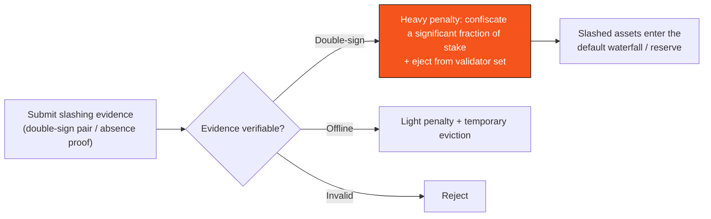

# F.2 Staking, Validator Economics & Slashing

> **Design status**: proposed design. Reward/slashing rates and the unbonding period are TBD parameters ([Appendix II](appendix-parameters.md)). This section covers protocol-level security economics and does not touch token supply/allocation.

## F.2.1 Stake as a Security Deposit

The safety of BFT consensus ([B.1](b1-consensus.md)) rests on $S_f < \tfrac{1}{3}S$ — i.e., honest stake is in the majority. **Staking** makes this assumption economic: validators lock stake as a "misbehavior deposit," and misbehavior is slashed. Attacking the network requires first controlling $\geq \tfrac{1}{3}S$ of the stake and bearing the cost of being slashed, making the attack **economically unprofitable**.

Effective stake ([B.2.1](b2-validators.md)):

$$s_i = s_i^{\text{self}} + \sum_{j} \mathrm{del}_{j \to i}$$

i.e., own stake plus delegations. Voting weight, rewards, and slashing risk all scale with $s_i$.

## F.2.2 Delegation & Reward Distribution

Token holders can delegate to a validator ([B.2.5](b2-validators.md)), sharing consensus rewards and co-bearing slashing. Let validator $i$ earn a consensus reward $\Pi_i$ in one period (the reward source belongs to token economics, whose composition is not expanded on here); after deducting the commission rate $\kappa_i$, it is distributed to delegators by stake share:

$$\text{delegator } j \text{ payoff} = (1 - \kappa_i)\cdot \Pi_i \cdot \frac{\mathrm{del}_{j\to i}}{s_i}$$

Delegation lowers the participation barrier and improves decentralization, without increasing the number of consensus-voting entities (delegations aggregate under the validator).

## F.2.3 Slashing Conditions

Slashing targets **provable protocol violations**. Two core violation classes:

**① Equivocation / double-sign** — a safety violation, the most severe:

$$\exists\, b \neq b',\ \text{same height } h:\quad \mathsf{Sign}_i(b) \wedge \mathsf{Sign}_i(b')$$

A validator signs two conflicting blocks at the same height — precisely the behavior assumed not to happen in the safety argument of [B.1.5](b1-consensus.md). Anyone can submit this pair of contradictory signatures as **non-repudiable slashing evidence**, triggering a heavy penalty on $v_i$ (slashing a significant fraction of its stake, possibly all) and ejection from the validator set.

**② Prolonged offline / inactivity (Downtime)** — a liveness violation, lighter:

$$\text{continuous absence beyond } \Theta \text{ blocks} \Rightarrow \text{light penalty + temporary eviction}$$

A lighter penalty incentivizes uptime without equating it with malice.

## F.2.4 Unbonding Period Prevents Escape

For slashing to have teeth, a malicious actor must not be able to withdraw immediately. After a validator exits, its stake enters an **unbonding period** $T_{\text{unbond}}$ before it can be withdrawn ([B.2.2](b2-validators.md)):

$$T_{\text{unbond}} > T_{\text{evidence-window}}$$

The unbonding period must be longer than the window in which slashing evidence can be submitted — ensuring "detect misbehavior first, then release the withdrawal," closing the "misbehave then instant-withdraw" escape path. This is one of the economic defenses against long-range attacks ([F.3](f3-security.md)).

## F.2.5 Reputation Bond

Beyond consensus validators, participants bearing higher responsibility — PayFi nodes, liquidity providers, high-privilege AI agents, **copy-trading operators (desk operators)** — may be required to lock a **reputation bond**, slashed upon misbehavior/default (echoing bounded authorization in [C.2](c2-session-keys.md) and the default waterfall in [E.2](e2-liquidation.md)). A copy-trading operator's reputation bond, on dereliction/misbehavior, is slashed into the copy-trading reserve pool ([E.4.5](e4-reserve-risk.md)) as the first tier of its loss-absorption waterfall. This extends "behavioral constraints" from purely technical boundaries into economic incentives: **not only blocking misbehavior technically, but also making it economically unprofitable**.

## F.2.6 Economic Security Summary

| Goal | Mechanism |
| --- | --- |
| Costly attacks | Stake = misbehavior deposit; an attack needs $\geq\tfrac13 S$ and must bear slashing |
| Heavy penalty for safety violations | Double-sign is provable → confiscation + ejection |
| Liveness incentive | Light penalty for going offline |
| Prevent misbehavior escape | Unbonding period > evidence window |
| Extend to business roles | Reputation bond + default waterfall |

---

*Next: [F.3 Security Model & Threat Analysis](f3-security.md)*
