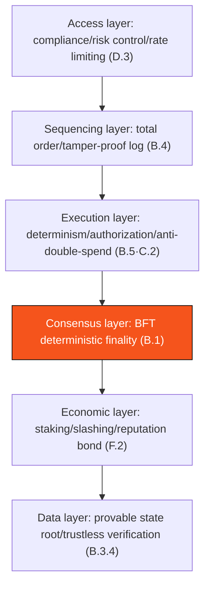

# F.3 Security Model & Threat Analysis

> **Design status**: proposed design. The threat analysis is continuously updated as implementation deepens and security reviews proceed.

This section systematically surveys AXON's attack surface and the corresponding mitigations. Each threat maps to a specific mechanism from earlier sections — security is not a feature of any single layer, but the result of co-designing the entire chain.

## F.3.1 Threat Matrix

| Threat | Description | Mitigation | Section |
| --- | --- | --- | --- |
| **Double-spend** | Spending the same funds twice | nonce + total-order execution + balance check + deterministic finality | [B.5.2](b5-finality.md) |
| **Consensus fork** | Conflicting blocks finalized simultaneously | quorum-intersection argument ($S_f<\tfrac13S$) | [B.1.5](b1-consensus.md) |
| **Long-range attack** | Rewriting history with old keys | weak-subjectivity checkpoints + unbonding period > evidence window | [F.2.4](f2-staking-slashing.md) · this section |
| **Censorship** | Excluding certain transactions | global-seqNo fair queuing + VRF leader + encrypted mempool (roadmap) | [B.4](b4-sequencing.md)·[B.2.3](b2-validators.md) |
| **MEV** | Arbitrage via ordering manipulation | separation of sequencing from block production + total order + encrypted mempool | [B.4.1](b4-sequencing.md) |
| **Oracle manipulation** | Skewing price to trigger wrongful liquidation | multi-source median + MAD + TWAP + circuit breaker | [D.2](d2-oracle.md) |
| **Agent runaway / hijack** | AI agent over-spends / pays erroneously | session-key bounded authorization + instant revocation | [C.2](c2-session-keys.md) |
| **DoS** | Resource exhaustion | gas metering + rate limiting + Paymaster quota | [F.1](f1-gas-fees.md)·[D.3](d3-compliance.md) |
| **Sybil attack** | Forging large numbers of identities | stake-weighting (not node count) + admission threshold | [B.2](b2-validators.md) |
| **State-bloat attack** | Flooding state | state gas pricing + archiving/rent | [B.3.5](b3-state.md)·[F.1.1](f1-gas-fees.md) |
| **Forged copy-trade settlement** | Quant desk reports a fake settlement result to arbitrage | multi-source settlement price + attestation proof + challenge window | [E.3.5](e3-copy-trading.md)·[D.2](d2-oracle.md) |
| **Operator run-off / over-allocation** | Copy-trading operator's dereliction or misappropriation | reputation-bond slashing + fund isolation + principal-first refund | [E.4.5](e4-reserve-risk.md)·[E.3.2](e3-copy-trading.md) |
| **Reserve run** | Exposure exceeds reserve under extreme markets | coverage invariant $\Xi\geq150\%$ + circuit breaker + black-swan protection | [E.4.3](e4-reserve-risk.md)·[E.4.4](e4-reserve-risk.md) |

## F.3.2 Long-Range Attack & Weak Subjectivity

A classic concern for BFT PoS is the **long-range attack**: an attacker obtains the old private keys of validators who once held a majority at some past point (by which time they have exited and their stake has unbonded), and forks from a historical point to rewrite a "seemingly legitimate" chain.

AXON's defenses (proposed):

* **Unbonding period > evidence window** ([F.2.4](f2-staking-slashing.md)): a misbehaving validator's stake remains locked throughout the period in which evidence can be submitted, and a double-sign can be slashed — the attack is not costless.
* **Weak-subjectivity checkpoints**: newly joining / long-offline nodes sync from a recent, socially-agreed checkpoint (rather than genesis). Any "history rewrite" earlier than the checkpoint is rejected. The checkpoint period must be shorter than the unbonding period.

Weak subjectivity is a pragmatic trade-off PoS makes relative to PoW: exchanging "a node needs a recent trusted starting point when joining" for energy-free deterministic finality — for a payment chain, this is entirely acceptable.

## F.3.3 Safety over Liveness

We reiterate the core trade-off of [A.1.4](a1-system-model.md): **under extreme conditions such as a network partition, AXON would rather halt block production (sacrificing liveness) than produce conflicting confirmations (preserving safety)**. For a payment system, "pausing" is far preferable to "double-spend" — a brief unavailability is recoverable, an erroneous finalization is not. Oracle circuit breakers ([D.2.4](d2-oracle.md)) and liquidation pauses ([E.2.1](e2-liquidation.md)) are both embodiments of this philosophy at each layer.

## F.3.4 Defense-in-Depth

AXON's security relies not on a single point but on **multi-layer redundancy**:

If any one layer is breached, the remaining layers still provide protection. This depth is the source of a payment infrastructure's public credibility — **first replace trust with verifiability, then dissolve trust with decentralization**.

---

*Next: [G.1 Network Layer & Transaction Propagation](g1-networking.md)*
