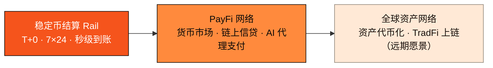

# 1.1 核心命题：L1 是地基，PayFi 是切口

## 一句话命题

> **AXON Finance 先把稳定币支付 / 结算的轨道跑通，再在这条被验证过的轨道上，长成更大的资产网络。**

这句话里藏着 AXON 的全部战略：**L1 是地基（foundation），PayFi 是切口（wedge）。**

* **地基（The L1）**：一条自有的高性能 Layer-1 公链——高吞吐、亚秒最终性、极低且可预测的费用。它把稳定币结算原语、账户抽象、费用代付与可插拔合规网关做进链的最底层，作为一切支付业务的确定性根基。
* **切口（The Wedge）**：首发旗舰场景锚定 **PayFi（Payment Finance，支付金融）**。这是当下加密世界里最具真实现金流、最贴近实体经济的方向——稳定币即时结算、AI 代理支付、把货币的时间价值搬上链。

## 为什么是「切口」而不是「大而全」

在基础设施创业中，最经典也最反直觉的一课是：**不要一开始就试图服务所有人。** 通用平台的胜利几乎都始于一个极窄、极深的切入点，先在一个场景里做到无可替代，再横向扩张。亚马逊从卖书开始，Facebook 从一所大学开始，Stripe 从「七行代码接入支付」开始。

对一条公链而言，「支付」正是这样一个理想的切口：

1. **它是所有金融的原子操作。** 借贷、交易、结算、清算，本质上都是「把一笔钱从 A 安全、确定地移到 B」的组合。把支付这一原子操作做到极致确定，上层的一切金融应用才有稳固的地基。
2. **它有真实、可测量的需求。** 稳定币 2025 年在链上结算了 $33T——这不是叙事，是现金流。需求已经在那里，缺的只是一条为它而生的轨道。
3. **它能自然地长出更大的网络。** 一旦一条链承载了可信的支付与清算，资产、信贷、乃至传统金融工具都会被吸附到同一条轨道上——因为它们都需要「结算」。

## 三段式演进弧

AXON 的路线不是一次性铺开，而是一条清晰的价值演进弧：

* **第一段 · 结算 Rail**：把稳定币支付的确定性轨道跑通。这是地基场景，承载其上的一切。
* **第二段 · PayFi 网络**：在轨道之上叠加货币市场、链上信贷与 AI 代理支付，捕获货币的时间价值。
* **第三段 · 资产网络**：复用已验证的资金与清算 rail，把网络延伸到更广阔的资产世界。

## 这与「又一条快链」有何不同

市面上从不缺「更快的链」。AXON 的差异不在于某个孤立的性能数字，而在于**它把整条链的设计目标，锚定在「支付级确定性」这一件事上**：

* 通用链追求「什么都能跑」，AXON 追求「支付永远不出错」；
* 通用链把合规、账户抽象、费用代付当作应用层的补丁，AXON 把它们当作地基的原生能力；
* 通用链顺带承载支付，AXON 为支付而生。

这不是速度之争，而是**定位之争**。下一节我们给出 AXON 的完整画像。

---

*延伸阅读：[1.2 AXON Finance 是什么](1-2-what-is-axon.md) · [1.3 设计哲学与第一性原理](1-3-design-principles.md) · [Part IV · PayFi 引擎](../part4-payfi/README.md)*
