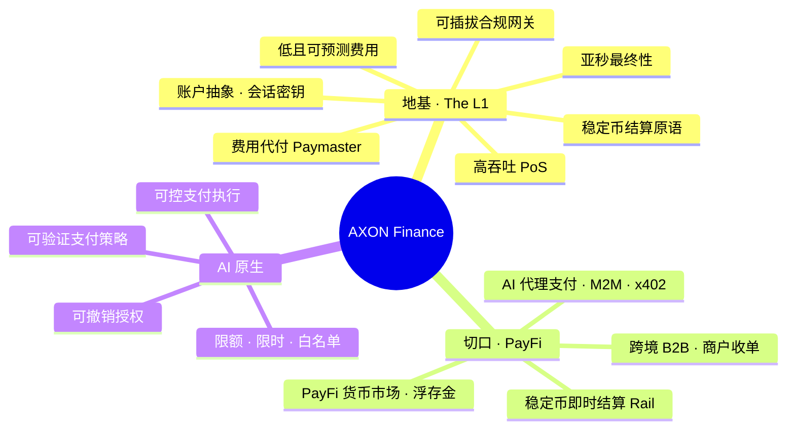

# 1.2 AXON Finance 是什么：双层叙事

## 定义

> **AXON Finance 是一条高吞吐、亚秒最终性、AI 原生的 Layer-1 公链；首发旗舰场景锚定 PayFi（支付金融）——稳定币即时结算、AI 代理支付、把「货币的时间价值」搬上链。**

用一张图看清它的全貌：

## 三块速览

### 一、地基：一条为支付而生的 L1

AXON 的底层是一条自有公链，它的设计目标只有一个词——**确定性**。支付不同于一般计算：一笔转账「大概率成功」是不够的，它必须**确定成功、确定不双花、确定可追溯**。为此，地基层提供：

* **支付级 SLA**：高吞吐、亚秒最终性、极低且可预测的费用；
* **稳定币结算原语内建**：结算不是一份智能合约，而是链层的一等能力；
* **AI 原生原语**：账户抽象、会话密钥、意图（intents）作为一等公民；
* **费用代付（Paymaster）**：用户无需持有 gas 代币即可完成支付，体验不被 gas 割裂；
* **可插拔合规网关**：KYC/AML、地理围栏、风控预审在接入层即可挂载。

### 二、切口：四大 PayFi 场景

在地基之上，AXON 首发四个层层叠加的 PayFi 场景（详见 [Part IV](../part4-payfi/README.md)）：

| 场景 | 一句话 |
| --- | --- |
| 稳定币即时结算 Rail | T+0、7×24、秒级到账的全球支付轨道 |
| AI 代理支付（M2M / x402） | 给 AI 代理设限额授权的机器原生支付层 |
| PayFi 货币市场 · 浮存金收益 | 把在途资金 / 应收 / 浮存金做成链上货币市场 |
| 跨境 B2B 与商户收单 | 让中小企业无需代理行网络即可秒级跨境收付 |

### 三、AI 原生：可控支付执行

AXON 对 AI 的定位是全书最关键的差异化之一：**我们不主打「AI 替你赚钱」，而是把 AI 安全地接进支付。** AI 代理经济正在到来，机器将代人发起海量的小额、高频支付；但让一个能自主行动的程序直接动钱，若没有限额、审计与可撤销机制，就是灾难。

AXON 把 AI 定位为链层原生的**「可控支付执行」**——账户抽象 + 会话密钥 + 可验证支付策略 + 限额 / 限时 / 白名单 / 可撤销授权，让 AI 代理**能付钱、跑不了路、超不了额**。详见 [Part V](../part5-ai/README.md)。

## 名字的含义

**Axon（轴突）** 是神经元向外传递信号的纤维——它是神经系统里负责「把信号确定地、快速地、定向地送达」的结构。这正是 AXON Finance 想成为的东西：**价值网络的轴突**，让每一笔支付像神经信号一样，快速、确定、定向地抵达目的地。母币命名为 **AXON**。

---

*延伸阅读：[1.3 设计哲学与第一性原理](1-3-design-principles.md) · [Part III · 技术架构](../part3-architecture/README.md)*
