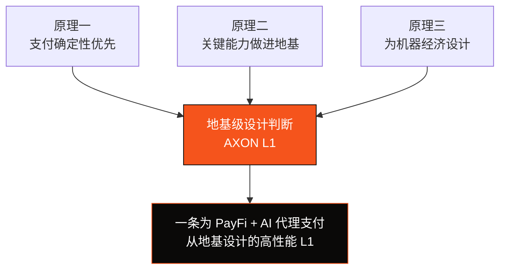

# 1.3 设计哲学与第一性原理

AXON 的每一个技术选择，都可以回溯到三条第一性原理。理解它们，就理解了这条链「为什么长这样」。

## 原理一：支付确定性 > 通用可编程性

在通用链的世界观里，一切皆为「计算」——转账只是一次特殊的状态变更。但从支付的世界观看，一笔支付的核心诉求不是「能不能算」，而是**「能不能确定」**：

* 钱**确定**到账了吗？（最终性）
* 会不会被**重复花费**？（反双花）
* 出问题时能不能**完整重放、追溯、恢复**？（可审计、可恢复）

> **一条被反复验证的工程直觉：支付链最难的不是吞吐量，而是确定性、授权与恢复。**
>
> 高吞吐可以靠硬件和并行堆出来；但「这笔钱绝不会算错、绝不会双花、出错时一定能查清」——这需要从共识、排序到日志的整条链路协同设计，无法在应用层打补丁补出来。

因此 AXON 从地基起就把确定性作为最高优先级：确定性最终性的共识、全局单调有序的排序层、可完整重放的预写日志（write-ahead log）。这些在 [Part III](../part3-architecture/README.md) 展开。

## 原理二：把关键能力做进地基，而非事后打补丁

通用链承载支付时，有三样东西天然缺席，只能靠应用层「打补丁」：**合规、账户抽象、费用代付**。而补丁式方案有根本缺陷——它们无法访问链的底层状态，无法保证全局一致，容易被绕过。

AXON 的选择是把这些能力**下沉到地基**：

| 能力 | 打补丁的问题 | AXON 的地基化方案 |
| --- | --- | --- |
| 合规（KYC/AML / 地理围栏） | 应用各自实现、口径不一、可绕过 | 接入层可插拔合规网关，统一挂载 |
| 账户抽象 / 会话密钥 | 靠合约钱包模拟，兼容性差 | 账户抽象作为一等公民，原生支持 |
| 费用代付（Gas 抽象） | 需第三方中继，体验割裂 | Paymaster 内建，用户无需持有 gas |

为什么这很重要？因为**支付的用户体验，容不下「补丁的裂缝」**。一个用户在为一杯咖啡付款时，不应该被要求先去买一种叫 gas 的代币、再祈祷网络不拥堵。把这些做进地基，支付体验才可能像 Web2 一样顺滑，同时保留链上的确定性与可组合性。

## 原理三：为机器经济设计，而非只为人

过去十五年，几乎所有支付基础设施都默认「付款的是人」——有人在点击「确认」，有人在输入验证码。但一个新的支付主体正在崛起：**AI 代理**。它们会代人订机票、买算力、按调用付费地消费 API，发起的将是人类手速无法企及的、海量的机器对机器（M2M）微支付。

为机器设计支付，约束条件截然不同：

* **授权必须可编程且有界**——不能靠人工逐笔确认，但必须有限额、限时、白名单；
* **可撤销与可审计是刚需**——一个失控的代理必须能被立即断电，且每一笔都可追溯；
* **成本必须趋近于零**——按调用计费的微支付，容不下几美分的 gas。

AXON 把这些约束前置到地基设计里——这就是「AI 原生」的真正含义：**不是加一个 AI 功能，而是让链的授权模型从一开始就假设付款方可能是一台机器。** 详见 [Part V](../part5-ai/README.md)。

## 三原理如何收束

这三条原理不是孤立的口号，它们共同指向同一个结论：**要真正服务支付与机器经济，必须自有一条 L1。** 这个结论的完整论证，是 [Part III](../part3-architecture/README.md) 的主题。

---

*延伸阅读：[Part II · 市场与机会](../part2-market/README.md) · [3.1 为什么必须自有 L1](../part3-architecture/3-1-why-own-l1.md)*
