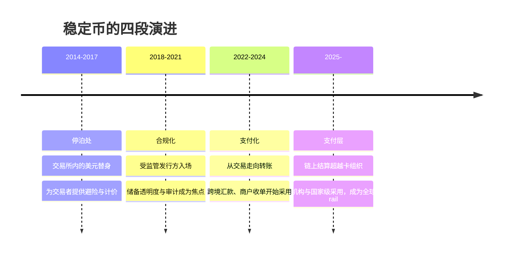

# 2.1 稳定币成为全球支付层

## 一个已经发生、却常被低估的事实

> **2025 年，稳定币在链上完成的结算量达到 $33T（万亿美元），已超过 Visa 与 Mastercard 两大卡组织清算额之和（约 $25.5T）。**

这个数字的意义，值得停下来体会：**一个诞生于加密世界、最初只是为交易者提供「避险停泊处」的工具，已经在结算量级上追平乃至超越了运行了半个多世纪的全球卡组织网络。** 稳定币不再是加密内部的叙事，它已经是一个真实的、全球规模的支付层。

## 稳定币简史：从停泊处到支付层

要理解这个量级从何而来，需要回看稳定币的演进。它大致经历了四个阶段：

* **第一阶段 · 停泊处（Parking）**：稳定币最初的用途，是让交易者在剧烈波动的市场里有一个「美元锚」——不必真正离场，就能停泊价值。它是加密交易的润滑剂，而非支付工具。
* **第二阶段 · 合规化（Compliance）**：随着受监管发行方的入场，储备资产的透明度、审计与合规成为行业焦点。稳定币开始获得机构信任，从「灰色工具」走向「可信资产」。
* **第三阶段 · 支付化（Payments）**：人们逐渐发现，一个 7×24、秒级到账、费率极低的美元凭证，天然适合做**转账**——尤其是传统 rail 又慢又贵的跨境场景。稳定币开始被用于汇款与商户收单。
* **第四阶段 · 支付层（The Payment Layer）**：到 2025 年，链上结算量级追平卡组织，稳定币正式成为一个独立的全球支付层。连传统巨头也开始接入——Visa 已开始接入 USDC 结算。

## 为什么稳定币适合做支付

稳定币能承担全球支付层的角色，源于它相对传统 rail 的几个结构性优势：

| 维度 | 传统电汇 / 卡组织 | 稳定币 rail |
| --- | --- | --- |
| 到账时间 | T+1 ~ T+5（跨境更慢） | 秒级 ~ 分钟级 |
| 运行时间 | 工作日、银行营业时间 | 7×24，无休 |
| 可编程性 | 几乎不可编程 | 原生可编程、可组合 |
| 边际成本 | 固定费 + 汇兑加价 | 趋近于零（取决于底层链） |
| 覆盖范围 | 受账户体系限制 | 只需一个链上地址 |

## 采用的广度

稳定币的采用已经不再局限于加密原生人群：

* 约 **90% 的金融机构**表示已在使用或试点稳定币；
* 在稳定币的跨境流量中，约 **60% 已是 B2B（企业对企业）**——这意味着稳定币正在进入实体商业的核心，而非仅仅是散户投机；
* 业界预测，到 **2030 年，稳定币可能占到跨境支付的约 10%**。

## 但轨道还没跟上

稳定币解决了「价值凭证」的问题——它让一美元可以数字化、可编程、可全球流动。但它没有解决**「承载这枚凭证的轨道」**的问题。今天绝大多数稳定币，仍跑在为通用计算设计的公链上，继承了这些链的所有支付级缺陷：

* **拥堵与波动的 gas**：网络繁忙时，一笔小额支付的手续费可能超过支付金额本身；
* **不确定的最终性**：概率性最终性意味着「几乎确定」，但支付需要「绝对确定」；
* **割裂的体验**：用户必须先持有原生 gas 代币，才能动用自己的稳定币。

**价值已经数字化了，但承载它的轨道还停留在上一个时代。** 这正是 AXON 的切入点——为这个已经真实存在、规模已达数十万亿的支付层，铺一条真正为它设计的轨道。

---

*延伸阅读：[2.2 PayFi 的诞生与货币时间价值](2-2-payfi-thesis.md) · [2.3 跨境支付的结构性痛点](2-3-crossborder-pain.md) · [3.1 为什么必须自有 L1](../part3-architecture/3-1-why-own-l1.md)*
