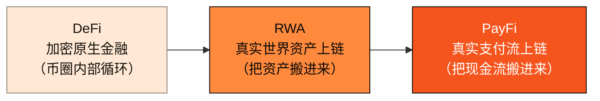

# 2.2 PayFi 的诞生与货币时间价值

## PayFi 是什么

**PayFi = Payment + Finance（支付金融）。** 它指的是围绕真实支付流构建的链上金融——不是把加密资产互相交易，而是把**现实世界的钱如何流动、结算与生息**这件事搬上链。

> **PayFi 的概念由 Solana 基金会的 Lily Liu 于 2024 年提出，其核心命题是：把「货币的时间价值」搬上链。**

这句「货币的时间价值」（Time Value of Money, TVM）是理解 PayFi 的钥匙。它是金融学最古老的第一性原理之一：**今天的一美元，比明天的一美元更值钱**——因为今天的一美元可以立即投入使用、产生收益。整个现代金融的利息、贴现、融资，本质上都是在为「时间」定价。

支付链路里，处处是这种「时间价值」：一笔跨境货款在途的三天、一张 30 天账期的应收账款、一笔信用卡结算前的浮存金……这些资金在「已经发生、但尚未清算」的间隙里沉睡着，它们的时间价值尚未被充分捕获。**PayFi 就是把这些沉睡的时间价值，用链上货币市场唤醒。** 它的金融学内核，我们在 [4.4 货币时间价值的金融学](../part4-payfi/4-4-time-value-of-money.md) 里深入展开。

## 谱系：从 DeFi 到 RWA 再到 PayFi

PayFi 不是凭空出现的，它是加密金融演进的第三级台阶：

* **DeFi（去中心化金融）**：第一级台阶。它证明了借贷、交易、做市可以在无需中介的情况下运行，但它的资产和收益大多是**加密原生**的——币圈内部的循环，收益最终来自其他参与者的投机。
* **RWA（真实世界资产）**：第二级台阶。人们开始把国债、房产、私募信贷等**现实资产**代币化搬上链，让链上收益有了现实锚定。但 RWA 主要搬的是「资产」这个静态存量。
* **PayFi（支付金融）**：第三级台阶。它搬的不是静态资产，而是**流动的现金流**——支付、结算、应收、浮存金。现金流比静态资产更高频、更贴近实体经济，也更能持续产生真实收益。

这条谱系背后是一个价值观的转向：**从「叙事驱动」到「现金流驱动」。** 上一轮周期，加密世界为各种宏大叙事定价；这一轮，市场越来越只为**真实、可持续、可测量的现金流**买单。PayFi 恰好站在这个转向的正中央。

## 现金流，不是叙事：Huma 的验证

这个转向不是纸上谈兵。PayFi 赛道的龙头 **Huma Finance** 已经用真实业务验证了这个模型：

> **Huma Finance 累计交易量已突破 $10B+（2026 年 2 月破百亿），同比增长约 3.4 倍（从 $2.9B 增至 $10B）。** Huma 运行在 Solana / Stellar 上，围绕真实的应收账款与支付融资构建链上货币市场——它验证了「把货币时间价值搬上链」不是概念，而是能跑出真实现金流的商业模式。

Huma 的意义在于：它证明了 **PayFi 有真实需求、真实收益、真实增长**。这不是又一个 TVL 靠激励堆起来的协议，而是有真实业务现金流支撑的网络。它同时也揭示了一个空白——像 Huma 这样的 PayFi 协议，今天仍不得不运行在通用链上，戴着通用链的镣铐跳舞。

## 从「协议」到「专链」

Huma 验证了 PayFi 的需求，但它是**协议层**的玩家——在别人的链上搭建应用。而一个更大的问题浮现出来：**如果 PayFi 是一个能跑出数百亿现金流的赛道，它是否值得拥有一条为它从地基设计的专链？**

历史一再给出肯定的回答。当一个应用场景足够大、且对底层有独特的确定性 / 合规 / 授权要求时，它总会催生专用的基础设施——正如高频交易催生了专用的撮合引擎，游戏催生了专用的图形硬件。**PayFi 正在到达这个临界点。** AXON 的判断是：这条专链的窗口已经打开。

---

*延伸阅读：[2.5 竞争格局](2-5-competitive-landscape.md) · [4.2 PayFi 货币市场](../part4-payfi/4-2-money-market.md) · [4.4 货币时间价值的金融学](../part4-payfi/4-4-time-value-of-money.md)*
