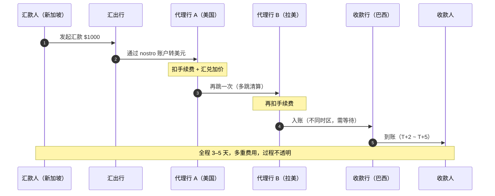
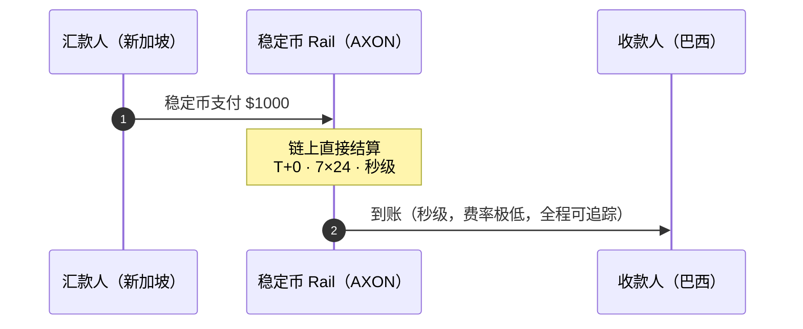

# 2.3 跨境支付的结构性痛点

## 一笔跨境汇款的一生

想象一位在新加坡工作的工程师，要给在巴西的家人汇 1000 美元。在传统体系里，这笔钱不会「直接」从新加坡飞到巴西——它要经过一条你看不见的、由多家银行接力的链条：

每一跳，都意味着**一次手续费、一次汇兑加价、一段时间延迟、一个可能出错的对账环节**。这就是为什么一笔看似简单的跨境汇款，往往要走 3–5 天、被层层加价、且全程无法追踪。

## 为什么会这样：代理行体系的机制

跨境支付之所以又慢又贵，根源在于它依赖的**代理行（correspondent banking）体系**。这套体系的核心，是银行之间互设的两类账户：

* **Nostro 账户**（「我们在你那里的账户」）：A 银行在 B 银行开设的、以 B 所在国货币计价的账户。
* **Vostro 账户**（「你们在我们这里的账户」）：同一个账户，从 B 银行的视角看。

由于世界上没有任何一家银行与所有其他银行都直接互设账户，一笔跨境支付往往需要**通过若干家中间代理行接力**，才能从汇出行走到收款行。这套体系带来四个结构性问题：

| 问题 | 成因 |
| --- | --- |
| **慢** | 多跳清算 + 时区错配 + 逐行对账，T+2~5 是常态 |
| **贵** | 每一跳都收费，加上不透明的汇兑加价 |
| **占用资金** | 银行必须在各 nostro 账户里预先存放大量「趴着的钱」（预筹资金），资金效率极低 |
| **不透明** | 汇款人无法实时追踪资金走到了哪一跳，出错难以定位 |

其中「预筹资金（pre-funding）」尤其被低估——为了随时能清算，全球银行在 nostro 账户里沉淀了数以万亿计的闲置资金。这些钱本可以创造收益，却只能趴在账户里等待清算。**这正是货币时间价值被大规模浪费的地方，也正是 PayFi 货币市场要捕获的机会**（见 [4.2](../part4-payfi/4-2-money-market.md)）。

## 稳定币 rail：从多跳到单跳

稳定币 rail 之所以能颠覆这套体系，在于它把「多跳接力」压缩成了「单跳直达」：

没有代理行接力，没有预筹资金占用，没有时区错配——一笔支付在链上直接结算，秒级到账，费率极低，且全程可追踪、可编程。

## 这是一个多大的问题

跨境支付的痛点，对应着一个巨大的市场：

* 全球跨境支付年流量（TAM）约 **$190T+（万亿美元）**；
* 其中 B2B 已占稳定币跨境流量的约 **60%**；
* 业界预测到 **2030 年，稳定币可能占跨境支付的约 10%**。

即便只捕获这个市场的一小部分，也是一个巨大的机会。而更重要的是：跨境支付只是 PayFi 的第一个场景——它是**地基场景**，一旦跑通，货币市场、信贷、AI 代理支付都能叠加在同一条 rail 上。

---

*延伸阅读：[4.1 稳定币即时结算 Rail](../part4-payfi/4-1-settlement-rail.md) · [4.3 跨境 B2B 与商户收单](../part4-payfi/4-3-crossborder-b2b.md)*
