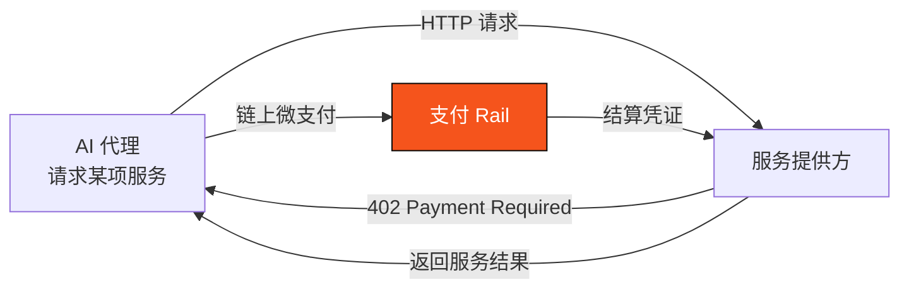

# 2.4 AI 代理经济的兴起

## 一个新的支付主体正在崛起

过去所有支付基础设施，都默认一个前提：**付款的是人**。有一双手在点击「确认」，有一双眼睛在核对金额。但这个前提正在被打破。

随着大模型与自主代理（AI agents）的成熟，一类新的经济主体正在出现：**能够自主规划、决策并执行任务的软件代理。** 它们会代你订机票、比价采购、按需租用算力、按调用付费地消费各种在线服务。当这些代理开始「花钱」时，一个全新的支付主体就诞生了——**机器**。

这不是遥远的科幻。它带来的支付形态，与人类支付有本质区别：

* **高频**：一个代理完成一个任务，可能触发成百上千次微小的付费调用；
* **微额**：单次支付可能只有几分之一美分——为一次 API 调用、一段算力、一条数据付费；
* **机器对机器（M2M）**：付款方和收款方都可能是软件，没有人在环路里逐笔确认。

这类支付被称为 **M2M（Machine-to-Machine）微支付**，它所支撑的商业形态被称为 **agentic commerce（代理商务）**。

## x402：一个沉睡协议的复兴

有趣的是，为机器支付准备的技术接口，其实早已存在——只是沉睡了三十年。

HTTP 协议里有一个几乎从未被真正使用的状态码：**`402 Payment Required`（需要付款）**。它在 1990 年代被定义出来，为「按次付费访问网络资源」预留，却因为当时缺乏可用的微支付手段而长期休眠。

**x402** 正是让这个协议复活的尝试：当一个代理请求某项服务时，服务方返回 `402`，代理在链上完成一笔微支付，服务方验证后即返回结果。整个过程无需注册账号、无需订阅、无需人工——**服务按调用付费，机器对机器直接结算**。这为 AI 代理经济提供了一个原生的、按需的支付接口。

## 真正的障碍：不是「能不能付」，而是「授权与安全」

到这里，一个关键的洞察浮现出来。很多人以为 AI 代理支付的难点是「让 AI 能付钱」——但这恰恰是最简单的部分。

> **真正的障碍不是「能不能付」，而是「授权与安全」。**
>
> 一个 AI 代理一旦能自主动钱，却没有限额、没有审计、不可撤销——那就是灾难。它可能被诱导、被劫持、或仅仅是因为一个 bug，就在你不知情时花光你的钱、或跑到你不希望的地方去。

这就是为什么支付与科技巨头正在**抢着定义 agentic payment 的授权标准**（如 AP2 等协议）——因为谁定义了「AI 如何被安全地授权动钱」，谁就掌握了机器经济的支付入口。这场标准之争，本质是一场关于**信任边界**的竞赛。

而这，恰恰是 AXON 的核心差异化所在：**我们不把 AI 支付理解为「让 AI 能花钱」，而是理解为「如何给 AI 花钱套上可控的缰绳」。** 这个判断如何落地为链层原生的能力，是 [Part V · AI 原生](../part5-ai/README.md) 的主题。

## 为什么通用链补不出来

有人会问：既然 AI 代理支付这么重要，通用链加个功能不就行了？

问题在于，「可控支付执行」不是一个应用层功能，而是一套**地基级的授权模型**。它要求：

* 会话密钥（session keys）作为一等公民——为每个代理签发有界的、可撤销的授权；
* 限额 / 限时 / 白名单在链层强制执行——而非依赖应用自觉；
* 微支付成本趋近于零——否则按调用付费的经济模型根本不成立。

这些要求，通用链只能靠合约层「模拟」，既不安全也不高效。**它们必须从地基设计。** 这正是「AI 原生」与「AI 兼容」的根本区别。

---

*延伸阅读：[5.1 Agentic Payments 的真问题](../part5-ai/5-1-agentic-payments.md) · [5.3 x402 与 M2M 微支付](../part5-ai/5-3-x402-m2m.md) · [3.7 账户抽象、会话密钥与 Paymaster](../part3-architecture/3-7-account-abstraction.md)*
