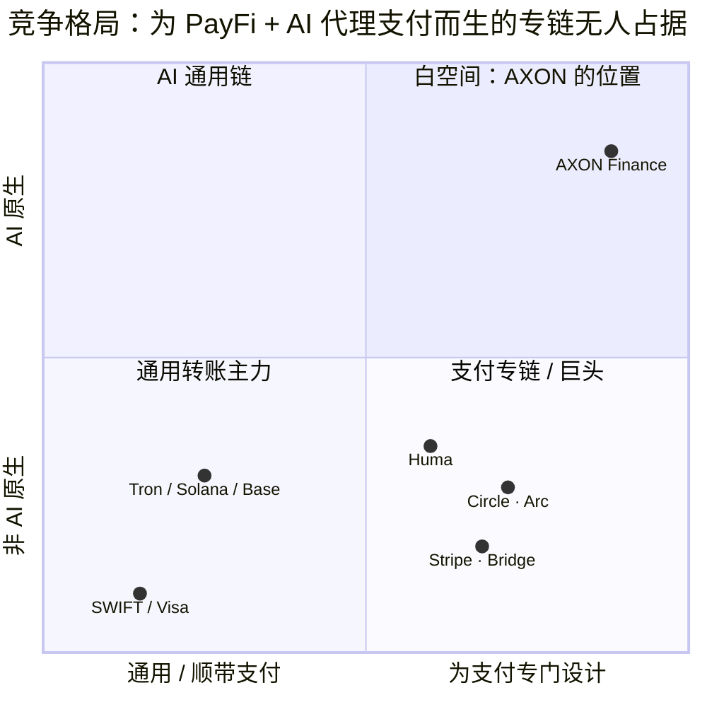

# 2.5 竞争格局

支付赛道从不缺玩家。但当我们把「为 PayFi + AI 代理支付从地基设计的高性能 L1」作为坐标去审视时，会发现一个反常的现象：**赛道很拥挤，但那个特定的位置却空着。**

## 五类玩家

当下涉足稳定币支付的力量，大致可分为五类：

| 玩家 | 路线 | 体量 / 判断 |
| --- | --- | --- |
| **Huma Finance** | PayFi 网络龙头（Solana / Stellar） | 累计交易量 $10B+，定义 PayFi 赛道、验证真实现金流模型 |
| **Circle · Arc** | 稳定币发行方自建支付 L1 | USDC 巨头亲自下场做支付专链——印证「支付专链」方向 |
| **Stripe · Bridge / Tempo** | 传统支付巨头 + 稳定币基建 | $11 亿收购 Bridge；但闭源 / 许可制，非 AI 原生 |
| **通用链 Tron / Solana / Base** | 稳定币转账主力 | 顺带承载支付，非 PayFi 原生、无 AI 代理支付原语 |
| **SWIFT / Visa / 代理行** | 传统跨境 rail | T+2~5、费率高、不可编程；Visa 才刚接入 USDC 结算 |

逐一来看：

* **Huma Finance** 验证了 PayFi 的真实需求与现金流模型，是赛道的定义者。但它是**协议层**玩家，运行在通用链上，受制于底层链的性能与授权能力。
* **Circle · Arc** 的动向极具信号意义——**USDC 的发行方亲自下场做支付专链**，这本身就印证了「支付需要专链」的判断。但作为稳定币发行方，其专链天然带有单一发行方的中心化色彩与生态边界。
* **Stripe · Bridge / Tempo**——Stripe 以约 $11 亿收购稳定币基建公司 Bridge，展现了传统支付巨头的决心。但这条路线**闭源、许可制**，是把稳定币纳入既有的中心化支付帝国，而非开放的、AI 原生的公共 rail。
* **通用链（Tron / Solana / Base）** 是当下稳定币转账的主力承载者。但对它们而言，支付只是**顺带**承载的一种应用——它们没有 PayFi 原生的结算原语，更没有 AI 代理支付的授权原语。
* **传统 rail（SWIFT / Visa / 代理行）** 是被颠覆的对象。它们体量庞大、网络深厚，但 T+2~5、费率高、不可编程的结构性缺陷难以自我革新——Visa 才刚刚开始接入 USDC 结算，正说明旧世界也不得不向新 rail 靠拢。

## 一张图看清白空间

把这些玩家放到两个维度上——横轴是「通用链 ↔ 支付专链」，纵轴是「非 AI 原生 ↔ AI 原生」——白空间一目了然：

* **右下象限**（支付专链，但非 AI 原生）：Circle·Arc、Stripe·Bridge、Huma 都在向这里聚集——大家都意识到「支付需要专门设计」，但没有一个把 AI 代理支付作为地基能力。
* **左下 / 左上象限**：通用链与传统 rail，它们要么只是顺带支付，要么根本不可编程。
* **右上象限**（为支付专门设计 **且** AI 原生）：**空着。** 这正是 AXON 要占据的位置。

## 竞争的信号，而非威胁

值得强调的是：Circle、Stripe 这些巨头的入场，对 AXON 而言**首先是信号，而非威胁**。当 USDC 的发行方和全球最大的互联网支付公司都开始自建支付链时，它们在用行动确认一件事——**「支付需要专链」的判断是对的，这个市场足够大、足够重要。**

它们验证了方向，却各自留下了空白：发行方专链有中心化边界，巨头方案闭源且非 AI 原生，通用链缺乏支付与 AI 原语。**一条开放的、AI 原生的、为 PayFi 从地基设计的高性能 L1，仍然虚位以待。**

---

*延伸阅读：[2.6 白空间与市场规模](2-6-whitespace.md) · [3.1 为什么必须自有 L1](../part3-architecture/3-1-why-own-l1.md)*
