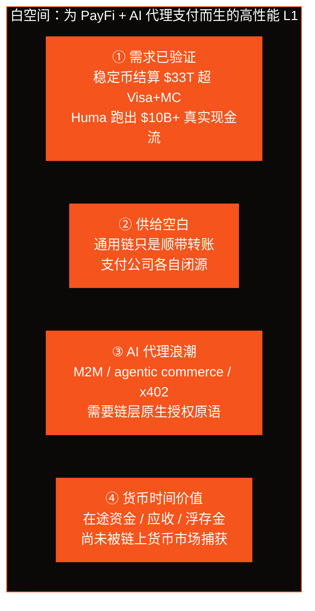
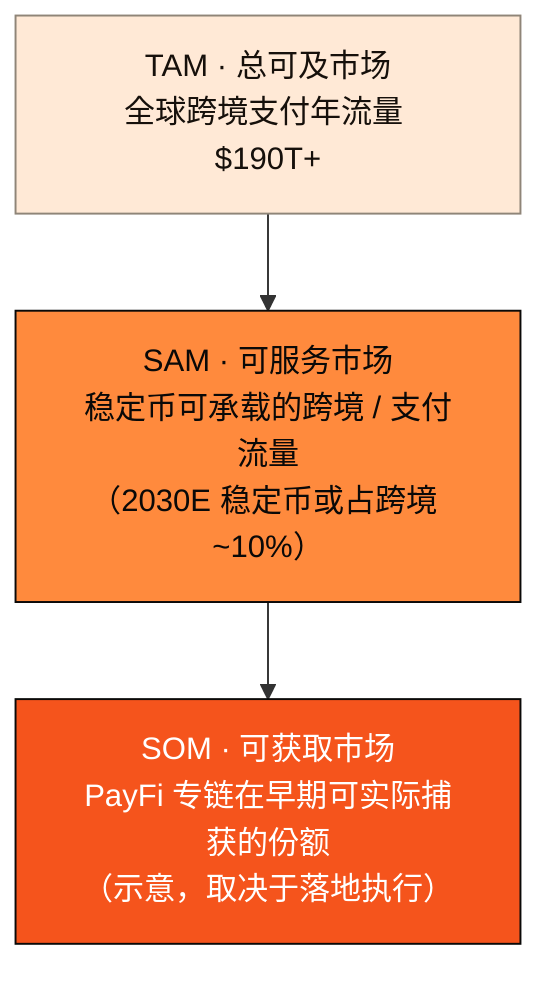

# 2.6 白空间与市场规模

## 四条论据，一片白海

把前几节的观察收束起来，AXON 的市场判断可以浓缩为四条论据。它们分别回答「需求」「供给」「趋势」「收益」四个问题：

* **① 需求已验证。** 稳定币 2025 年链上结算 $33T 已超 Visa+MC；Huma 等 PayFi 协议跑出 $10B+ 的真实业务——**这是现金流，不是叙事。** 市场不需要被教育，需求已经在那里。
* **② 供给空白。** 通用链只是顺带承载转账，支付公司各自闭源封闭；**没有人做一条「为 PayFi + AI 代理支付从地基设计」的高性能 L1。**
* **③ AI 代理浪潮。** M2M、agentic commerce、x402 需要链层原生的账户抽象、会话密钥、限额授权——这些通用链补不出来，是一个全新的、正在打开的原生需求。
* **④ 货币时间价值。** 支付链路里的在途资金、应收账款、浮存金，尚未被链上货币市场充分捕获——**这正是 PayFi 的超额收益来源。**

将这四条合成一句定位钩子：

> **为 PayFi 与 AI 代理支付而生的高性能 L1——稳定币 T+0 结算 + 把「货币的时间价值」搬上链。**

## 市场规模：从 TAM 到落脚点

这片白海到底有多大？我们用经典的 TAM / SAM / SOM 框架来标定量级——注意，这里给出的是**市场量级的示意**，而非对 AXON 业务规模的预测。

| 层级 | 量级 | 口径 |
| --- | --- | --- |
| **TAM**（总可及市场） | 全球跨境支付年流量 **$190T+** | 公开监测 / 业界数据 |
| **参照锚点** | 稳定币 2025 链上结算 **$33T**（超 Visa+MC $25.5T） | 不同层口径，看趋势 |
| **趋势** | 稳定币占跨境支付 2030E **~10%** | 业界预测 |
| **龙头验证** | Huma 累计 **$10B+**（YoY 3.4×） | PayFi 赛道真实现金流 |

## 时机（Why Now）

伟大的机会需要对的时机。AXON 认为这个窗口正当其时：

* **需求侧成熟**——稳定币结算已达数十万亿量级，PayFi 龙头验证了模型；
* **供给侧空白**——巨头入场印证方向，却各自留下开放专链的空白；
* **技术侧就绪**——高性能共识、账户抽象、可验证策略沙盒等基础技术已经成熟到可以组合成一条为支付而生的 L1；
* **AI 侧临界**——AI 代理经济从概念走向落地，机器支付的授权标准之争刚刚开始。

四条曲线在同一个时点交汇——这就是 AXON 选择「现在」的原因。Part III 起，我们进入技术：这条为白海而生的 L1，究竟该如何被建造。

---

*延伸阅读：[Part III · 技术架构](../part3-architecture/README.md) · [6.1 路线图 P0 → P3+](../part6-roadmap/6-1-roadmap.md)*
