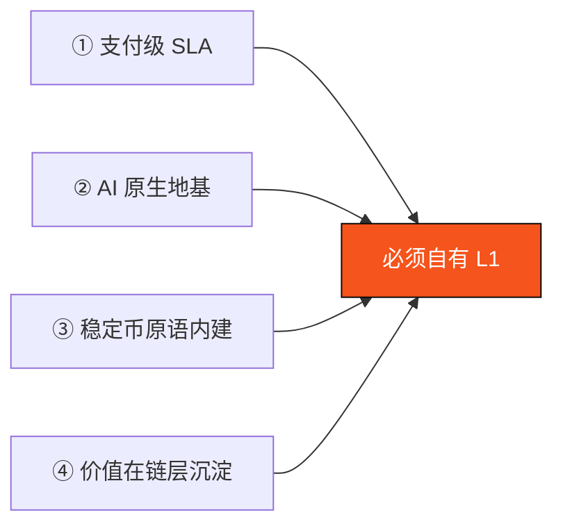

# 3.1 为什么必须自有 L1

建一条新的 Layer-1 是一个昂贵、艰难的决定。所以第一个必须回答的问题是：**为什么不在现有的高性能链上做一个应用就好？** AXON 的回答是四条无法回避的理由。它们的共同点是：**每一条都指向链的地基，无法在应用层解决。**

## 理由一：支付级 SLA

支付有一套与通用计算截然不同的服务质量（SLA）要求：

* **高吞吐**——要承载全球规模的支付流量；
* **亚秒最终性**——用户点了「付款」，必须在一眨眼内确定成功；
* **极低且可预测的费用**——为一杯咖啡付款，手续费不能比咖啡还贵，更不能随网络拥堵剧烈波动。

通用链的拥堵与 gas 波动，做不到支付 / 结算所需的确定性。当网络繁忙时，交易费飙升、确认时间拉长——这对 DeFi 交易者或许可以忍受，但对一个必须「秒级、固定成本」完成的支付，是致命的。

要保证支付级 SLA，你必须能控制共识、区块生产节奏与费用模型——这些都是**链层的东西**，无法通过在别人的链上部署合约来获得。

## 理由二：AI 原生地基

如 [2.4](../part2-market/2-4-ai-agent-economy.md) 所述，AI 代理支付的核心不是「能付」，而是「可控」。而「可控」要求把账户抽象、会话密钥、意图（intents）作为**一等公民**做进链里：

* 为每个代理签发有界、可撤销的会话密钥；
* 在链层强制执行限额 / 限时 / 白名单；
* 让支付策略可被验证地沙盒执行。

这些不是通用链能「打补丁」补出来的能力——它们要求从账户模型到执行环境的原生支持。**AI 原生，必须从地基开始。**

## 理由三：稳定币结算原语内建

在通用链上，一笔稳定币转账是一次 ERC-20 合约调用——稳定币只是「一个恰好叫 USDC 的 token」。但在 AXON 的设计里，**稳定币结算是链层的一等能力**：

* 结算引擎、法币锚定的多源喂价、风险准备金内建在链层；
* Paymaster 费用代付让用户无需持有 gas 代币；
* 可插拔合规网关在接入层挂载。

把这些做进地基，支付体验才不会被「先买 gas、再祈祷不拥堵、还要自己处理合规」这些裂缝割裂。

## 理由四：价值在链层沉淀

第四条是商业模式层面的。AXON 作为一条为支付而生的 L1，其网络承载的每一笔支付、结算与信贷，都会在链层产生**真实的协议手续费收入**。

与靠代币增发补贴运转的网络不同，AXON 的价值主张建立在**真实业务量（TPV, Total Payment Volume）产生真实营收**之上——网络的可持续性，来自它承载的真实经济活动，而非通胀激励。

一条自有 L1，才能让这些价值在链层被捕获与治理；若只是在别人的链上做应用，价值的很大一部分会被底层链抽走。

*（关于协议营收如何与代币价值关联的具体机制，见 [Part VII · 代币经济](../part7-tokenomics/README.md) 的「通缩飞轮」。）*

## 四条理由，一个结论

这四条理由无一能在应用层解决，它们共同指向同一个结论：**要真正服务 PayFi 与 AI 代理支付，必须自有一条 L1。** 这条 L1 的样子，就是下一节的五层架构。

---

*延伸阅读：[3.2 五层架构总览](3-2-layered-architecture.md) · [1.3 设计哲学与第一性原理](../part1-vision/1-3-design-principles.md)*
