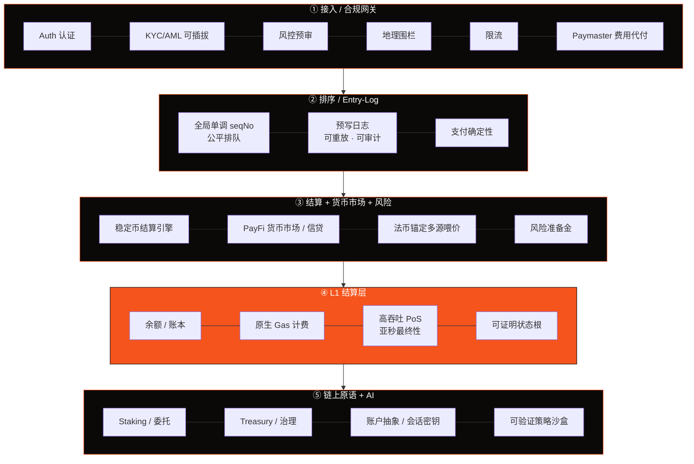
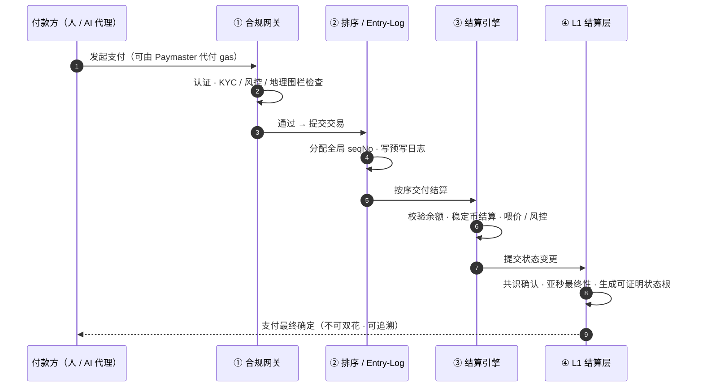

# 3.2 五层架构总览

AXON 的地基被组织为五个层次。理解这五层最好的方式，是跟随**一笔支付**自上而下地走一遍——它从接入层进入，经排序层定序，在结算层完成，落到 L1 状态，并由最底层的链上原语支撑整个系统的运转。

## 全景图

## 逐层职责

| 层 | 职责 |
| --- | --- |
| **① 接入 / 合规网关** | Auth · KYC/AML 可插拔 · 风控预审 · 地理围栏 · 限流 · Paymaster 费用代付 |
| **② 排序 / Entry-Log** | 全局单调 seqNo 公平排队 · 预写日志（可重放、可审计）· 支付确定性 |
| **③ 结算 + 货币市场 + 风险** | 稳定币结算引擎 · PayFi 货币市场 / 信贷 · 法币锚定多源喂价 · 风险准备金 |
| **④ L1 结算层** | 余额 / 账本 · 原生 Gas · 高吞吐 PoS 与亚秒最终性 · 可证明状态根 |
| **⑤ 链上原语 + AI** | Staking / 委托 · Treasury · 治理（费率 / 支付 / 信贷）· 账户抽象 / 会话密钥 / 可验证策略沙盒 |

各层要点：

* **① 接入 / 合规网关** 是支付进入系统的第一道门。它把认证、合规、风控、限流、费用代付都放在入口统一处理——让合规成为地基能力而非应用补丁（详见 [3.6](3-6-compliance-gateway.md)）。
* **② 排序 / Entry-Log** 是支付确定性的核心。它给每一笔交易分配全局单调递增的序号（seqNo），公平排队，并写入可完整重放的预写日志——这是「出错时一定能查清、能恢复」的技术基础（详见 [3.4](3-4-payment-finality.md)）。
* **③ 结算 + 货币市场 + 风险** 是 PayFi 业务的引擎所在。稳定币结算、货币市场 / 信贷、多源喂价与风险准备金都在这一层（详见 [Part IV](../part4-payfi/README.md) 与 [3.5](3-5-oracle-safety.md)）。
* **④ L1 结算层**（图中高亮）是整条链的心脏：账本、原生 gas 计费、高吞吐 PoS 共识与亚秒最终性、可证明的状态根（详见 [3.3](3-3-consensus-finality.md)）。
* **⑤ 链上原语 + AI** 提供支撑整个系统的底层能力：质押与委托、金库与治理、以及最关键的 AI 原语——账户抽象、会话密钥、可验证策略沙盒（详见 [3.7](3-7-account-abstraction.md) 与 [Part V](../part5-ai/README.md)）。

## 一笔支付的时序旅程

把五层「竖着」的结构，换成「横着」的时序，就是一笔稳定币支付的完整生命线：

这条时序线揭示了 AXON 设计的核心思想：**支付的每一个环节都被显式建模、显式定序、显式记录。** 没有「大概率成功」的模糊地带——从进入网关到最终确定，每一步都可验证、可审计、可恢复。这就是「把确定性做进地基」的具体含义。

---

*延伸阅读：[3.3 共识、亚秒最终性与性能目标](3-3-consensus-finality.md) · [3.4 支付最终性与反双花](3-4-payment-finality.md)*
