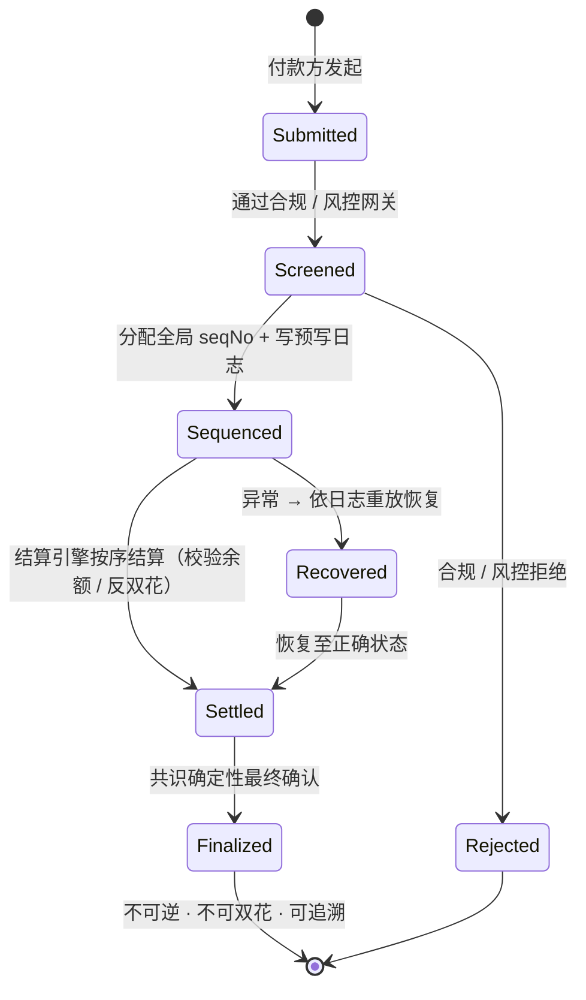

# 3.4 支付最终性与反双花

## 支付链真正的难题

如果只看宣传，人们容易以为链的竞争是「谁的 TPS 更高」。但真正建过支付系统的人都知道，最难的从来不是吞吐量——**最难的是确定性、授权与恢复**：

> 这笔钱**确定**到账了吗？会不会被**重复花费**？如果系统出了故障，能不能**完整地重放、追溯、并恢复**到正确状态？

高吞吐可以用硬件和并行堆出来；但「绝不算错钱、绝不双花、出错必可查」，需要从共识、排序到日志的整条链路协同设计。本节讲 AXON 如何守住这条底线。

## 三道护栏

AXON 在支付确定性上设了三道护栏：

* **确定性结算**——依托 [3.3](3-3-consensus-finality.md) 的 BFT 确定性最终性，交易一旦确认即不可逆，不存在「被更长的链回滚」的概率尾巴。
* **反双花**——同一笔资金不可能被花费两次。每一笔支付在排序层获得全局唯一的序号（seqNo），按序结算，杜绝并发双花。
* **回滚保护**——即使发生异常，系统也能依据预写日志确定「正确状态应当是什么」，而不会陷入不一致。

## 排序层：确定性的心脏

支付确定性的核心，落在**排序 / Entry-Log 层**。它做两件看似朴素、实则关键的事：

1. **全局单调 seqNo 公平排队**——每一笔进入系统的交易，都被分配一个全局单调递增的序号。这意味着系统里所有交易有一个**唯一的、确定的先后顺序**，消除了「谁先谁后」的模糊地带（也压缩了 MEV 式的排序操纵空间）。
2. **预写日志（Write-Ahead Log, WAL）**——在交易被真正执行之前，先把它「要做什么」写进一份只追加、不可篡改的日志。这份日志可以被**完整重放**：给定同样的日志，任何一个节点都能重建出完全相同的状态。

预写日志是从传统数据库借来的、久经考验的工程智慧。数据库正是靠 WAL 保证「即使断电，重启后也能恢复到一致状态」。AXON 把这套思想用在支付上：**只要日志在，正确的状态就永远可以被重建。** 这就是「出错必可查、可恢复」的技术根基。

## 一笔支付的状态机

把这些护栏落到一笔支付上，它的生命周期是一个严格的状态机——每一步转移都是显式的、可验证的：

关键在于：**没有任何一个状态是「模糊」的。** 一笔支付要么在网关被明确拒绝（Rejected），要么走完 Submitted → Screened → Sequenced → Settled → Finalized 的确定路径；即使中途异常，也能沿预写日志重放恢复（Recovered）到正确状态，再继续。**不存在「钱不知道去哪了」的中间态。**

## 中心化 Sequencer 的信任最小化

在网络的早期阶段，排序器（Sequencer）可能是相对中心化的——这在高性能链的早期是常见的工程取舍。AXON 对此的原则是明确的：

> **Sequencer 即使在中心化阶段，也必须证明其日志不可篡改、且可被完整重放。**

也就是说，排序器可以「快」，但不能「黑箱」。它必须持续提供可验证的证据，让任何第三方都能独立重建状态、核对它没有作恶。随着网络成熟（见 [6.1 路线图](../part6-roadmap/6-1-roadmap.md) 的 P2 阶段），排序与验证将逐步去中心化，交由更广泛的验证者集合。

这是一条「信任最小化」的路径：**先用可验证性替代信任，再用去中心化消解信任。** 支付系统的公信力，正是这样一步步建立起来的。

---

*延伸阅读：[3.5 稳定币与喂价：多源校验与熔断](3-5-oracle-safety.md) · [6.1 路线图 P0 → P3+](../part6-roadmap/6-1-roadmap.md)*
